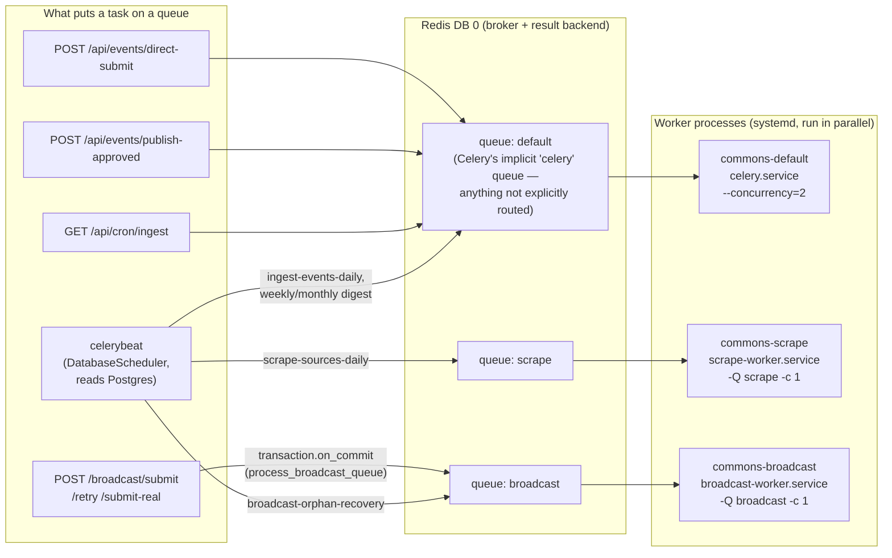
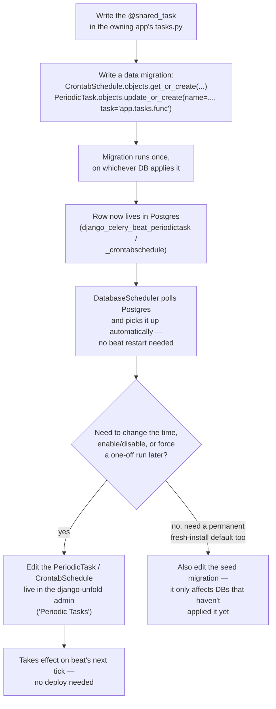
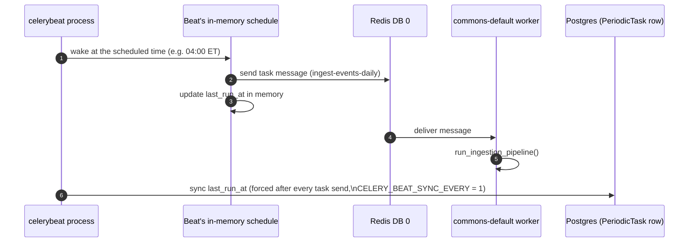
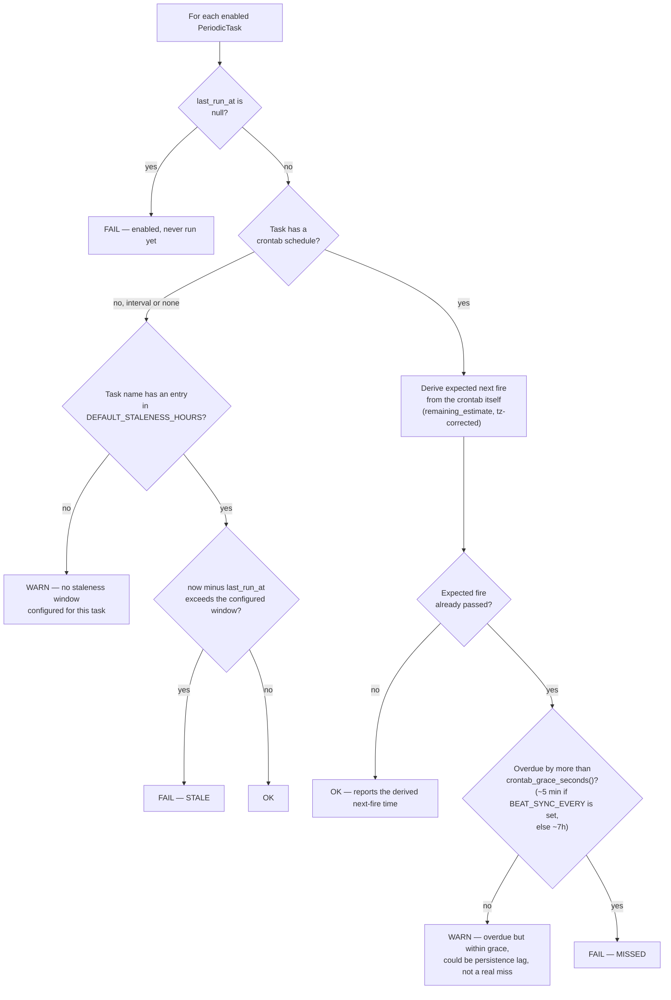

# Async: Redis + Celery

Written 2026-08-01 against commit `5fe7a45`. This is the human-facing companion to
[`docs/redis-celery-handoff.md`](../docs/redis-celery-handoff.md) (the agent-facing deep
dive — stays the system of record for exact settings names, migration mechanics, and prod
provisioning commands) and touches on the same incident [`docs/ingestion-monitoring.md`](../docs/ingestion-monitoring.md)
records in its "Beat scheduler: last_run_at persistence lag" section. Where this doc and
those disagree, the code won the argument — see "Known gaps and doc drift" at the end.

Audience: someone inheriting this codebase who needs to add a new background job or
scheduled task, or figure out why a scheduled job didn't run.

**A note on what's current.** A parallel effort is moving this stack into Docker Compose —
there's a `docker-compose.yml` in the tree defining `celery`, `celerybeat`,
`broadcast-worker`, and `scrape-worker` services that mirror the systemd units this doc
describes, and `deploy/healthcheck.sh` has already been rewritten to shell into those
containers. None of that is cut over yet. This doc describes the systemd units
(`deploy/celery.service`, `deploy/celerybeat.service`, `deploy/broadcast-worker.service`,
`deploy/scrape-worker.service`) as they exist at this commit, because that's what's
actually running in production today. The containerized version is covered by a sibling
doc, `containerization.md`, once it exists.

---

## 1. What this is and who depends on it

The Commons runs almost everything that isn't an HTTP request/response cycle through
Celery: the nightly ingestion pipeline, weekly and monthly email digests, bulk-publishing
approved events, and pushing a submitted event out to third-party town calendars
(broadcast). Before Celery existed, this was two disconnected things — a bespoke
Postgres-polling broadcast worker, and OS cron hitting HTTP endpoints — with no shared
retry, queueing, or scheduling story. Redis + Celery gives every Django app in the repo
(`accounts`, `events`, `newsletter`, `ingestion`, `broadcast`) a single place to define
`@shared_task` functions and a single place (Postgres, via `django-celery-beat`) to define
when they run.

Two things depend on this layer directly and visibly: the ingestion pipeline (see
[`ingestion.md`](ingestion.md) once it exists) won't pull in new events at all if
beat or the default worker is down, and the newsletter digest engine
(see [`newsletter.md`](newsletter.md) once it exists) won't send weekly/monthly email if
the same is true. Broadcast (see [`broadcast.md`](broadcast.md) once it exists, or
[`docs/broadcast.md`](../docs/broadcast.md) today) depends on it too, but less visibly —
**`ARCHITECTURE.md` currently claims broadcast "does not use Celery — it runs its own
DB-backed queue worker," and that's stale.** `broadcast/tasks.py` defines two real Celery
tasks, `process_broadcast_queue` and `recover_broadcast_orphans`, routed to their own
`broadcast` queue. What's true is narrower and more interesting than the doc's claim: the
*queue-claiming logic itself* (`broadcast/worker.py`, `SELECT ... FOR UPDATE SKIP LOCKED`
against Postgres) is bespoke and older than the Celery integration, but it now runs
*inside* a Celery task rather than its own standalone service. If this whole layer goes
down, nothing crashes anywhere in the request path — events just quietly stop flowing,
digests stop sending, and broadcast submissions sit at `status="queued"` forever. That
silence is exactly why the healthcheck section later in this doc matters as much as the
"how to add a task" section.

---

## 2. How it works

### 2.1 Queue and worker topology

Redis holds two logically separate things on one self-hosted instance, and it's worth
saying plainly: **DB 0 is the Celery broker and result backend. DB 1 is the Django page
cache** (`events/cache.py`, wired into `CACHES["default"]` via Django's stdlib
`RedisCache` backend). They are unrelated to each other — a Redis `FLUSHALL` takes out
both, but nothing else couples them, and nothing should ever read/write DB 1 as if it were
the broker or vice versa.

On the Celery side there are three named queues, each drained by a purpose-built worker
process (a separate systemd unit, all reading the same `REDIS_URL` broker on DB 0):



**Five things worth calling out:**

1. **The default queue is memory-light and network-bound** (LLM calls, Brevo email, plain
   HTTP fetches), so it runs at `--concurrency=2` on the same 1-OCPU/6GB VM everything
   else shares. `scrape` and `broadcast` each get their own `MemoryMax=2G`-capped, `-c 1`
   worker specifically because both drive headless Chromium (Playwright), which is memory-
   heavy enough that letting it share the default worker risked taking down gunicorn and
   Next.js alongside it.
2. **The `broadcast` queue's `-c 1` is not a tuning knob — it's a correctness
   requirement.** `recover_broadcast_orphans` assumes that any `BroadcastSubmission` still
   in `status="running"` at the moment it runs is necessarily orphaned (the worker that
   claimed it must have died mid-job). That assumption only holds if `process_broadcast_queue`
   can never be mid-drain on a *second* worker at the same time — i.e., if there is
   structurally only one broadcast worker process. Scaling `broadcast-worker.service` up
   (more replicas, or dropping the `-c 1`) is the obvious-looking fix for "broadcast feels
   slow" and it is wrong: it reintroduces exactly the race the single-worker constraint
   exists to prevent.
3. **`process_broadcast_queue` is not on a beat schedule at all.** Every submission,
   retry, and promote-to-real action calls `transaction.on_commit(process_broadcast_queue.delay)`
   (`broadcast/services.py`) — the queue gets drained on demand, right after the DB row
   that created the work actually commits, not on a poll loop. `recover_broadcast_orphans`
   *is* on a beat schedule (every 6 hours) precisely because on-demand dispatch has no
   mechanism to notice a submission that got stranded when nobody triggered a new one.
4. **Scrape and ingest are two separate beat schedules on two separate queues, not one
   pipeline.** `run_ingestion_pipeline` (the `ingest-events-daily` task, on the default
   queue) only polls `ics`-type sources. `scrape_all_sources_task` (on the `scrape` queue,
   fired 30 minutes earlier so scraped rows land before the standardizer runs) polls
   `scraper`- and `http`-type sources. They are deliberately not chained — a prior version
   of `run_ingestion_pipeline`'s docstring claimed it mirrored the CLI command end-to-end,
   which was false, and two `http`-type sources went unpolled for weeks before anyone
   noticed. `python manage.py ingest_events` with no flags is the one entrypoint that
   actually covers both legs in one pass.
5. **"default" is a convenience name, not a Celery setting.** Nothing in
   `backend/settings/base.py` sets `CELERY_TASK_DEFAULT_QUEUE` — the queue everything lands
   on by default is Celery's own built-in `celery` queue. `CELERY_TASK_ROUTES` only lists
   the two exceptions (`scrape`, `broadcast`); everything else falls through to that
   implicit queue, which `commons-default`'s worker drains because it starts with no `-Q`
   flag at all.

### 2.2 Where a schedule comes from, and how to change one

Beat schedules are **not defined in a settings file you can grep for the current cron
times.** `django-celery-beat`'s `DatabaseScheduler` reads `CrontabSchedule`/`PeriodicTask`
rows out of Postgres, and Postgres — not any `.py` file — is the live truth. Code only
gets involved once, to seed the row the first time:



**Three things worth calling out:**

1. **The migration is a one-time seed, not a sync.** It runs `get_or_create`/`update_or_create`
   once, on first apply. Editing the migration file after it has already run on a given
   database (dev, prod) does nothing to that database's existing row — you have to either
   edit the row live (admin) or write a follow-up migration, the same way
   `newsletter/migrations/0002_repoint_digest_beat.py` did to repoint the digest tasks'
   dotted path after they moved apps (see § Interfaces below).
2. **To see the schedule that's actually running right now**, don't read a settings file —
   open the django-unfold admin's "Periodic Tasks" page (or `PeriodicTask.objects.all()`
   in a shell), on the database you actually care about (dev vs. prod are different
   Postgres instances with potentially different live edits).
3. **A schedule change made in the admin is real and permanent for that database**, but
   invisible to anyone reading the seed migrations in the repo. If prod's actual fire time
   for a task ever needs to match what's in git, someone has to check both places.

### 2.3 One beat tick, and why `last_run_at` can lie

This is the flow behind the sharpest edge in this whole layer, so it earns its own
diagram. `django-celery-beat`'s `DatabaseScheduler` keeps `PeriodicTask.last_run_at` in
memory while it runs, and only writes it back to Postgres when Celery's own
`Scheduler._do_sync()` fires:



**Four things worth calling out:**

1. **`CELERY_BEAT_SYNC_EVERY = 1` (in `backend/settings/base.py`) is why step 6 happens
   right after every task send instead of on a timer.** Without it, the only sync triggers
   are `CELERY_BEAT_MAX_LOOP_INTERVAL` (currently `6 * 60 * 60`, i.e. six hours — this
   setting caps how long beat may sleep between waking to re-poll Postgres for schedule
   *changes*, not how often it fires due tasks) and a 3-minute time-based trigger baked
   into Celery itself. A task that fires shortly after the last sync could sit unflushed
   in memory for up to six hours.
2. **This is not hypothetical — it's a confirmed 2026-07-29 prod incident**
   (`docs/ingestion-monitoring.md`, "Beat scheduler: last_run_at persistence lag"). Before
   `CELERY_BEAT_SYNC_EVERY = 1` was added, `broadcast-orphan-recovery` was firing exactly
   on schedule every six hours, but the healthcheck kept reporting it `STALE` because
   `last_run_at` in Postgres was still showing the *previous* run — the write was buffered
   in memory and only flushed when celerybeat happened to restart. The task was fine; the
   bookkeeping column was lying.
3. **Never widen a staleness window to paper over this.** The tempting fix when a
   monitoring check false-alarms is to make the window bigger. That hides the false alarm
   but also means a *real* multi-hour outage now takes that much longer to surface. The
   actual fix is making the persisted value trustworthy (`CELERY_BEAT_SYNC_EVERY = 1`), not
   giving the check more slack to be wrong in.
4. **If `CELERY_BEAT_SYNC_EVERY` is ever unset or set back to a falsy value, this lag
   comes back exactly as it was** — `backendServer/events/management/commands/healthcheck.py`'s
   `crontab_grace_seconds()` knows this and automatically widens its own grace window to
   match `CELERY_BEAT_MAX_LOOP_INTERVAL` when that happens, so the healthcheck won't
   immediately start crying wolf again — but the underlying lag itself is back, silently.

### 2.4 Diagnosing "the job didn't run"

`manage.py healthcheck` (run hourly on the VM by `healthcheck.timer` → `healthcheck.service`,
and manually via `bash deploy/healthcheck.sh`) is the tool for this. Its periodic-task
check doesn't use a single hand-tuned staleness window for every task — a window wide
enough to never false-alarm on a *weekly* task would let a missed *daily* task ride along
silently for over a week. Instead, wherever a task has a crontab, it asks the crontab
itself what the next expected fire time was and compares that to now:



**Three things worth calling out:**

1. **`DEFAULT_STALENESS_HOURS` (in `healthcheck.py`) plays a narrower role than its name
   suggests.** It's not the primary freshness check for the four crontab-backed seeded
   tasks (`ingest-events-daily`, `scrape-sources-daily`, `weekly-digest-sunday`,
   `broadcast-orphan-recovery`) — those are judged against their own crontab's expected
   fire time. It's used for two narrower things: flagging a seeded task that's missing
   from the schedule entirely (a FAIL, regardless of staleness), and as the only signal
   available for a hypothetical interval-scheduled or schedule-less task, which has no
   crontab to derive an expected time from.
2. **The grace window in step H exists because of § 2.3's persistence lag, and shrinks
   automatically once that lag is fixed.** With `CELERY_BEAT_SYNC_EVERY = 1` (current
   prod config), the grace is ~5 minutes — just enough for scheduler jitter and the task's
   own run time. If that setting is ever lost, the grace widens itself back out to match
   `CELERY_BEAT_MAX_LOOP_INTERVAL` so a `FAIL` doesn't start firing on every ordinary sync
   delay.
3. **A `WARN` here is not "probably fine" — it means "cannot yet distinguish a real miss
   from bookkeeping lag."** Don't dismiss it as noise; if a `WARN` on the same task
   persists across multiple healthcheck runs (an hour or more apart), that's no longer
   plausibly persistence lag and is worth treating as a real miss.

---

## 3. Data model

There's no domain data model here in the usual sense — the state this layer owns is
scheduling and caching metadata, not business data:

| Table (owner) | Key fields | What it means |
|---|---|---|
| `django_celery_beat_periodictask` (`django_celery_beat`) | `name` (unique, human label like `ingest-events-daily`), `task` (dotted Python path, e.g. `ingestion.tasks.run_ingestion_pipeline`), `crontab` FK, `enabled`, `last_run_at`, `total_run_count` | One row per scheduled job. `task` is a plain string, not a real import reference — nothing breaks at write time if it points at a function that no longer exists; it just fails loudly the next time beat tries to send it. This is exactly why moving a task to a new app requires a *data migration* to repoint this column (§ 2.2), not just moving the Python code. |
| `django_celery_beat_crontabschedule` (`django_celery_beat`) | `minute`/`hour`/`day_of_week`/`day_of_month`/`month_of_year`, `timezone` | The crontab a `PeriodicTask` points at. `timezone` is stored per-row (`America/New_York` for the ingest/scrape/digest tasks, `UTC` for broadcast orphan recovery) — beat uses `TzAwareCrontab` (see § 5) to honor it. |
| Redis DB 0 keys (broker/result backend) | Celery-internal — task messages, results | Not meant to be read directly; `redis-cli -n 0 KEYS '*'` works for debugging but there's no app-level schema here worth documenting. |
| Redis DB 1 keys (`events/cache.py`) | `events:list:version` (an integer, bumped on every `Event`/write); `events:list:v{N}:{sha256-prefix-of-sorted-query-params}` (TTL 60s); `events:towns`, `events:categories` (plain keys, TTL 1h) | The read-endpoint cache. **The version-in-the-key trick exists because Django's stdlib `RedisCache` backend has no `delete_pattern`** — there's no way to invalidate "every cached event-list page" by pattern, so instead every write bumps a version counter and old-version keys just age out via TTL instead of ever being explicitly deleted. `Town`/`Category` writes clear their own plain keys directly instead, since those aren't parameterized by query string. |

Invalidation is signal-driven, not task-driven: `events/signals.py`, registered in
`EventsConfig.ready()`, listens for `post_save`/`post_delete` on `Event`, `Town`, and
`Category` and calls the corresponding `events/cache.py` invalidation function inline,
synchronously, in the request/transaction that made the write — there's no Celery task
involved in cache invalidation at all.

---

## 4. Interfaces

### Periodic (beat-scheduled) tasks — the live schedule as seeded

| `PeriodicTask.name` | Task (dotted path) | What it does | Queue | Cadence | Worker that drains it |
|---|---|---|---|---|---|
| `ingest-events-daily` | `ingestion.tasks.run_ingestion_pipeline` | Full ICS-leg pipeline: cleanup → poll ICS sources → Gemini standardize → dedup → safety-score → auto-publish | default | 04:00 daily, `America/New_York` | `commons-default` (`celery.service`) |
| `scrape-sources-daily` | `ingestion.tasks.scrape_all_sources_task` | Polls `scraper`- and `http`-type sources (fires 30 min before the daily ingest so rows land in time) | scrape | 03:30 daily, `America/New_York` | `commons-scrape` (`scrape-worker.service`) |
| `weekly-digest-sunday` | `newsletter.tasks.fan_out_weekly_digest` | Queues one `send_one_digest` per WEEKLY subscriber/user-profile | default | Sundays 18:00, `America/New_York` | `commons-default` |
| `monthly-digest-first` | `newsletter.tasks.fan_out_monthly_digest` | Queues one `send_one_digest` per MONTHLY subscriber/user-profile | default | 1st of month, 18:00, `America/New_York` | `commons-default` |
| `broadcast-orphan-recovery` | `broadcast.tasks.recover_broadcast_orphans` | Re-queues `BroadcastSubmission`/`BroadcastTarget` rows stranded by a crashed worker | broadcast | every 6 hours on the hour, `UTC` | `commons-broadcast` (`broadcast-worker.service`) |

The two digest rows are the ones with history worth knowing: both were originally seeded
(by `events/migrations/0015_seed_digest_beat.py` and `0020_seed_monthly_digest_beat.py`)
pointing at `events.tasks.fan_out_weekly_digest`/`fan_out_monthly_digest`. When the digest
engine moved to the `newsletter` app, a follow-up data migration
(`newsletter/migrations/0002_repoint_digest_beat.py`) updated the `task` string on those
*same* rows to `newsletter.tasks.fan_out_weekly_digest`/`fan_out_monthly_digest` — the
`PeriodicTask.name` and its `CrontabSchedule` never changed, only the dotted path it
dispatches to. `docs/redis-celery-handoff.md` referred to the pre-move path; that's been
corrected as part of this pass.

### On-demand tasks (not on any beat schedule)

| Task | Queue | Triggered by |
|---|---|---|
| `ingestion.tasks.publish_all_approved_task` | default | `POST /api/events/publish-approved` (API key), and the admin's "Publish approved events" docs page |
| `ingestion.tasks.ingest_direct_submission_task` | default | `POST /api/events/direct-submit` — the broadcast SPA's host-submission flow |
| `newsletter.tasks.send_one_digest` | default | Called once per recipient by `fan_out_weekly_digest`/`fan_out_monthly_digest` — never called directly from a view |
| `broadcast.tasks.process_broadcast_queue` | broadcast | `transaction.on_commit(...)` inside `broadcast/services.py`, after `POST /broadcast/submit`, `/retry`, or `/submit-real` commits |
| `events.tasks.ping` | default | Nothing in the running app calls this — it exists purely as a smoke-test task (`events/tests/test_tasks_fast.py`), not part of the healthcheck's worker-liveness probe (that uses Celery's own `control.ping()` RPC, a different mechanism with the same name) |

### Local dev commands

```bash
# alongside runserver
uv run celery -A backend worker -l info                       # default queue
uv run celery -A backend beat -l info                          # scheduler
uv run celery -A backend worker -Q scrape -c 1 -l info         # scrape queue
uv run celery -A backend worker -Q broadcast -c 1 -l info      # broadcast queue
```

The test suite doesn't need any of this running — `backend/settings/test.py` sets
`CELERY_TASK_ALWAYS_EAGER = True`, so every `.delay()` call executes inline, synchronously,
in the test process, and exceptions propagate immediately instead of vanishing into a
worker that isn't there.

### Adding a new periodic task, correctly

1. Write the `@shared_task` function in the owning app's `tasks.py`. `autodiscover_tasks()`
   (called from `backend/celery.py`) finds it automatically — no registration step.
2. If it needs to stay off the default queue (heavy browser work, or anything that
   shouldn't share a process with digests/ingestion), add an entry to `CELERY_TASK_ROUTES`
   in `backend/settings/base.py`, and give it a dedicated worker unit if it's going to run
   in prod unattended (follow the pattern in `deploy/scrape-worker.service`).
3. Write a data migration in the owning app that does the `CrontabSchedule.get_or_create`
   / `PeriodicTask.update_or_create` seed — copy the shape of e.g.
   `ingestion/migrations/0012_seed_scrape_beat.py`. Pick the timezone deliberately:
   `America/New_York` for anything user-facing/business-hours-sensitive, `UTC` for
   internal crash-recovery-style jobs (that's the actual distinction the two existing
   choices encode, not an arbitrary pick).
4. Run the migration wherever the task needs to actually be live (dev DB, then prod on
   deploy). Nothing else needs restarting for the schedule itself to take effect — beat
   picks up new/changed rows on its own poll of Postgres.
5. If the task ever moves to a different app afterward, its dotted `task` path has to be
   repointed with a *second* data migration (see the digest fan-out example in § Interfaces
   above) — moving the Python file alone silently orphans the schedule, since
   `PeriodicTask.task` is just a string beat doesn't validate until send time.
6. Add it to `DEFAULT_STALENESS_HOURS` in `events/management/commands/healthcheck.py` only
   if it has no crontab (interval-based) — crontab-backed tasks get their freshness judged
   automatically from the crontab itself (§ 2.4).

---

## 5. Sharp edges

**`CELERY_BEAT_MAX_LOOP_INTERVAL` (6 hours) and `CELERY_BEAT_SYNC_EVERY` (1) work together,
and tuning one without the other silently reopens a monitoring blind spot.** Both live in
`backend/settings/base.py`. `CELERY_BEAT_MAX_LOOP_INTERVAL = 6 * 60 * 60` caps how long
beat may sleep before re-polling Postgres for schedule *changes* — a deliberate trade-off
to reduce Neon wake-ups, and worth keeping. `CELERY_BEAT_SYNC_EVERY = 1` is the fix for the
side effect that setting has on `last_run_at` bookkeeping: without it, a fired task's
`last_run_at` can sit unflushed in memory for up to that same six hours (§ 2.3), which is
exactly what happened in the confirmed 2026-07-29 prod incident. Never change a
staleness/monitoring window that reads `last_run_at` without checking both of these
settings' current values first — as of this commit they're `6 * 60 * 60` and `1`
respectively.

**`TzAwareCrontab.remaining_estimate()` has a timezone bug that `is_due()` on the same
class doesn't.** `TzAwareCrontab` (from `django_celery_beat.tzcrontab`, the class every
seeded crontab actually uses) overrides `is_due(last_run_at)` to convert its argument into
the schedule's own timezone (`last_run_at.astimezone(self.tz)`) before delegating to the
base Celery `crontab` class — that conversion is what makes an `America/New_York` schedule
actually fire at the right wall-clock time. It does **not** override
`remaining_estimate()`, which is inherited unmodified from `celery.schedules.crontab` and
compares whatever `datetime` it's handed directly against the crontab's fields, with no
conversion at all. In real beat operation this is invisible — beat only ever calls
`is_due()`, and its own `nowfunc()` already returns time in the schedule's tz, so both
sides of every comparison beat makes are already in the same zone. It becomes a real bug
the moment anything calls `remaining_estimate()` directly with a UTC datetime, which is
exactly what `manage.py healthcheck`'s freshness check does (§ 2.4) — without an explicit
`.astimezone(schedule.tz)` conversion on both operands first, `"0 4 * * *"`/
`America/New_York` gets silently read as "04:00 UTC," landing the expected-fire estimate
four to five hours off **every single day**, not just around a DST transition. The
healthcheck code already carries this conversion (see the comment in
`_crontab_freshness` in `healthcheck.py`) — the edge to remember is that it's a property of
*that call site*, not of `TzAwareCrontab` in general: any new code that calls
`remaining_estimate()` directly (rather than going through beat's own `is_due()` machinery)
has to redo the same conversion by hand, or it will be wrong in exactly this way.

**Beat schedules are database rows, not code — the file you'd grep for the current cron
time can be lying.** A seed migration only writes its `CrontabSchedule`/`PeriodicTask` once,
on first apply, and django-unfold admin edits made afterward change the row live without
ever touching a migration file. Reading `ingestion/migrations/0007_seed_ingest_beat.py`
tells you what the schedule *was* the day that migration was written and applied — it does
not tell you what's actually firing in prod right now if anyone has since edited it in the
admin. § 2.2 covers how to check the live truth.

---

## 6. Known gaps and doc drift

- **`ARCHITECTURE.md`'s Broadcast section is stale**, per § 1 above — it says broadcast
  "does not use Celery," which was true before the queue-drain and orphan-recovery logic
  moved into `broadcast/tasks.py`'s `@shared_task` functions. The Async section further
  down the same file is accurate; only the Broadcast section wasn't updated to match.
- **`docs/redis-celery-handoff.md`'s "Testing" section says the suite runs under dev
  settings with `CELERY_TASK_ALWAYS_EAGER = False`.** That's backwards from what's actually
  configured: the suite runs under `backend.settings.test` (which inherits from `dev.py`
  but then explicitly sets `CELERY_TASK_ALWAYS_EAGER = True`), so tasks run inline by
  default and the `@override_settings` pattern shown there is only needed if a test
  deliberately wants *non*-eager behavior, not the reverse. This wasn't in scope to correct
  on that file for this pass (only its stale digest task-path references were) — flagging
  it here so it doesn't get propagated further.
- **This doc did not independently verify `docs/redis-celery-handoff.md`'s prod
  provisioning commands** (Redis install/config, systemd `cp`/`enable` sequence) — they
  read as plausible and internally consistent with the service files in `deploy/`, but
  weren't re-run against a live VM for this pass. Treat that doc as authoritative for the
  exact commands; this doc is about the shape of the system, not a runbook.
- **No consumer of `events.tasks.ping` exists outside its own test.** It's either a leftover
  smoke-test scaffold from before `manage.py healthcheck`'s `control.ping()`-based worker
  check existed, or an intentionally-kept minimal example task — nothing in the codebase
  says which, and it wasn't worth guessing at here.
