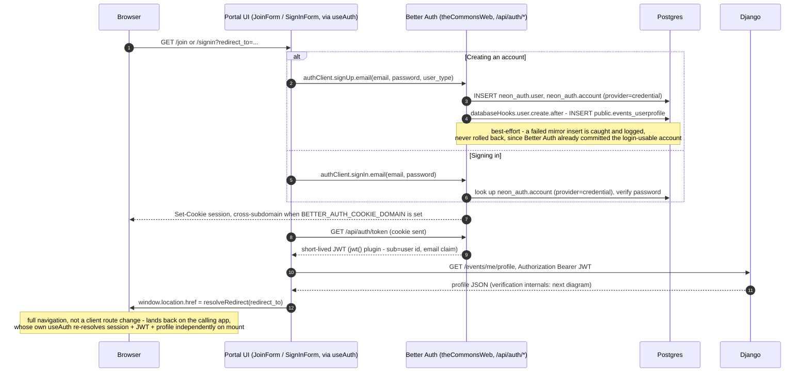
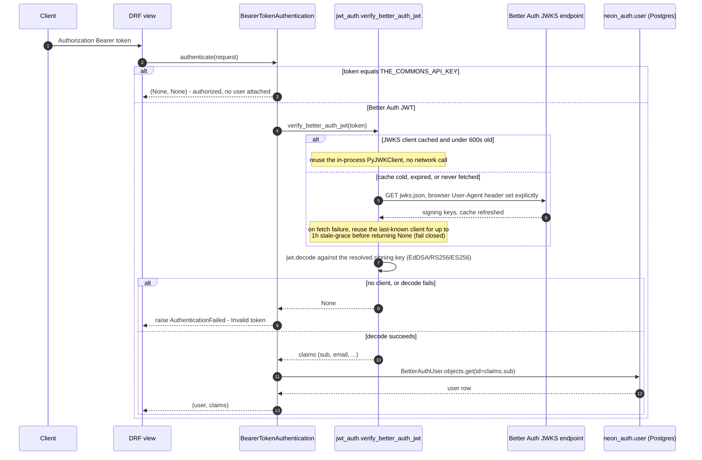
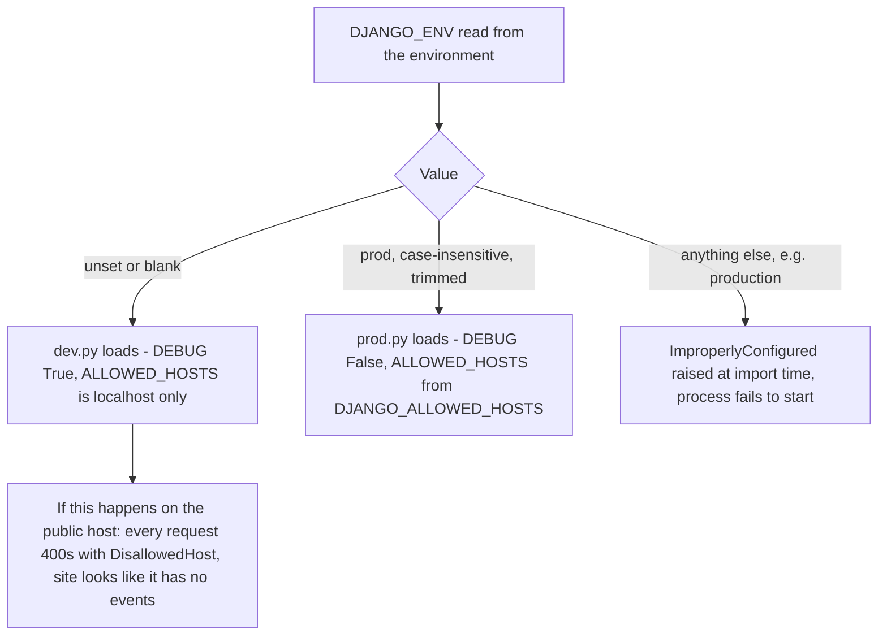

# The Auth Bridge — Better Auth and Django

> **Last updated:** 2026-08-03, commit `d66b059`, branch `main`. Previously reflected commit
> `5fe7a45` (2026-08-01), written by reading `backendServer/accounts/` (models, admin, urls,
> views, migrations), `backendServer/backend/jwt_auth.py`, `backendServer/backend/permissions.py`,
> `backendServer/backend/settings/` (`__init__.py`, `base.py`, `dev.py`, `prod.py`),
> `theCommonsWeb/src/lib/auth.ts`, `auth-schema.ts`, `auth-client.ts`, `db.ts`,
> `theCommonsWeb/src/hooks/useAuth.tsx`, the portal route group (`src/app/(portal)/`),
> `src/app/reset-password/`, `src/lib/redirect-allowlist.ts`, and `broadcastWeb/src/App.tsx`.
> Complements `ARCHITECTURE.md`'s Authentication section, which is also current as of that
> commit; the two shouldn't drift, and if they ever do, trust the code. Companion docs
> referenced below: `overview.md` (system map), `data-model.md` (full schema), `deploy-ops.md`
> (VM/nginx/systemd), `frontend.md` (Next.js app structure).

## Overview

- **Django does not own user accounts.** There is no `django.contrib.auth.User` for app users,
  no Django login view, no Django-issued session. Identity lives entirely inside the Next.js app
  (`theCommonsWeb`), owned by an embedded library called **Better Auth**. Django keeps a
  read-only mirror of Better Auth's tables so it can `JOIN` against them, and it verifies tokens
  Better Auth issued — it never creates a user, checks a password, or invalidates a session.
- **Three things depend on this bridge**: the main site (needs a live Better Auth session for
  the UI plus a JWT to call Django's API), the broadcast SPA (`broadcastWeb`, a separate app on
  its own subdomain that shares the same Better Auth session via a cross-subdomain cookie), and
  Django itself (`BearerTokenAuthentication` gates nearly every non-public DRF view — if JWT
  verification breaks, those views start rejecting real users).
- **The one fact to remember:** sign-in/sign-up happens entirely in Next.js; Django only ever
  sees a short-lived JWT, fetched fresh on every page load (never persisted client-side), and
  verifies it locally against Better Auth's published JWKS keys — no callback to Next.js, no
  Django session, no CSRF.
- **If this bridge is down**, users can typically still sign in on the frontend (Better Auth
  doesn't depend on Django), but every page that calls the Django API for personalized data —
  profile, dashboard, event submission, business listings, all of `broadcast/` — starts failing
  or serving generic/anonymous responses.
- **Where to jump in Deep Dive**, by task:
  - Understanding sign-in/sign-up end to end, cross-subdomain cookies, or the JWT-never-stored
    pattern → §2.1.
  - Debugging a 401/403 on a protected endpoint, or anything JWKS-related → §2.2 and Sharp edge 1.
  - Looking up a specific table, model, or the `neon_auth` schema-crossing trick → §3.
  - Wiring a new authenticated endpoint, or explaining a 401 vs. 403 to a bug reporter → §4.
  - `DJANGO_ENV` misconfiguration, the passwordless-account rollover, or the `UUIDField` history
    → §5.
  - What's still unverified or unfinished (Google sign-in, email verification, prod nginx) → §6.

## Deep Dive

The single fact that matters more than any other in this codebase: **Django does not own user
accounts.** There is no `django.contrib.auth.User` for app users, no Django login view, no
Django-issued session. Identity lives entirely inside the Next.js app (`theCommonsWeb`), owned
by an embedded library called **Better Auth**. Django's job is narrower and more mechanical than
a newcomer usually assumes: it keeps a read-only mirror of Better Auth's tables so it can `JOIN`
against them, and it verifies a token that Better Auth issued. It never creates a user, never
checks a password, and never has the authority to invalidate a session. If you find yourself
about to add a login endpoint to Django, or wondering why `python manage.py createsuperuser`
doesn't create an account regular users can sign in with, that's the inversion this doc exists
to correct.

### 1. What this is and who depends on it

Two systems share one identity: **Better Auth**, running inside `theCommonsWeb`'s Next.js
process, and Django's `accounts` app, which mirrors Better Auth's tables just enough to join
against them and verify the tokens Better Auth mints. Every other backend app that needs to know
"who is this request from" — `events`, `newsletter`, `broadcast`, `ingestion` — depends on
`accounts` for that answer; none of them talk to Better Auth directly.

Concretely, three things depend on this bridge working:

- **The main site** (`theCommonsWeb`) — every authenticated page (`/profile`, `/dashboard`,
  `/post`) needs both a live Better Auth session (for the UI) and a valid JWT (to call Django's
  API for profile data, event ownership, and business listings).
- **The broadcast SPA** (`broadcastWeb`) — a separate Vite app on its own subdomain that
  authenticates against the *same* Better Auth instance via a shared cookie, so a user who signs
  in on the main site is already signed in there, and vice versa.
- **Django itself** — `BearerTokenAuthentication` (`backend/permissions.py`) is the
  authentication class nearly every non-public DRF view in this repo declares. If JWT
  verification breaks, every one of those views starts rejecting real users, and the failure
  mode looks nothing like "auth is down" — see Sharp edge 1.

If this bridge is down, users can typically still sign in on the frontend (Better Auth doesn't
depend on Django), but every page that calls the Django API for personalized data — profile,
dashboard, event submission, business listings, all of `broadcast/` — starts failing or serving
generic/anonymous responses.

### 2. How it works

#### 2.1 Signing in or creating an account

Every place in the product that needs a user to authenticate — the main site's header, the
broadcast SPA's "Sign in" button, the old `/auth` legacy routes — does the same thing: a full
browser navigation to the portal (`/signin` or `/join`, on `theCommonsWeb`, at the shared auth
origin) with a `?redirect_to=<absolute URL>` query param. Sign-up and sign-in converge on the
same downstream steps once Better Auth accepts the credentials, so this is one diagram with an
`alt` for the branch that differs — account creation also fires a database hook that inserts a
matching Django-side profile row.

**Five things worth calling out about this picture:**

1. **The JWT is fetched and re-fetched from scratch, never stored.** `useAuth.tsx` keeps the JWT
   only in React state — nothing is written to `localStorage` or a non-httpOnly cookie. Every
   fresh page load (including the one after the portal's full navigation back) calls
   `authClient.getSession()` then `/api/auth/token` again. That's simple and safe against XSS
   token theft, but it means a slow or failing `/api/auth/token` call blocks every authenticated
   page load, not just sign-in.
2. **The account-creation side effect can silently fail without blocking signup.** The
   `databaseHooks.user.create.after` hook in `theCommonsWeb/src/lib/auth.ts` inserts into
   `public.events_userprofile` wrapped in a try/catch specifically so a schema hiccup on the
   Django side can never roll back the `neon_auth.user`/`account` rows Better Auth just
   committed — a user must never be left with a login that immediately breaks. The trade-off is
   a `UserProfile`-less `BetterAuthUser` if that insert ever does fail, which most `accounts`
   views assume can't happen (`me`, `businesses`, etc. all `.filter(user_id=...).first()` and
   404 rather than crash, so this degrades gracefully, but there's no reconciliation job that
   backfills the missing row).
3. **The physical table name is a historical fossil, not a bug.** That `INSERT INTO
   public.events_userprofile` targets a table whose Django model is `accounts.UserProfile`
   today — the app moved in a state-only migration (§5, Sharp edge 5) but the table's physical
   name never changed, and this raw-SQL insert (written before the move, unchanged since)
   still says `events_userprofile` on purpose.
4. **Cross-subdomain cookies are conditional, not a repo-wide constant.** `BETTER_AUTH_COOKIE_DOMAIN`
   is only set to `.thecommons.town` in production; when it's unset (local dev), Better Auth's
   default `SameSite=Lax`, host-scoped cookie applies instead, so a session on `localhost:3000`
   won't be visible to a broadcast dev server on `localhost:5173` — you sign in separately in
   dev, and that's expected, not broken. In prod, the cookie is scoped to the whole
   `.thecommons.town` domain with `SameSite=None; Secure`, which is what lets someone who signs
   in on the apex site show up already signed in on `broadcast.thecommons.town` — and what lets
   `broadcastWeb`'s "Sign in" button (`App.tsx`) just navigate to
   `${VITE_BETTER_AUTH_URL}/signin?redirect_to=<current URL>` and rely on the shared cookie to
   bring the user right back in.
5. **Password sign-up is the only path today.** `emailAndPassword: { enabled: true, autoSignIn:
   true }` in `auth.ts` is the entire signup surface — `signUp.email` creates the credential
   account and signs the user in in the same call. Google sign-in exists in the codebase
   (`socialProviders.google`) but is commented out; there's no passwordless flow left either
   (see Sharp edge 4).

#### 2.2 Django verifying a Bearer JWT against JWKS

This is the other half of the bridge, and the one that actually enforces anything: every
protected DRF view in this repo uses `BearerTokenAuthentication`
(`backend/permissions.py`), which accepts either the shared `THE_COMMONS_API_KEY` (no user
attached — for server-to-server calls like the ingestion pipeline) or a Better Auth JWT,
verified statelessly against Better Auth's published JWKS endpoint. Django never calls back into
Next.js to ask "is this session valid" — it downloads Better Auth's public signing keys once,
caches them in-process, and verifies the JWT's signature locally.

**Three things worth calling out about this picture:**

1. **The browser User-Agent header on the JWKS fetch is load-bearing, not decoration** — see
   Sharp edge 1. It looks like the kind of line a cleanup pass removes.
2. **The stale-grace fallback exists so a Next.js deploy or blip doesn't cascade into Django
   auth.** For up to an hour after the last successful JWKS fetch, a failing refresh reuses the
   old signing keys rather than rejecting every request. Past that window, verification fails
   closed (`None`), which surfaces to callers as `AuthenticationFailed`.
3. **`broadcast/` calls `verify_better_auth_jwt` directly**, skipping the `BetterAuthUser` ORM
   lookup step entirely (`broadcast/access.py`) — by design, to keep `broadcast/` from importing
   anything outside itself. It gets back claims, not a Django user object, and resolves an
   access tier from the email claim instead.

### 3. Data model

`accounts` owns two kinds of tables: five **Better Auth mirrors** it never writes to, and two
**Django-owned profile tables** that hang off them.

| Model | Schema / table | Managed by Django | What it's for |
|---|---|---|---|
| `BetterAuthUser` | `neon_auth.user` | No (`managed = False`) | The account record — id, email, name. Hardcodes `is_authenticated = True` / `is_anonymous = False` as class attributes so DRF's permission classes treat it as a real authenticated user without a database round trip for that check. |
| `BetterAuthSession` | `neon_auth.session` | No | Better Auth's server-side session record. Django never reads this for request auth — auth is JWT-based, not session-based, on the Django side. |
| `BetterAuthAccount` | `neon_auth.account` | No | One row per sign-in method (`provider_id = 'credential'` for password auth). Holds the hashed password for credential accounts. `user_id` is a `UUIDField` — see Sharp edge 3. |
| `BetterAuthVerification` | `neon_auth.verification` | No | Better Auth's internal token bookkeeping (password-reset tokens, etc). |
| `BetterAuthJwks` | `neon_auth.jwks` | No | The signing keypair(s) Better Auth's `jwt()` plugin uses. Django never reads this table directly — it fetches the public half over HTTP from the JWKS endpoint instead (§2.2), not from the database. |
| `UserProfile` | `public.events_userprofile` | Yes | `user_type` (LOCAL/BUSINESS/VENUE), `primary_city`, `address`, `email_preference`, tag interests. `OneToOneField` to `BetterAuthUser` with `db_constraint=False` (no DB-level FK across the schema boundary onto an unmanaged table). |
| `BusinessProfile` | `public.events_businessprofile` | Yes | Business-account listing data — name, description, contact info, service area, publish state. Also `OneToOneField` to `BetterAuthUser`, `db_constraint=False`. |

Every `neon_auth` model's `db_table` uses a double-quote trick to cross a schema boundary Django
doesn't natively support in this form — `db_table = 'neon_auth"."user'` — so that when Django
wraps it in its own quoting (`"` + value + `"`), the emitted SQL comes out as
`FROM "neon_auth"."user"`, a valid Postgres cross-schema reference. It reads like a stray quote
character; it isn't one.

The full event/newsletter/ingestion/broadcast schema (and how those tables relate to the ones
here) is `data-model.md`'s job, not this doc's — this table only covers the identity slice.

### 4. Interfaces

| Method | Path | Auth | Notes |
|---|---|---|---|
| GET/PATCH | `/auth/me` | Bearer JWT | Read/update the caller's own `UserProfile` — email preference, city, address, tags, and (once, LOCAL to BUSINESS/VENUE only) account type. PATCH also syncs a `NewsletterSubscriber` row to match `email_preference`. |
| GET/POST | `/businesses` | Bearer JWT | Browse published businesses (VENUE accounts only) / create a listing (BUSINESS accounts only). |
| GET | `/businesses/me` | Bearer JWT | Caller's own business listing. |
| GET/PATCH/DELETE | `/businesses/<uuid>` | Bearer JWT | Business listing CRUD, owner-only for write. |
| GET/POST | `/api/auth/*` | — | Not a Django route — Better Auth's own catch-all handler in `theCommonsWeb` (`src/app/api/auth/[...all]/route.ts`). This is where `/api/auth/token` (JWT mint), `/api/auth/jwks` (public keys), and the password/reset-password endpoints actually live. |

Every `accounts` view above uses `BearerTokenAuthentication` + DRF's `IsAuthenticated` — there is
no Django session auth and no CSRF token involved, by design (see §1). A request with no
`Authorization` header, an expired JWT, or a JWT whose `sub` doesn't resolve to a
`BetterAuthUser` all end up as `401`; a valid user hitting an endpoint gated on the wrong
`user_type` (e.g. a LOCAL account calling `POST /businesses`) gets `403`, not `401` — worth
knowing when a bug report says "I'm logged in but I get an error."

### 5. Sharp edges

**1. The JWKS fetch needs a browser-like User-Agent, or every JWT verification fails.**
Cloudflare sits in front of the auth origin and 403s the default `python-urllib` User-Agent that
`PyJWKClient` sends by default. `backend/jwt_auth.py` sets an explicit
`_JWKS_HEADERS = {"User-Agent": "Mozilla/5.0 (compatible; TheCommons/1.0)"}` on both the
pre-flight `requests.get` and the `PyJWKClient` itself specifically to route around this. If
someone "cleans up" that header as unnecessary boilerplate, the JWKS fetch starts getting 403'd
by Cloudflare, `_get_jwks_client` returns `None` (once any stale-grace window expires),
`verify_better_auth_jwt` returns `None` for every token, and every Bearer-JWT-protected endpoint
in the app starts returning 401/403 for real, legitimately-signed-in users. This is exactly what
happened once in production — broadcast's tier-2 endpoints started blanket-403ing, and the
symptom (auth suddenly broken everywhere) looked nothing like the cause (one HTTP header).

**2. `DJANGO_ENV` has to be exactly `prod` for the production settings to load — and the
failure mode for getting this wrong is still partly silent.** `backend/settings/__init__.py`
resolves `DJANGO_ENV` to `dev` or `prod` before anything else loads:

A *typo'd* value now fails loudly (`ImproperlyConfigured` at process startup) — that part used
to be silent and has since been hardened, with a regression test
(`events/tests/test_config_fast.py::SelectSettingsEnvTests`) locking the behavior in. What's
*still* true, and still by design (every local dev setup relies on it), is that an **unset**
`DJANGO_ENV` silently resolves to `dev`. If the production VM's `.env` is ever missing that line
entirely, the app comes up as `dev.py` — `DEBUG=True`, `ALLOWED_HOSTS=["localhost", "127.0.0.1"]`
— and every request to the real public host gets rejected with `DisallowedHost` (HTTP 400),
which the frontend renders as "no events." `manage.py healthcheck --require-prod` now exists
specifically to catch this after the fact (it fails loud if `DEBUG` is `True` or `ALLOWED_HOSTS`
is localhost-only) and is wired into the periodic health check, but it's a detector, not a
guard — it doesn't stop a misconfigured deploy from going live, it just makes the misconfig
visible fast instead of only when someone notices the site is empty.

**3. `BetterAuthAccount.user_id` is a `UUIDField`, matching the real column — this used to be
wrong.** The live `neon_auth.account."userId"` column is `uuid`. The Django mirror model
originally declared it as a `TextField`, which worked fine for simple lookups but broke any ORM
join across it — `operator does not exist: uuid = text` — because Postgres won't implicitly
compare those types. This was fixed by changing the field to `UUIDField(db_column="userId")`,
and there's now a standing regression test
(`BetterAuthAccountUserIdFieldTests` in `events/tests/test_config_fast.py`) asserting the field
type matches. If someone reverts that field back to `TextField` — plausible, since a lone
`get()`-by-id lookup on this model still works fine with either type and gives no visible signal
anything's wrong — any code doing a cross-model anti-join (exactly the shape the passwordless
account rollover, Sharp edge 4, needs) breaks again at query time. Because this model is
`managed = False`, nothing about the database enforces the Django field type matches reality;
only the test does.

**4. Password-required accounts and the passwordless rollover: wiring is done, the actual send
looks outstanding.** Before password requirements landed, an account could exist with no
password at all — sign-in was just "enter your email." That flow is gone: `SignInForm.tsx`
requires both fields, and there is no other way to reach a session without one. Anyone whose
account predates that change is locked out with no password to type. The fix that's since landed
threads all the way through: `theCommonsWeb/src/lib/auth.ts` now wires
`emailAndPassword.sendResetPassword` (sends the reset email directly via Brevo's REST API from
the Next.js server), `/forgot-password` calls `authClient.requestPasswordReset` for real instead
of showing a stub message, and a new public `/reset-password` page consumes the token via
`authClient.resetPassword`. The identification side is also built:
`events.management.commands.rollover_passwordless_accounts` finds affected users with a raw-SQL
anti-join against `neon_auth` (deliberately raw SQL, not the ORM — the `neon_auth` mirror tables
aren't built in the test database, so there's no way to exercise an ORM version of this query in
CI) and, with `--send`, emails each one a rollover notice. What isn't confirmed from the repo:
whether that command has actually been run with `--send` against production yet. Its own
docstring, and the runbook it points to (`docs/suite-38-passwordless-rollover.md`), still
describe the reset link as a dead end and the whole effort as blocked — that prose predates the
wiring above and is now stale; don't trust it over the code in `auth.ts` and
`ForgotPasswordForm.tsx`/`ResetPasswordForm.tsx`. Before ever passing `--send`, verify the
current prerequisites for real (an unset `BREVO_API_KEY` in the frontend's production
environment makes `/forgot-password` report success while sending nothing), and treat the
management command's dry-run output as the actual list of who's still stranded.

**5. `neon_auth` is never migrated by Django, and the app-extraction migration that moved
`UserProfile`/`BusinessProfile` into `accounts` is deliberately state-only.** Every `neon_auth`
mirror model carries `managed = False` for exactly one reason: Better Auth owns those tables
completely, and a Django `migrate` must never touch them. If that flag were ever dropped or
flipped — "cleaning up" what looks like a stray `False` — the next `makemigrations` would try to
generate real `CreateModel`/`AlterField` operations against tables that already exist with a
different owner, and `migrate` would then attempt DDL against `neon_auth.user`,
`neon_auth.account`, and the rest, which at best fails outright and at worst silently diverges
Django's idea of the schema from the one Better Auth is actually writing to — breaking
authentication for the whole app, not just the mirror. Related, and worth reading correctly: the
migration that moved `UserProfile`/`BusinessProfile` (and all five mirrors) into the `accounts`
app, `accounts/migrations/0001_initial.py`, is built entirely from
`migrations.SeparateDatabaseAndState` with `database_operations=[]` — it *looks* like it creates
seven tables (there's a `CreateModel` for every one of them, mirrors included), but zero DDL
actually runs. It only changes which Django app the ORM believes owns each model; every
`db_table` (`events_userprofile`, `events_businessprofile`, and every `neon_auth.*` mirror) stays
physically exactly where it was. A newcomer skimming that migration file and assuming it built
those tables would be wrong in a way that matters if they ever try to reason about what
`migrate` did or didn't touch.

### 6. Known gaps

- **The passwordless-rollover command and its guardrail test still live under `events/`, not
  `accounts/`**, even though they exist entirely to work around a bug in `accounts.models`.
  `events/management/commands/rollover_passwordless_accounts.py`'s own docstring still says
  `BetterAuthAccount.user_id (events/models.py)` — that model has lived in `accounts/models.py`
  since the app extraction (§5). Neither file was moved when `accounts` was carved out of
  `events`; functionally harmless (the import path in the code itself is correct — only the
  comment and the file's location are stale), but worth relocating alongside any future touch of
  either file.
- **Whether the passwordless-rollover email has actually been sent to production users is not
  verifiable from the repository.** See Sharp edge 4 — the wiring is confirmed done, the send is
  not confirmed either way.
- **No email verification.** Signup doesn't gate on a verified email for MVP (`emailAndPassword`
  has no `requireEmailVerification`, and there's no verify-email route in
  `theCommonsWeb/src/app`). Confirmed by absence rather than by finding an explicit "no
  verification" flag — worth a second look if this doc is read much later than its date above.
- **Google sign-in is fully wired in Better Auth's config but commented out**
  (`socialProviders.google` in `auth.ts`), and the client-side popup flow that used to call it
  was deleted along with the pre-portal auth UI. Re-enabling it needs a new post-OAuth
  account-type step built into the portal (it used to bypass the LOCAL/BUSINESS/VENUE choice
  entirely) — not just uncommenting the block.
- **Production nginx routing for the auth origin was not verified for this doc.** This repo's
  deploy tooling was mid-change while this doc was written (a Docker-based nginx config was
  present but not yet part of a committed state), so the exact current routing for
  `auth.thecommons.town` is `deploy-ops.md`'s claim to verify, not this one's — everything above
  about cookies, trusted origins, and the JWKS URL is grounded in application code and env-var
  wiring, not in reading the live nginx config.
