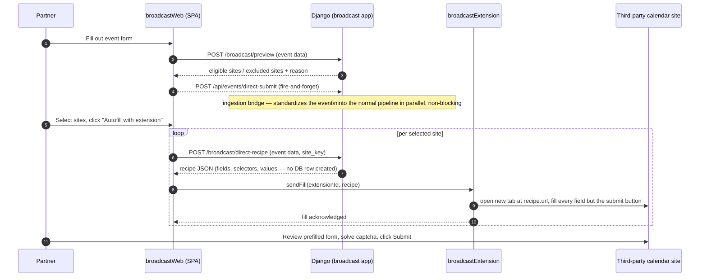
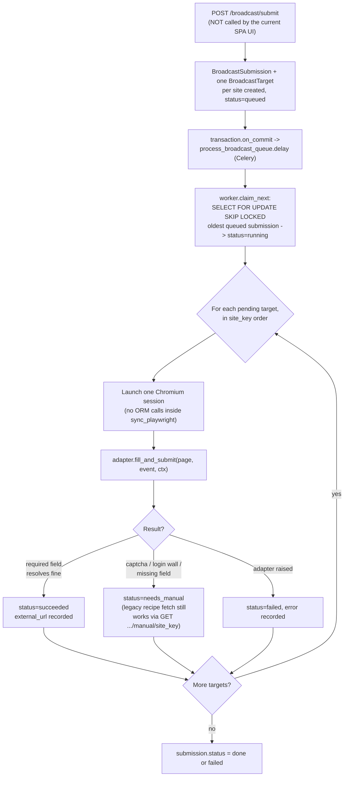

# Broadcast — Pushing Events Out

> **Last updated:** 2026-08-03, commit `9a38379`, branch `suite-47-tags-and-filters`

This is the human-facing companion to [`docs/broadcast.md`](../docs/broadcast.md), which stays
the system of record — the exact model fields, every API endpoint's rate limit, the full
adapter list, environment variables, and management commands all live there in more detail than
belongs here. Read this first for orientation, then go to `docs/broadcast.md` for anything
precise. Where the two disagree, the code (and `docs/broadcast.md`, which was re-verified
against it) wins — this doc calls out the one place that matters below.

Audience: someone inheriting this codebase who has never touched the broadcast subsystem and
needs to understand what it is before the deep-dive doc makes sense.

## Overview

- **What it is:** Broadcast is the reverse of ingestion. Ingestion pulls other towns' events
  *into* The Commons; broadcast pushes a single event *out* onto several other towns' calendar
  websites, so a partner can list an event once and have it land on half a dozen third-party
  sites instead of retyping it into six forms.
- **Who uses it:** Not residents browsing the main site — partner organizations and event hosts,
  working through a separate console (`broadcastWeb`) gated behind an access code or login. If
  broadcast is down, the main site (`theCommonsWeb`) is unaffected; only a partner's distribution
  workflow breaks.
- **The one or two facts that matter most:** (1) Broadcast is architecturally walled off from
  `events`/`ingestion` — a real AST-parsing test enforces zero imports from either app, so it has
  its own copy of event fields, its own locality/category vocabulary, and its own access control.
  (2) There are two submission paths in the code, but only one is actually reachable today: the
  extension-driven "recipe" flow (a human clicks Submit) is live; a second, complete
  Playwright-headless server-side path exists, is tested, but nothing in the current SPA UI can
  trigger it — don't trust `ARCHITECTURE.md`'s framing of this, it's stale (see Deep Dive §4).
- **Where to go for what:**
  - Who runs it and how access/tiers work → Deep Dive §2
  - The live extension-based submission flow → Deep Dive §3
  - The dormant headless/Playwright path → Deep Dive §4
  - Celery worker concurrency and why it's pinned to one → Deep Dive §5
  - Access codes (trial vs. upgrade) → Deep Dive §6
  - Gotchas that bite newcomers → Deep Dive §7
  - What this doc couldn't independently verify → Deep Dive §8

**Note:** we used to use something like the headless path for fully automating the
posting, but most of the time users still have to go through and click the submit button
due to captcha. We can't bypass this due to laws surrounding captcha. Additionally it's
not straightforward to test that these events are actually being submitted to the
calendars properly. Hence, we've opted for just using the recipe to fill out the page,
and letting users walk the last mile of verifying the info and having the satisfaction of
knowing it was submitted.

**Future work:**
- Implement broadcast history per user (so they can track what events they've already
  uploaded, and we can tell them how much time they've saved in total).
- Add more destinations (possibly by creating a Claude skill to one-shot add a new
  destination).

---

## Deep Dive

### 1. What this is and who depends on it

Ingestion (see `ingestion.md`) pulls events *in* — it polls other towns' calendars and pulls
their events onto The Commons. Broadcast does the reverse: it takes a single event and pushes
it *out* onto several other towns' calendar websites, so a partner organization — a chamber of
commerce, a venue, an event host — can list one event once and have it land on The Commons plus
half a dozen third-party sites, instead of retyping the same event into six different forms by
hand.

The people who use it are not residents browsing the public site. They're partner
organizations and event hosts, working through a separate console (`broadcastWeb`) gated
behind an access code or a login. If broadcast is down, nothing on the main site
(`theCommonsWeb`) breaks — it's an entirely separate flow with its own frontend, its own
backend app, and its own database rows. What breaks is a partner's ability to distribute an
event listing; the event itself can still be posted directly to The Commons through the normal
submission form.

Architecturally, broadcast is deliberately walled off from the rest of the backend. The
`broadcast` Django app is not allowed to import anything from `events` or `ingestion` — a real
test (`broadcast/tests/test_isolation.py`) walks every `.py` file in the app with Python's
`ast` module and fails the suite if it finds an import rooted at either package. This isn't
incidental tidiness. Broadcast operates on its own denormalized copy of an event's fields
(title, datetimes, venue, locality tags, category tags — all just columns on
`BroadcastSubmission`, not a foreign key to `events.Event`), on its own locality/category
vocabulary (`broadcast/routing.py` defines its own list of towns and categories rather than
reading `events.Town`/`events.Category`), and its own access-control system entirely separate
from Better Auth accounts. The one place broadcast reaches back toward the rest of the site is
one-directional and lives on the other side of the wall: when a host submits an event through
the broadcast console, the SPA also fires a request at an ingestion endpoint
(`POST /api/events/direct-submit`) that runs the event through the same LLM standardization
pipeline as a scraped event. That bridge code lives entirely inside `ingestion/` — `broadcast/`
still imports nothing from `ingestion/` or `events/`. If someone "fixes" the isolation by
having `broadcast/` reach into `events.Town` directly to reuse a vocabulary, the isolation test
fails immediately, but the deeper cost is that a future change to `events.Town` (renaming a
slug, deleting a town) would silently start breaking broadcast's routing logic in a way nobody
watching the `events` app would think to check for.

---

### 2. Who operates it, and how

Three pieces work together:

- **`broadcastWeb`** (`broadcastWeb/`) — a Vite + React single-page app, separate from
  `theCommonsWeb` entirely (different build, different deploy, different test suite). This is
  where a partner fills out an event, picks which calendars to send it to, and watches the
  status of each site.
- **`broadcastExtension`** (`broadcastExtension/`) — a Chrome MV3 browser extension that the
  SPA talks to. It's the thing that actually opens each third-party calendar's submission form
  and fills it in.
- **`broadcast`** (`backendServer/broadcast/`) — the Django app underneath both. It decides
  which calendars a given event is eligible for, builds the per-site "recipe" the extension
  fills in, gates all of this behind an access-tier system, and also contains a second,
  currently-unused submission path described in §4.

#### Signing in and getting access

There's no separate broadcast account system — signing in uses the same Better Auth identity
as the main site (see `auth.md`), via the shared cookie domain across `thecommons.town`
subdomains. But being logged in isn't enough by itself; broadcast additionally gates every
feature behind a **tier** (0, 1, or 2), resolved per request from either a Bearer JWT or an
access-code header. Tier 0 (logged in, no grant, or not logged in at all) can't fill or
broadcast anything. Tier 1 can fill and broadcast. Tier 2 additionally unlocks the AI-autofill
helper that turns pasted free text into a draft event.

There are two independent ways to get above tier 0, and they're deliberately kept apart:

- A **trial code**, entered anonymously with no account required. It's always tier 2, and
  instead of being metered by number of uses it just expires — three days by default. This is
  the "hand someone a code so they can try it right now" path.
- An **upgrade code**, which only works for a logged-in user (`POST /broadcast/redeem`) and
  permanently sets that account's tier. Whoever enters the code last wins — there's no
  downgrade protection, which is a deliberate choice so sales/support can just say "enter this
  code" without worrying about someone accidentally reverting a customer's access.

The one text field in the SPA does double duty depending on login state — logged out it reads
"Access Code" and resolves a trial code anonymously; logged in it relabels to "Upgrade Account"
and permanently redeems an upgrade code against that account. `broadcast/access.py` is where
this resolution actually happens; `docs/broadcast.md`'s Access control section has the full
tier table and every metering rule.

---

### 3. How an event actually gets onto another town's calendar

This is the live flow — the one a partner uses today.

**Five things this diagram can't say on its own:**

1. **This is the primary, and today the only reachable, submission path.** The current
   `broadcastWeb` UI has no button that creates a job for the server-side headless path
   described in §4 — the code that would call `POST /broadcast/submit` isn't wired to anything
   in `App.tsx` anymore. A partner's event never becomes a `BroadcastSubmission`/
   `BroadcastTarget` database row under this flow; `direct-recipe` is explicitly a read-through
   endpoint that computes a recipe and creates nothing.
2. **The recipe request and the actual autofill are two separate round trips per site**,
   because the recipe is computed fresh from whatever's currently in the form (no server-side
   state to go stale) and the extension is a different origin the SPA can only reach by
   messaging.
3. **The extension never clicks Submit.** That's not a missing feature — it's the whole point.
   Every recipe-driven site has either a captcha, a terms checkbox, or both, and the design
   intentionally leaves the final click (and any captcha-solving) to the human who can see the
   filled-in form and vouch for it.
4. **The direct-submit call in step 3 runs in parallel with everything else and can fail
   silently without affecting the visible flow.** It exists so a broadcast submission also
   becomes a real event on The Commons itself, going through the identical LLM
   standardize/dedupe/safety-score pipeline described in `ingestion.md` — but a failure there
   never blocks or surfaces as an error in the preview step.
5. **Not every eligible-looking site gets this treatment.** Four Tier-1 sites
   (`fun4raleighkids`, `chapelboro`, `explore_pittsboro`, `shop_pittsboro`) require a login
   before any form appears, or are otherwise not deterministically fillable — their adapters
   carry no recipe at all, and `SitePicker` in the SPA greys them out with "coming soon" instead
   of letting a partner select them.

#### The adapter pattern

Each third-party calendar has its own **adapter** — a small Python class in
`broadcast/adapters/` (`abc11_community.py`, `triangle_on_the_cheap.py`, `visit_raleigh.py`,
and so on) that knows that one site's form: its field selectors, what format each field expects
a date or a price in, and which locality/category combination the site is even willing to
accept (`routing.py` uses this to compute the eligible/excluded split in step 2 of the diagram
above). An adapter is intentionally dumb by design — it never invents content, never calls an
LLM at request time, and never solves a captcha; if a required field can't be resolved from the
event data, or the site presents a login wall or a captcha, the result is "needs manual
attention," not an invented guess.

What makes an adapter usable by the extension flow is a second, declarative layer on top of the
same field definitions: `RecipeField` objects (selector, type, how to resolve a value from the
event) that get serialized straight into the recipe JSON the extension consumes. The two layers
share the same field/selector definitions on purpose, so the imperative fill logic (used by the
disabled headless path in §4) and the recipe JSON (used by the live extension path) can't drift
apart into filling a form two different ways. Six adapters currently expose a full recipe —
`abc11_community`, `triangle_on_the_cheap`, `triangle_weekender`, `visit_raleigh`,
`chatham_arts`, `chatham_chamber` — and those six are exactly the sites listed in the
extension's `host_permissions`. The remaining Tier-1 adapters exist (so routing can still
report them as "eligible, but not automatable") but return no recipe.

---

### 4. The other path: server-side headless submission (disabled today)

The `broadcast` app also contains a complete, independent second way of doing this, built
first and still fully present in the code: a database-backed job queue, a Playwright-driven
headless Chromium worker, and the same adapters' *imperative* `fill_and_submit` methods (as
opposed to their declarative `recipe()` output). `POST /broadcast/submit` creates a
`BroadcastSubmission` plus one `BroadcastTarget` row per selected site, a Celery task drains
the queue, and a worker process launches a real (usually headless) browser per target and
drives the form itself — no human in the loop unless an adapter reports `needs_manual`.

**This path is real, tested, and currently unreachable from the SPA.** `broadcastWeb`'s
`App.tsx` still has handlers for retrying a job, promoting a dry-run job to a real submission,
and canceling a job — but nothing in the current UI ever calls `POST /broadcast/submit` to
*create* one, so those handlers only matter for a job that already exists. It's worth stating
plainly because two of the repo's own root-level docs disagree about this: `ARCHITECTURE.md`'s
Broadcast section narrates this headless path as if it were the live flow, and separately
claims broadcast "does not use Celery." Neither is accurate as of this commit — trust
`docs/broadcast.md` and the code instead, both of which agree the extension flow in §3 is
primary and this one is dispatched over a real Celery queue (see §5).

Why keep a whole second, disabled path around instead of deleting it? Because it's the honest
long-term answer for sites without a usable recipe, or for a future bulk/unattended mode — the
architecture supports both a human-supervised and a fully automated submission without
duplicating the per-site form logic, since both paths are adapter methods on the same class.

---

### 5. The worker, and why its concurrency is fixed at one

Both the headless path's queue-drain and its crash-recovery sweep run as real Celery tasks
(`broadcast.tasks.process_broadcast_queue` and `broadcast.tasks.recover_broadcast_orphans`),
routed to a dedicated `broadcast` Celery queue via `CELERY_TASK_ROUTES` in
`backend/settings/base.py`. In production, exactly one worker process drains that queue — the
`broadcast-worker` systemd unit runs `celery -A backend worker -Q broadcast -c 1`, concurrency
pinned to one.

That `-c 1` is load-bearing, not a conservative default someone forgot to tune up. The
crash-recovery task assumes that any `BroadcastSubmission` still marked `running` when it runs
must have been orphaned by a worker that died mid-drain — a safe assumption only if there is
never more than one worker that could have been mid-drain in the first place. Scale that worker
to two or more processes and this assumption breaks: a submission actually being processed by
worker B could get its `running` status matched by orphan-recovery's sweep and get re-queued
out from under worker B, which would then finish and write results for a submission that a
second, freshly-spawned attempt is now also racing to process. The obvious-looking fix for "the
queue is slow" — bump the worker's concurrency — is exactly the wrong move here; the right fix
is a second single-concurrency worker on its own separate queue, not a wider pool on this one.

This queue is not polled on an interval. `services._dispatch_worker()` calls
`transaction.on_commit(process_broadcast_queue.delay)` right when a submission is created,
retried, or promoted from dry-run to real — so a job starts draining the instant its database
transaction commits, not on the next tick of a fixed poll loop. A separate, coarser safety net —
`recover_broadcast_orphans`, seeded as a periodic task running every six hours — exists purely
to catch a submission stranded by a worker that crashed mid-drain between one partner's session
and the next; it is not how ordinary progress happens. Day-to-day stalled-target recovery is
actually driven by the SPA's own polling loop, which flags a target that's been sitting
`queued`/`in_progress` too long and asks the backend to re-queue just that target, capped at a
couple of automatic retries before surfacing a "stuck" state to the partner. `async-jobs.md`
covers the full Celery queue layout (the ingestion and digest queues too) in depth; this
section is scoped to what's specific to broadcast.

---

### 6. Access codes, briefly

Access codes are managed entirely through the database — there is no environment-variable code
list to update on deploy. Codes are generated from the Django admin (self-serve, shows the raw
code once, right after creation, then never again) or from a management command. `data-model.md`
has the full field-by-field reference for `AccessCode`, `AccessCodeUse`, and
`AccessCodeRedemption`; the one thing worth internalizing here is that **trial** and
**upgrade** codes are two genuinely separate pools distinguished by `AccessCode.kind`, not two
labels on the same mechanism — a trial code is only ever checked against the anonymous
header/body path, an upgrade code only ever against the logged-in redeem endpoint, and neither
code type will ever validate against the other's path. There's also a small evergreen layer on
top (`SalesCodeSlot`) that keeps exactly one always-current, always-visible code per tier
showing in the admin, specifically so a salesperson never has to run a CLI command to hand
someone a working code.

---

### 7. Sharp edges

1. **Isolation from `events`/`ingestion` is enforced by a real test, and it's easy to break
   without noticing.** `broadcast/tests/test_isolation.py` parses every `.py` file in the app
   with Python's `ast` module and fails if any file imports from `events` or `ingestion` at any
   depth — not just direct top-level imports. Reaching for `events.Town` to avoid duplicating
   broadcast's own locality list, or importing an `ingestion` helper to reuse some parsing
   logic, will fail CI immediately if it's caught — and if it somehow isn't (a new test file,
   a refactor that moves code around), the real cost lands later, as a change to `events` or
   `ingestion` silently breaking broadcast in a way nobody reviewing that change would think to
   check.

2. **No Django ORM call may happen while a `sync_playwright()` block is open.** `runner.py`'s
   docstring explains why: Playwright keeps its own event loop alive on the thread it runs on,
   and Django's async-aware connection handling can silently start using a second database
   connection inside that block instead of the one the surrounding code expects. The fix in
   place is structural — `run_submission` fetches everything it needs into a plain
   `CanonicalEvent` object *before* opening a browser session, and the browser is opened and
   closed once per target, with every database write happening in between sessions rather than
   inside one. Any change that tries to look something up from the database mid-fill (to avoid
   an extra round trip, say) reintroduces this specific hazard, and it's the kind of bug that
   only shows up under real concurrent load, not in a quick manual test.

3. **The `broadcast` Celery queue's single-worker constraint is a correctness requirement, not
   a performance knob** — covered in full in §5. Worth repeating here as its own edge because
   it's the one most likely to look like an easy fix to someone trying to speed up a slow
   broadcast queue.

4. **The Chrome extension only autofills hosts explicitly listed in `manifest.json`'s
   `host_permissions`.** Today that list is exactly the six recipe-enabled adapters' domains
   plus `api.thecommons.town` (needed so the extension's service worker, which isn't bound by a
   page's CORS policy, can fetch an event's self-hosted image before attaching it to a form —
   see `BroadcastImage` in `data-model.md`). Add a seventh recipe-enabled adapter without adding
   its domain to `host_permissions`, and nothing throws an error anywhere: the extension simply
   never runs its content script on that tab, no banner appears, no field gets filled, and the
   most likely diagnosis from an operator's chair is "the extension is broken" rather than "the
   manifest is missing an entry." Adding a `host_permissions` entry also isn't free once the
   extension is actually published to the Chrome Web Store — it triggers a mandatory re-review,
   and existing installs won't pick up the new permission until each user individually
   re-approves it, so there's a real rollout gap between shipping the fix and it actually
   reaching partners already using the extension.

5. **The two on-record disabled/dormant framings mean different things and it's worth not
   conflating them.** The extension is "dormant" in the sense that its content script never
   runs during ordinary browsing — it only activates when the SPA explicitly messages it, which
   is a deliberate security property (visit any of the target calendar sites directly and
   nothing happens). The headless Playwright path in §4 is "disabled" in a completely different
   sense — its code is complete and tested, but nothing in the current SPA UI can trigger it.
   Neither means "unfinished" or "safe to delete."

---

### 8. Not independently verified

- Whether the extension has actually been submitted to and approved on the Chrome Web Store, or
  is still distributed as a load-unpacked developer build to partners. `broadcastWeb/.env` has
  a real-looking published extension ID alongside a dev-unpacked one, and the extension's own
  README documents the Web Store submission process as something the account owner runs
  manually — this doc did not confirm whether that submission has actually happened.
- The actual production behavior of the headless path end-to-end (a real Chromium run against a
  live third-party form) — its code was read, not exercised, for this doc.

---

See also: `data-model.md` for the full `broadcast` model field reference, `async-jobs.md` for
the complete Celery queue and beat-schedule layout, `deploy-ops.md` for the `broadcast-worker`
Docker Compose service and how it's deployed, and `ingestion.md` for the pipeline the
direct-submit bridge in §3 feeds into.
