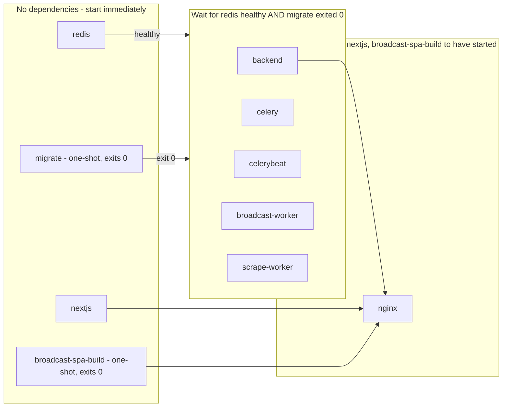

# Containerization

> **Last updated:** 2026-08-03, commit `9a38379`, branch `suite-47-tags-and-filters`

## Overview

The Commons's production stack now runs on Docker Compose. The cutover
(tracked internally as Suite 42) shipped via PR #41, merged 2026-08-02 — the
Oracle Cloud VM runs `docker compose -f docker-compose.yml up -d` today, and
the old per-process systemd units it used to run under (`celery.service`,
`celerybeat.service`, `broadcast-worker.service`, `scrape-worker.service`,
plus gunicorn/nextjs/redis-server which were never tracked as files) are
retired on the box.

What changed, in one paragraph: nginx moved into a container and became the
single ingress for all three subdomains, replacing the host-installed nginx
package; Redis moved into a container (`redis:7-alpine`) with the same
DB-0/DB-1 broker/cache split preserved; Postgres stayed external on Neon in
every environment, exactly as before; and build artifacts (`collectstatic`
output, the compiled broadcast SPA bundle) get baked into images rather than
living on the host filesystem.

One exception worth knowing up front: `deploy/healthcheck.service` +
`.timer` were **never containerized** and still are not. The hourly
watchdog remains a host-level systemd timer; it now shells into the
containers via `docker compose ... exec` instead of touching local
processes directly. "Systemd is retired" means the app-process units —
not this one.

The `deploy/*.service` files (and `deploy/nginx-broadcast.conf.snippet`)
are still physically present in the repo as historical artifacts — they
are not deleted, just no longer what runs in production.

For what's actually running today operationally, see
`human-docs/deploy-ops.md`. The Deep Dive below covers: why each piece was
containerized, the service startup/dependency graph, the compose-to-systemd
mapping, and the sharp edges (footguns) that are still live traps today —
not blockers, but things that will bite an unwary future edit.

## Deep Dive

### What was containerized, and why

The Commons ran, before this cutover, as seven long-lived processes
hand-wired as individual systemd units on a single Oracle Cloud VM, plus a
hand-edited nginx config with no local-dev equivalent at all.
`docs/adr/0001-containerization.md` is the actual design record for the work
described here — this section summarizes it; read the ADR for the full
reasoning and the incidents that motivated it.

Four decisions anchored the design. First, **nginx moved into a container
and became the single ingress** for all three subdomains, replacing the
host-installed nginx package entirely. The Cloudflare origin cert stays a
read-only bind mount rather than something baked into an image layer — a
rotated cert shouldn't require a rebuild, and a private key has no business
inside something that could be pulled or inspected off the VM. The
consequence worth remembering: gunicorn moved from a unix socket to plain
TCP, because a socket path can't cross a container boundary the way nginx
and gunicorn used to share one. That's a strictly weaker isolation posture —
any container on the compose network can now reach port 8000 — accepted as
the standard shape for a containerized nginx-plus-app pair, not an
oversight.

Second, **Redis moved into a container** (`redis:7-alpine`), which was also
the only piece of async infrastructure that had zero local-dev story before
this — it was apt-install-only. Nothing about the DB-0/DB-1 broker/cache
split changed: it was never hardcoded, it falls straight out of
`REDIS_URL` and `REDIS_CACHE_URL`, so pointing both at a containerized
Redis with the same `/0` and `/1` suffixes preserves it untouched.
`requirepass` is kept, sourced the same way it was before, and the
container gets a named volume because DB 0 holds in-flight Celery task
state that an unpersisted restart would silently drop.

Third, **Postgres stays external, on Neon, in every environment** — it was
never a candidate for the compose stack. Neon already provides the actual
restore mechanism (branching, point-in-time recovery); a containerized
Postgres alongside that would just be a second, weaker source of truth for
local dev only. The one consequence: the CI pipeline's pre-migrate `pg_dump`
safety net, which used to depend on a host-installed `postgresql-client`,
now runs from a throwaway `postgres:18-alpine` container invoked for the
duration of the dump and discarded.

Fourth, **build artifacts get baked into images; only real, unrecoverable
state gets a volume.** `collectstatic` output and the compiled broadcast SPA
bundle are both regenerated from source on every build, so baking them in
is strictly safer than a volume — a volume here would let a stale build
survive a fresh deploy. Client-uploaded media, the pre-migrate backup dumps,
and the Playwright debug screenshots/downloads are all volumes, because
losing any of them on a restart destroys something no rebuild can recreate.

Worth noting separately: containerizing this stack also closed the exact
failure class that took the async stack down for eight days starting
2026-07-21 (`docs/prod-incident-2026-07-21-scheduler-outage.md`) — a
snap-packaged `uv run` spawning its child inside a systemd user-session
scope that a post-deploy SSH logout tore down. There's no snap, no
`logind`, no per-user systemd slice inside a container's PID namespace for a
lost SSH session to tear down, so that mitigation (exec the venv binary
directly, plus `loginctl enable-linger`) became moot by construction rather
than by fix. One piece of it is still carried forward for an unrelated
reason: every compose service execs its real binary directly rather than
through a wrapper shell, so the container's PID 1 receives `SIGTERM` on
`docker stop` and shuts down cleanly.

### Service topology

The diagram below shows what starts immediately, what waits on what, and
why — not every dependency edge is drawn individually where five services
share an identical gate; see the callouts underneath.

Four things the diagram can't say on its own:

1. **`migrate` doesn't wait on Redis, deliberately.** It only ever talks to
   Neon over `DATABASE_URL`, so it's grouped with `redis` in the "starts
   immediately" tier rather than gated behind it — the compose file's own
   comment calls this out ("not a Celery service, so it has no reason to wait
   on redis").
2. **All five gated services share the identical two-part gate**, even though
   only the Celery ones use Redis as a broker in the traditional sense.
   `backend` (gunicorn) is gated the same way because Django will 500 on
   nearly every route without a completed migration — not because gunicorn
   itself needs Redis to boot. (It does read `REDIS_CACHE_URL` for the cache
   backend, but nothing in this dependency graph enforces that the cache
   actually round-trips before `backend` starts serving.)
3. **`nginx`'s dependency is the weakest of the three tiers.** Compose's
   default `depends_on` condition — used here with no explicit condition — is
   "has started," not "is healthy" or "is ready to accept traffic." `nginx`
   can come up and start proxying to a `backend` or `nextjs` container that
   is still mid-initialization, unlike the `redis`/`migrate` gate ahead of
   it, which explicitly waits on health and exit status.
4. **`broadcast-spa-build` and `migrate` are both `restart: "no"` one-shots
   that are supposed to exit 0 immediately.** `docker compose ps` showing
   them `Exited (0)` is correct behavior, not a crash — a newcomer running
   `ps` for the first time and seeing two "stopped" containers among a list
   of "running" ones could easily read that as a partial failure.

#### Compose service to systemd unit

| Compose service | Replaced | Notes |
|---|---|---|
| `redis` | `redis-server.service` (apt-installed; no unit file was ever tracked in this repo) | `requirepass` moved from `/etc/redis/redis.conf` into the compose `command:` block, sourced from `REDIS_PASSWORD` in `backendServer/.env`. |
| `migrate` | New — previously a manual `manage.py migrate` step run by hand during deploy | Runs once per deploy as an exiting container instead of a step in a deploy script; also seeds the `django_celery_beat` schedule tables. |
| `backend` | `gunicorn.service` (its unit file, like `nextjs.service`, was apparently never checked into `deploy/` — only referenced by name in `DEPLOY.md` and the ADR) | Switched from a unix socket to TCP `8000`, internal to the compose network only. |
| `celery` | `deploy/celery.service` | Same `ExecStart` command, minus the exec-direct/linger workaround — see the ADR's historical note above. |
| `celerybeat` | `deploy/celerybeat.service` | Same command; still exactly one process, `DatabaseScheduler` keeps the schedule in Postgres. |
| `broadcast-worker` | `deploy/broadcast-worker.service` | Same command, `-c 1` concurrency preserved (mandatory — `recover_orphans()` assumes a single worker). |
| `scrape-worker` | `deploy/scrape-worker.service` | Same command, `-c 1` to keep headless-Chromium memory off the default worker. |
| `nextjs` | `nextjs.service` (also not tracked under `deploy/`) | Unchanged behavior: `node server.js` on port 3000, internal only. |
| `broadcast-spa-build` | New — previously a manual `pnpm run build` step whose `dist/` nginx served directly off the VM filesystem | Build-only helper; never runs as a long-lived process (see diagram callout 4). |
| `nginx` | The host-installed nginx package plus the hand-edited `/etc/nginx/sites-available/thecommons` (previously only tracked as a snippet, `deploy/nginx-broadcast.conf.snippet`) | Full config now lives at `deploy/nginx/thecommons.conf` and is baked into the image; the TLS cert stays a bind mount, never baked in. |
| — | `deploy/healthcheck.service` + `.timer` | **Not replaced.** Still a host-level systemd timer; `deploy/healthcheck.sh` now shells out to `docker compose ... exec` to reach the containers, and degrades to a `WARN` rather than crashing if Docker isn't installed on the host at all. |

Two things stood out while building this table, worth flagging rather than
silently smoothing over: `docs/adr/0001-containerization.md` describes "seven
long-lived systemd units," but only four of them (`celery`, `celerybeat`,
`broadcast-worker`, `scrape-worker`) ever had a tracked unit file under
`deploy/` — `gunicorn.service`, `nextjs.service`, and `redis-server.service`
existed only by reference in `DEPLOY.md` and the ADR, never as files in this
repo. Not a contradiction, just a gap in what was checked in versus what ran
on the box. The `deploy/*.service` files that do exist are still present in
the repo today (`ls deploy/` confirms `celery.service`, `celerybeat.service`,
`broadcast-worker.service`, `scrape-worker.service`, `healthcheck.service`,
`healthcheck.timer`, `healthcheck.sh`, `nginx/`,
`nginx-broadcast.conf.snippet`) — "retired" describes what runs on the
production VM, not what's tracked in git.

### Sharp edges — permanent traps, not cutover blockers

These are live footguns in the current, deployed setup. None of them are
"left to do" — they're behaviors of the tooling that will keep being true
and keep being worth knowing.

**The override file is a loaded footgun on the VM.** `docker-compose.yml`
alone is the production config. A bare `docker compose` invocation with no
`-f` flag auto-loads `docker-compose.override.yml` from the same directory —
that is Compose's default two-file-merge behavior, not a bug — and that
override is explicitly local-dev-only: plain HTTP nginx with no TLS cert at
all, bind mounts remapped to repo-relative `.local-dev/` paths instead of the
real `/home/ubuntu/broadcast/...` directories, and `DJANGO_ENV` forced to
`dev`. Running that combination against the VM would not fail loudly — nginx
would happily bind port 80 in plain HTTP, Django would boot under dev
settings, and the Redis URLs would point at an unauthenticated connection
string that doesn't carry the real `REDIS_PASSWORD` even though the actual
Redis container still expects it (since `.env`'s `REDIS_PASSWORD` is
untouched by the override). The result is a mix of wrong TLS, wrong
hostnames, and a Redis auth mismatch, discovered only once someone notices
the site is serving unencrypted or Celery has gone silent. Every production
command — in `DEPLOY.md`, in CI, run by hand — passes `-f
docker-compose.yml` explicitly for exactly this reason.

**The `.dockerignore` at the repo root exists as much for secrets as for
build speed.** The repo root holds a real private key (`oraclevps.key`) and
`broadcastWeb/` holds a committed certificate. The file's own header records
an empirically verified quirk of this Docker Desktop/buildkit version: a
pattern with no leading `**/` only matches at the exact context-root path,
even with no slash in the pattern — a bare `*.pem` did not exclude a nested
`broadcastWeb/commons-broadcast.pem` in a real test build, only `**/*.pem`
did. That's stricter than plain `.gitignore` semantics, where a no-slash
pattern matches at any depth, and it means every secret-adjacent pattern in
that file deliberately carries the `**/` form rather than the shorter one
someone might "simplify" it down to later.

**`WORKDIR` plus `COPY --chown` does not chown a pre-existing directory.**
`backendServer/Dockerfile` sets `WORKDIR /app` as root before switching to a
non-root user, and `COPY --from=builder --chown=app:app /app /app` only sets
ownership on the files it copies in — the `/app` directory itself, created
earlier by `WORKDIR`, stays root-owned unless something says otherwise. The
Dockerfile carries an explicit `chown app:app /app` specifically to avoid
`collectstatic` failing with `EACCES` trying to create
`staticfiles_build/` under a directory it can't write to — this is prior
history in this repo, not a hypothetical, and the fix is already in place,
but the trap reappears instantly if a future edit reorders those two lines.

**A Docker Desktop proxy can corrupt large apt fetches as "Hash Sum
mismatch."** Both stages of `backendServer/Dockerfile` that touch apt write
`Acquire::Retries "3"` and disable HTTP pipelining before installing
anything, specifically because the Playwright stage's `--with-deps` fetch is
large enough to trip this locally, and the failure reads like package
corruption on a different package each run rather than what it actually is —
a proxy mangling a large or pipelined response. Anyone debugging an
inexplicable, non-reproducible apt failure inside these images should look
here before assuming a broken mirror.

**Building `nginx` in isolation doesn't work.** `deploy/nginx/Dockerfile`
consumes two Buildx named build contexts — `backend-static` and
`broadcast-spa`, bound in `docker-compose.yml` to the `backend` and
`broadcast-spa-build` services respectively — to pull in `collectstatic`
output and the compiled broadcast bundle. A standalone `docker build -f
deploy/nginx/Dockerfile deploy/nginx` has no way to resolve those names and
fails; `docker compose build nginx` (verified to build the two named-context
services first even when only `nginx` is requested) is the only supported
path.

**Frontend build args are a separate mechanism from runtime env, and mixing
them up produces a build that "succeeds" with the wrong values baked in.**
`nextjs` and `broadcast-spa-build` inline their `NEXT_PUBLIC_*`/`VITE_*`
values at build time via Compose variable interpolation, which only reads
the shell environment or a root-level `.env` next to `docker-compose.yml` —
it cannot read `theCommonsWeb/.env.local` or `broadcastWeb/.env` directly,
even though those are the files that actually hold the real values. Every
build arg has a safe placeholder default so `docker compose build` always
succeeds with zero setup, which is exactly the trap: a real prod build that
skips sourcing the real files and re-exporting them under the
`NEXTJS_BUILD_*`/`BROADCAST_BUILD_*` names will build cleanly and ship a
broadcast bundle silently misrouting every API call. CI already greps the
compiled bundle for a `thecommons.town` origin as a guard, but that guard
only exists in the CI job — a manual build on the VM has no equivalent
safety net.

### Cutover — resolved, historical

The cutover landed via PR #41 (merged 2026-08-02). The blockers that were
tracked ahead of it are all resolved as of that merge:

- `backendServer/.env` on prod now points `REDIS_URL` and `REDIS_CACHE_URL`
  at the `redis` compose service with the real password embedded, rather
  than `localhost`/`127.0.0.1` — the failure mode this avoided (Celery
  silently connecting to nothing while everything synchronous stayed green)
  was the same shape as the 2026-07-21 outage, which is why it was called
  out ahead of time rather than discovered after.
- `DJANGO_ALLOWED_HOSTS` is set in prod's `.env`; `prod.py`'s bare
  `os.environ["DJANGO_ALLOWED_HOSTS"]` no longer crashes backend/Celery
  containers at boot.
- The VM has Docker Engine and the Compose v2 plugin installed, and the
  deploy user is in the `docker` group.
- `.github/workflows/ci.yml`'s `deploy` job (gated on
  `needs: [backend, frontend-commons, frontend-broadcast]`, triggered on
  push to `main`) runs `docker compose -f docker-compose.yml build` and
  `up -d` over SSH against the VM, and this now succeeds — the VM prep
  above was the precondition, and it's done. This is no longer a landmine
  waiting for the next merge.
- The persistent host directories the compose file bind-mounts into
  (media, broadcast screenshots/downloads, the backups directory) exist
  and are writable by uid 1000, matching the images' non-root `app` user.
- The Cloudflare origin cert is in place at
  `/etc/ssl/cloudflare/thecommons.town.{pem,key}` for the container nginx
  to bind 443.
- The cutover itself — stopping the host nginx and starting the container
  one — has happened and been verified live; see
  `human-docs/deploy-ops.md` for current operational detail (restart
  procedures, log locations, monitoring) now that this is the live stack.
- Resource footprint on the Oracle VM (1 OCPU / 6 GB) with six long-running
  containers plus two Playwright-capable images has been running in
  production since 2026-08-02 without a resource-driven incident; the
  `mem_limit` values on the Celery workers reflect what's actually in use,
  not pre-cutover guesses.

## Fold or keep standalone

**Recommendation: fold this doc's still-true content into
`human-docs/deploy-ops.md` and retire this file**, rather than keeping two
docs describing the same production system in parallel. The rationale in
the original "when to delete this doc" section holds even more now that the
cutover is real: this file's Overview/Deep Dive split (why containerized,
topology, sharp edges) is exactly the kind of detail `deploy-ops.md` should
own once there is no longer a "before/after" story to keep separate — there
is only one system running in prod now. The ADR
(`docs/adr/0001-containerization.md`) remains the permanent historical
record of the *decision*; this doc's job of narrating a not-yet-real future
plan is done. Recommend the orchestrator fold the "Service topology,"
"Compose service to systemd unit," and "Sharp edges" subsections into
`deploy-ops.md` and delete this file, keeping `deploy-ops.md` as the single
source of truth for the running production stack.
