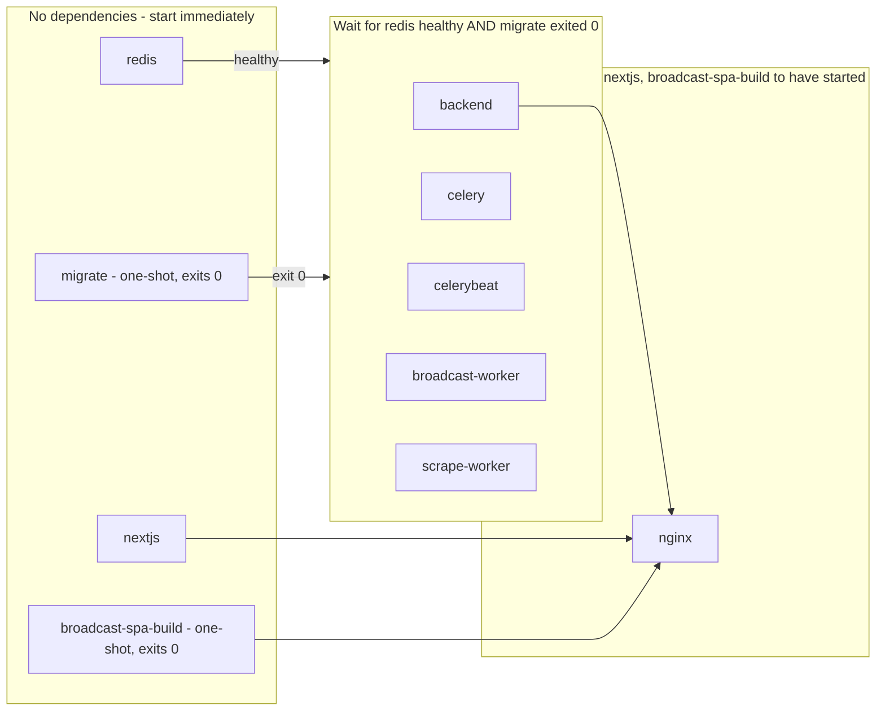

# Containerization — status

> **PROVISIONAL — written 2026-08-01, against commit `5fe7a45`.** Every file
> this doc describes was **uncommitted** in the working tree at the time of
> writing (tracked internally as Suite 42, status "Needs QA"): `docker-compose.yml`,
> `docker-compose.override.yml`, `backendServer/Dockerfile`, `Dockerfile.frontend`,
> both `.dockerignore` files, `deploy/nginx/` (`Dockerfile` + `thecommons.conf`),
> `docs/adr/0001-containerization.md`, and a Docker-first rewrite of `DEPLOY.md`.
> Treat anything here as accurate only up to that commit and that uncommitted
> snapshot — if the working tree has moved since, re-read the source files
> before trusting a claim in this doc over the code.
>
> **Built and verified locally end-to-end. Not deployed.** The production VM
> has no Docker Engine installed and still runs the systemd units in `deploy/`
> — nothing described below is live. This doc is a placeholder: once the
> cutover actually lands, it should either be promoted into a proper handoff
> report or folded into `human-docs/deploy-ops.md` (see the closing section).
> `human-docs/deploy-ops.md` covers what's running today, in production, right
> now — this doc covers what's coming. Read that one first if you're trying to
> fix something in prod this minute.

## What was containerized, and why

The Commons runs today as seven long-lived processes hand-wired as individual
systemd units on a single Oracle Cloud VM, plus a hand-edited nginx config
with no local-dev equivalent at all. `docs/adr/0001-containerization.md` is
the actual design record for the work described here — this section
summarizes it; read the ADR for the full reasoning and the incidents that
motivated it.

Four decisions anchor the design. First, **nginx moves into a container and
becomes the single ingress** for all three subdomains, replacing the
host-installed nginx package entirely. The Cloudflare origin cert stays a
read-only bind mount rather than something baked into an image layer — a
rotated cert shouldn't require a rebuild, and a private key has no business
inside something that could be pulled or inspected off the VM. The
consequence worth remembering: gunicorn moves from a unix socket to plain
TCP, because a socket path can't cross a container boundary the way nginx and
gunicorn share one today. That's a strictly weaker isolation posture — any
container on the compose network can now reach port 8000 — accepted as the
standard shape for a containerized nginx-plus-app pair, not an oversight.

Second, **Redis moves into a container** (`redis:7-alpine`), which is also
the only piece of async infrastructure that currently has zero local-dev
story — it's apt-install-only today. Nothing about the DB-0/DB-1 broker/cache
split changes: it was never hardcoded, it falls straight out of `REDIS_URL`
and `REDIS_CACHE_URL`, so pointing both at a containerized Redis with the
same `/0` and `/1` suffixes preserves it untouched. `requirepass` is kept,
sourced the same way it is today, and the container gets a named volume
because DB 0 holds in-flight Celery task state that an unpersisted restart
would silently drop.

Third, **Postgres stays external, on Neon, in every environment** — it was
never a candidate for the compose stack. Neon already provides the actual
restore mechanism (branching, point-in-time recovery); a containerized
Postgres alongside that would just be a second, weaker source of truth for
local dev only. The one consequence: the CI pipeline's pre-migrate `pg_dump`
safety net, which today depends on a host-installed `postgresql-client`,
moves to a throwaway `postgres:18-alpine` container invoked for the duration
of the dump and discarded.

Fourth, **build artifacts get baked into images; only real, unrecoverable
state gets a volume.** `collectstatic` output and the compiled broadcast SPA
bundle are both regenerated from source on every build, so baking them in is
strictly safer than a volume — a volume here would let a stale build survive
a fresh deploy. Client-uploaded media, the pre-migrate backup dumps, and the
Playwright debug screenshots/downloads are all volumes, because losing any of
them on a restart destroys something no rebuild can recreate.

Worth noting separately: containerizing this stack also closes the exact
failure class that took the async stack down for eight days starting
2026-07-21 (`docs/prod-incident-2026-07-21-scheduler-outage.md`) — a
snap-packaged `uv run` spawning its child inside a systemd user-session scope
that a post-deploy SSH logout tore down. There's no snap, no `logind`, no
per-user systemd slice inside a container's PID namespace for a lost SSH
session to tear down, so that mitigation (exec the venv binary directly, plus
`loginctl enable-linger`) becomes moot by construction rather than by fix.
One piece of it is still carried forward for an unrelated reason: every
compose service execs its real binary directly rather than through a wrapper
shell, so the container's PID 1 receives `SIGTERM` on `docker stop` and shuts
down cleanly.

## Service topology

The diagram below shows what starts immediately, what waits on what, and
why — not every dependency edge is drawn individually where five services
share an identical gate; see the callouts underneath.

Four things the diagram can't say on its own:

1. **`migrate` doesn't wait on Redis, deliberately.** It only ever talks to
   Neon over `DATABASE_URL`, so it's grouped with `redis` in the "starts
   immediately" tier rather than gated behind it — the compose file's own
   comment calls this out ("not a Celery service, so it has no reason to wait
   on redis").
2. **All five gated services share the identical two-part gate**, even though
   only the Celery ones use Redis as a broker in the traditional sense.
   `backend` (gunicorn) is gated the same way because Django will 500 on
   nearly every route without a completed migration — not because gunicorn
   itself needs Redis to boot. (It does read `REDIS_CACHE_URL` for the cache
   backend, but nothing in this dependency graph enforces that the cache
   actually round-trips before `backend` starts serving.)
3. **`nginx`'s dependency is the weakest of the three tiers.** Compose's
   default `depends_on` condition — used here with no explicit condition — is
   "has started," not "is healthy" or "is ready to accept traffic." `nginx`
   can come up and start proxying to a `backend` or `nextjs` container that
   is still mid-initialization, unlike the `redis`/`migrate` gate ahead of
   it, which explicitly waits on health and exit status.
4. **`broadcast-spa-build` and `migrate` are both `restart: "no"` one-shots
   that are supposed to exit 0 immediately.** `docker compose ps` showing
   them `Exited (0)` is correct behavior, not a crash — a newcomer running
   `ps` for the first time and seeing two "stopped" containers among a list
   of "running" ones could easily read that as a partial failure.

### Compose service to systemd unit

| Compose service | Replaces | Notes |
|---|---|---|
| `redis` | `redis-server.service` (apt-installed; no unit file was ever tracked in this repo) | `requirepass` moves from `/etc/redis/redis.conf` into the compose `command:` block, sourced from `REDIS_PASSWORD` in `backendServer/.env`. |
| `migrate` | New — previously a manual `manage.py migrate` step run by hand during deploy | Runs once per deploy as an exiting container instead of a step in a deploy script; also seeds the `django_celery_beat` schedule tables. |
| `backend` | `gunicorn.service` (its unit file, like `nextjs.service`, was apparently never checked into `deploy/` — only referenced by name in `DEPLOY.md` and the ADR) | Switches from a unix socket to TCP `8000`, internal to the compose network only. |
| `celery` | `deploy/celery.service` | Same `ExecStart` command, minus the exec-direct/linger workaround — see the ADR's historical note above. |
| `celerybeat` | `deploy/celerybeat.service` | Same command; still exactly one process, `DatabaseScheduler` keeps the schedule in Postgres. |
| `broadcast-worker` | `deploy/broadcast-worker.service` | Same command, `-c 1` concurrency preserved (mandatory — `recover_orphans()` assumes a single worker). |
| `scrape-worker` | `deploy/scrape-worker.service` | Same command, `-c 1` to keep headless-Chromium memory off the default worker. |
| `nextjs` | `nextjs.service` (also not tracked under `deploy/`) | Unchanged behavior: `node server.js` on port 3000, internal only. |
| `broadcast-spa-build` | New — previously a manual `pnpm run build` step whose `dist/` nginx served directly off the VM filesystem | Build-only helper; never runs as a long-lived process (see diagram callout 4). |
| `nginx` | The host-installed nginx package plus the hand-edited `/etc/nginx/sites-available/thecommons` (previously only tracked as a snippet, `deploy/nginx-broadcast.conf.snippet`) | Full config now lives at `deploy/nginx/thecommons.conf` and is baked into the image; the TLS cert stays a bind mount, never baked in. |
| — | `deploy/healthcheck.service` + `.timer` | **Not replaced.** Still a host-level systemd timer; `deploy/healthcheck.sh` now shells out to `docker compose ... exec` to reach the containers, and degrades to a `WARN` rather than crashing when Docker isn't installed on the host at all. |

Two things stood out while building this table, worth flagging rather than
silently smoothing over: `docs/adr/0001-containerization.md` describes "seven
long-lived systemd units," but only four of them (`celery`, `celerybeat`,
`broadcast-worker`, `scrape-worker`) actually have a tracked unit file under
`deploy/` — `gunicorn.service`, `nextjs.service`, and `redis-server.service`
exist only by reference in `DEPLOY.md` and the ADR, not as files in this
repo. Not a contradiction, just a gap in what's checked in versus what runs
on the box.

## Sharp edges already known

**The override file is a loaded footgun on the VM.** `docker-compose.yml`
alone is the production config. A bare `docker compose` invocation with no
`-f` flag auto-loads `docker-compose.override.yml` from the same directory —
that is Compose's default two-file-merge behavior, not a bug — and that
override is explicitly local-dev-only: plain HTTP nginx with no TLS cert at
all, bind mounts remapped to repo-relative `.local-dev/` paths instead of the
real `/home/ubuntu/broadcast/...` directories, and `DJANGO_ENV` forced to
`dev`. Running that combination against the VM would not fail loudly — nginx
would happily bind port 80 in plain HTTP, Django would boot under dev
settings, and the Redis URLs would point at an unauthenticated connection
string that doesn't carry the real `REDIS_PASSWORD` even though the actual
Redis container still expects it (since `.env`'s `REDIS_PASSWORD` is
untouched by the override). The result is a mix of wrong TLS, wrong
hostnames, and a Redis auth mismatch, discovered only once someone notices
the site is serving unencrypted or Celery has gone silent. Every production
command — in `DEPLOY.md`, in CI, run by hand — passes `-f
docker-compose.yml` explicitly for exactly this reason.

**The `.dockerignore` at the repo root exists as much for secrets as for
build speed.** The repo root holds a real private key (`oraclevps.key`) and
`broadcastWeb/` holds a committed certificate. The file's own header records
an empirically verified quirk of this Docker Desktop/buildkit version: a
pattern with no leading `**/` only matches at the exact context-root path,
even with no slash in the pattern — a bare `*.pem` did not exclude a nested
`broadcastWeb/commons-broadcast.pem` in a real test build, only `**/*.pem`
did. That's stricter than plain `.gitignore` semantics, where a no-slash
pattern matches at any depth, and it means every secret-adjacent pattern in
that file deliberately carries the `**/` form rather than the shorter one
someone might "simplify" it down to later.

**`WORKDIR` plus `COPY --chown` does not chown a pre-existing directory.**
`backendServer/Dockerfile` sets `WORKDIR /app` as root before switching to a
non-root user, and `COPY --from=builder --chown=app:app /app /app` only sets
ownership on the files it copies in — the `/app` directory itself, created
earlier by `WORKDIR`, stays root-owned unless something says otherwise. The
Dockerfile carries an explicit `chown app:app /app` specifically to avoid
`collectstatic` failing with `EACCES` trying to create
`staticfiles_build/` under a directory it can't write to — this is prior
history in this repo, not a hypothetical, and the fix is already in place,
but the trap reappears instantly if a future edit reorders those two lines.

**A Docker Desktop proxy can corrupt large apt fetches as "Hash Sum
mismatch."** Both stages of `backendServer/Dockerfile` that touch apt write
`Acquire::Retries "3"` and disable HTTP pipelining before installing
anything, specifically because the Playwright stage's `--with-deps` fetch is
large enough to trip this locally, and the failure reads like package
corruption on a different package each run rather than what it actually is —
a proxy mangling a large or pipelined response. Anyone debugging an
inexplicable, non-reproducible apt failure inside these images should look
here before assuming a broken mirror.

**Building `nginx` in isolation doesn't work.** `deploy/nginx/Dockerfile`
consumes two Buildx named build contexts — `backend-static` and
`broadcast-spa`, bound in `docker-compose.yml` to the `backend` and
`broadcast-spa-build` services respectively — to pull in `collectstatic`
output and the compiled broadcast bundle. A standalone `docker build -f
deploy/nginx/Dockerfile deploy/nginx` has no way to resolve those names and
fails; `docker compose build nginx` (verified to build the two named-context
services first even when only `nginx` is requested) is the only supported
path.

**Frontend build args are a separate mechanism from runtime env, and mixing
them up produces a build that "succeeds" with the wrong values baked in.**
`nextjs` and `broadcast-spa-build` inline their `NEXT_PUBLIC_*`/`VITE_*`
values at build time via Compose variable interpolation, which only reads
the shell environment or a root-level `.env` next to `docker-compose.yml` —
it cannot read `theCommonsWeb/.env.local` or `broadcastWeb/.env` directly,
even though those are the files that actually hold the real values. Every
build arg has a safe placeholder default so `docker compose build` always
succeeds with zero setup, which is exactly the trap: a real prod build that
skips sourcing the real files and re-exporting them under the
`NEXTJS_BUILD_*`/`BROADCAST_BUILD_*` names will build cleanly and ship a
broadcast bundle silently misrouting every API call. CI already greps the
compiled bundle for a `thecommons.town` origin as a guard, but that guard
only exists in the CI job — a manual build on the VM has no equivalent
safety net.

## What's left before this is real

The three blockers already known going in: `backendServer/.env`'s
`REDIS_URL` and `REDIS_CACHE_URL` still point at `localhost`/`127.0.0.1`,
which inside a container is the container itself — Celery would silently
connect to nothing and no task would ever run, while everything synchronous
stayed green, the same failure shape as the 2026-07-21 outage. Both need to
repoint at the `redis` compose service with the real password embedded.
`DJANGO_ALLOWED_HOSTS` must be present in that same file — `prod.py` does a
bare `os.environ["DJANGO_ALLOWED_HOSTS"]` with no default, so its absence
crashes every backend/Celery container at boot, not just one. And the VM
itself needs one-time prep — Docker Engine and the Compose v2 plugin
installed, and the deploy user added to the `docker` group — before the
first automated container deploy can run at all.

Beyond those three, reading the actual compose file and CI workflow surfaced
more:

- **The CI deploy job is already wired for containers, and the VM isn't
  ready for it.** `.github/workflows/ci.yml`'s `deploy` job — gated on
  `needs: [backend, frontend-commons, frontend-broadcast]` and triggered only
  on a push to `main` — already runs `docker compose -f docker-compose.yml
  build` and `up -d` over SSH. That means the very next merge to `main` after
  this branch lands will fail that step outright (`docker: command not
  found`) unless the VM prep above happens first. This fails loudly rather
  than silently — the deploy job errors out — but it's still a live landmine
  worth flagging before anyone merges, not something to discover from a red
  CI run.
- The persistent host directories the compose file bind-mounts into
  (media, broadcast screenshots/downloads, the backups directory) need to
  exist and be writable by uid 1000 before the first `up`, matching the
  images' non-root `app` user.
- The Cloudflare origin cert needs to already be in place at
  `/etc/ssl/cloudflare/thecommons.town.{pem,key}` for the container nginx to
  bind 443 at all — this isn't new (the same cert the host nginx uses today),
  but the container won't start without it being reachable at that exact
  path.
- The actual cutover moment — stopping the host nginx and starting the
  container one — is a single step where two processes briefly cannot both
  hold ports 80/443, and it's the one step in the whole plan where a mistake
  produces an immediate, visible outage rather than a quiet misconfiguration.
  It has not been rehearsed against the real VM; everything verified so far
  has been local-only.
- Nothing here has been run against the actual Oracle VM's resource limits (1
  OCPU / 6 GB) — six long-running containers plus two Playwright-capable
  images is a meaningfully different memory footprint than seven bare
  systemd processes, and that has not been measured, only asserted via
  `mem_limit` guesses on the Celery workers.

## When to delete this doc

This file is provisional by design and should not accumulate history. Once
the VM cutover has actually happened and been verified — containers running
in production, the old systemd units retired, the blockers above resolved —
do one of two things, not both: either promote this into a proper handoff
report under `human-docs/` with its own verified sharp edges from real
production operation, or fold whatever's still true into
`human-docs/deploy-ops.md` and delete this file outright. Don't leave it
sitting alongside a working `deploy-ops.md` describing the same system twice.
