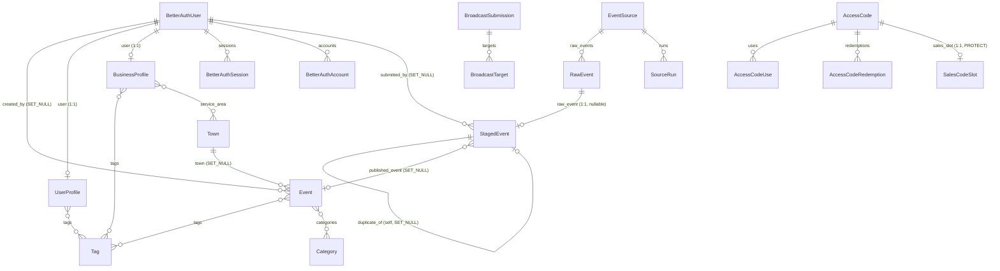
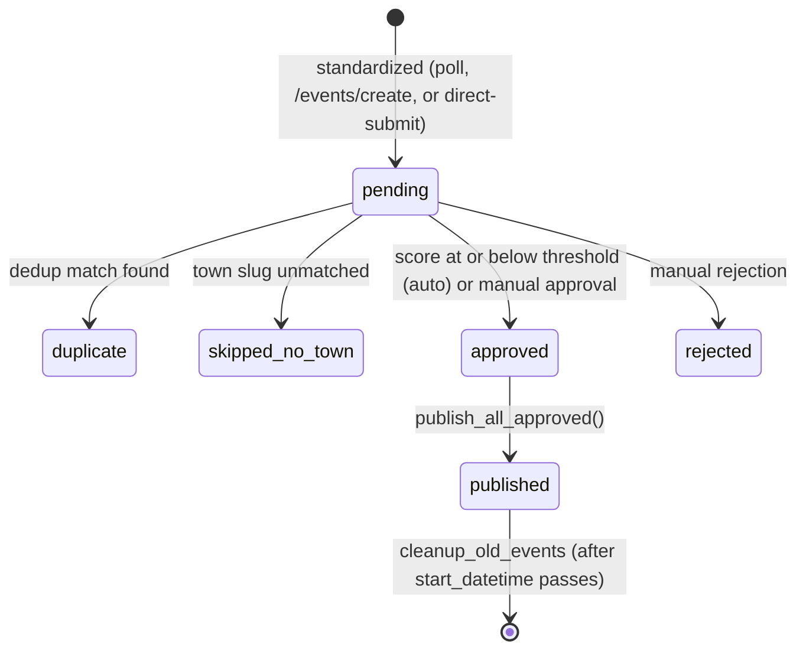

# Data Model Reference

*Reflects commit `5fe7a45`, 2026-08-01. Grounded in each app's `models.py` and `migrations/`
(`accounts`, `events`, `newsletter`, `ingestion`, `broadcast`), plus `theCommonsWeb/src/lib/auth-schema.ts`
for the Better Auth side. If anything here contradicts the code, trust the code — a couple of
places where `ARCHITECTURE.md` §Data Models has drifted are called out in §9.*

This is the reference doc, not the narrative one — for the story of how an event moves through
the system, read `overview.md` first. This doc exists so you can keep a tab open and look up
"what does this column actually mean" without re-reading a `models.py`.

## 1. The short version

Five Django apps in `backendServer/` own the `public` Postgres schema between them —
`events`, `ingestion`, `accounts`, `newsletter`, `broadcast` — plus five more models that
`accounts` merely *mirrors*, read-only, out of a `neon_auth` schema that belongs to Better Auth
(the Next.js identity provider, not Django). A recent refactor (Suite 41) moved several models
between apps without moving their physical tables — §8 explains exactly what that means and why
a table name and its owning Django app no longer match for three of these models. `Town` and
`Category` are real SQL tables, not hardcoded choices — nothing in the codebase should treat them
as enums, and the ingestion pipeline silently parks (not drops) any event whose town slug doesn't
match a row.

## 2. How the models relate

Two things this diagram deliberately leaves out, because they aren't foreign keys:

- **`NewsletterSubscriber` has no relationship line to `UserProfile`.** There isn't one in the
  database — see §5 and the sharp edge in §10.
- **`broadcast`'s models never point at `events`, `accounts`, or `ingestion` models**, and vice
  versa. That's not an omission — `broadcast/routing.py` is contractually forbidden from
  importing `events`, and the whole app operates on its own denormalized copy of an event's
  fields (`BroadcastSubmission`'s title/datetime/venue/etc. columns) rather than a foreign key
  into `Event`. `BroadcastAccess` and `BroadcastImage` are standalone rows keyed by a plain
  string (email, client_label) for the same reason — no FK anywhere in the picture.

## 3. `events` app

Owns the genuine event/taxonomy models — the public-facing data. All four tables are physically
in `public.events_*`, and the app label matches the table prefix here (unlike `accounts` and
`newsletter` — see §8).

### `Tag`

| Field | Meaning |
|---|---|
| `name` | Unique, free-text. Lowercased by convention at write time (`ingestion.services` does `tag_name.strip().lower()` before `get_or_create`), not enforced by the field itself. |

Reverse-related from `Event.tags`, `UserProfile.tags`, `BusinessProfile.tags` — one shared tag
vocabulary across events, personal interests, and business listings.

### `Town`

| Field | Meaning |
|---|---|
| `slug` | Unique, e.g. `carrboro`. This is the join key the ingestion pipeline computes from the LLM's free-text town guess (`town.lower().replace(" ", "-")`) — see §10. |
| `name` | Display name, e.g. `Carrboro`. |

A real SQL table, not an enum — seeded by data migrations (`events/migrations/0016_seed_chatham_towns.py`, `0018_seed_apex_durham_towns.py`), editable in the admin. Adding a new town is a data change, not a code change.

### `Category`

| Field | Meaning |
|---|---|
| `slug` | Unique (`SlugField`). |
| `display_name` | Human label. |

Same story as `Town` — a real table (`Meta.verbose_name_plural = "categories"` is the only
non-default option), not hardcoded. Unlike `Town`, an unmatched category slug does **not** stall
an event's publication — see §10.

### `Event`

| Field | Meaning |
|---|---|
| `uuid` | **Primary key.** Not `id` — see §10, the single most-hit trap in this codebase. |
| `title`, `venue`, `description`, `price`, `photo`, `link` | Plain content fields; `price` is nullable (no price listed, not "$0"). |
| `date` | Indexed (`db_index=True`) — this is the field every list/window query filters and sorts on. |
| `town` | FK → `Town`, `SET_NULL` — an event survives its town row being deleted, just loses the association. |
| `tags`, `categories` | M2M → `Tag`, `Category`. |
| `is_verified` | `True` only when the submitter was an authenticated user with `user_type="BUSINESS"` at publish time (`ingestion.services`) — not a manual admin toggle, not related to safety scoring. |
| `source_name` | Free text describing provenance: the originating `EventSource.name` for scraped events, `"Community Submission"` for anonymous `/events/create` posts, `"Direct submission by {organizer}"` / `"Direct submission by host"` for the broadcast direct-submit path. |
| `created_by` | FK → `accounts.BetterAuthUser`, `SET_NULL`, `db_constraint=False` (see §8 for why FKs into the mirrors never carry a DB-level constraint). Null for pipeline-ingested events — this is how you tell "someone submitted this" from "the scraper found this." |

There is no soft-delete or unpublish concept: an `Event` row existing *is* what "published"
means. Only the owner (`created_by`) can hard-delete their own event via the API.

## 4. `ingestion` app

The pipeline that produces `Event` rows from external sources. Full flow narrative lives in
`overview.md` §3 and `ingestion.md`; this section is field-level reference.

### `EventSource`

| Field | Meaning |
|---|---|
| `source_type` | One of `ics`, `scraper`, `http`, `email`, `direct`. `direct` doesn't get polled at all — it exists so direct-submit's synthetic `RawEvent`s have a `source` FK to point at, same as every other row. |
| `active` | Poll loop skips inactive sources. |
| `last_polled` | Null = never successfully polled yet. |
| `poll_interval_hours` | Minimum gap between polls for this source, default 24. |
| `prompt_suffix` | Extra text appended to the Gemini standardization prompt for this source specifically — a per-source LLM tuning knob. |
| `scraper_key` | Looks up the corresponding Python scraper module for `source_type="scraper"`; blank for other types. |

### `SourceRun`

| Field | Meaning |
|---|---|
| `status` | `ok` / `failed` / `refused` / `skipped` — one row per poll attempt, for observability (this table isn't in `ARCHITECTURE.md`'s Data Models section — see §9). |
| `trigger` | `scheduled` / `probe` / `manual` — how the run was kicked off. |
| `items_fetched` / `items_new` / `items_duplicate` | Counts from that single run. |
| `finished_at` | Null while the run is still in progress (or if it crashed hard enough not to reach the finally block). |
| `error_class`, `error_message`, `traceback` | Populated only on `status="failed"`. |

Ordered `-started_at` by default; indexed on `(source, -started_at)` for the "recent runs for
this source" query the admin/monitoring views use.

### `RawEvent`

| Field | Meaning |
|---|---|
| `source` | FK → `EventSource`. |
| `raw_*` fields | Exactly what was scraped/submitted, before any LLM cleanup. |
| `source_uid` | The feed's own per-item identifier (an ICS `UID`) for scraped sources; the client-generated `draft_id` string for direct-submit rows. `unique_together=(source, source_uid)` is what makes direct-submit idempotent — resubmitting the same `draft_id` upserts instead of creating a duplicate row. |
| `raw_organizer` | Only populated by direct host submissions; drives the `"Direct submission by {name}"` attribution on the eventual `Event.source_name`. Blank for everything else. |
| `processed` | Flips to `True` once `standardizer.py` has consumed it into a `StagedEvent`. |

### `StagedEvent`

| Field | Meaning |
|---|---|
| `raw_event` | OneToOne → `RawEvent`, **nullable** — null for events entered via the plain `/events/create` form, since those skip the raw/standardize step entirely and go straight to a pending `StagedEvent`. |
| `town`, `category` | Plain strings (an LLM's best guess, or a user's typed value), **not foreign keys** — see §10 for what happens when they don't match a real row. |
| `tags` | `JSONField`, a list of tag-name strings — converted to real `Tag` rows only at publish time via `get_or_create`. |
| `status` | `pending` / `approved` / `rejected` / `duplicate` / `published` / `skipped_no_town`. See the state diagram below — `published` is terminal but the row is **not deleted**, because it's part of the deduplicator's matching corpus (`deduplicator.CANDIDATE_STATUSES` includes `pending`, `approved`, `duplicate`, `published`, and `skipped_no_town` — everything except `rejected`). Rows are eventually reaped by `cleanup_old_events` once `start_datetime` is in the past. |
| `safety_score` | **Nullable, and the null-vs-value distinction matters.** `null` = not yet scored by Gemini. A non-null value with `status="pending"` means it *was* scored and came back above `SAFETY_SCORE_THRESHOLD` (default `0.3`) — held for manual review, not rejected. `<= SAFETY_SCORE_THRESHOLD` triggers auto-approval instead. There is no separate "held for review" status value; it's this null/non-null-plus-pending combination. |
| `duplicate_of` | Self-FK, `SET_NULL`. Set alongside `status="duplicate"` when the deduplicator (`thefuzz`) matches this row against an existing `StagedEvent`. |
| `published_event` | FK → `events.Event`, `SET_NULL`. Normally non-null only once `status="approved"` flips to `"published"` — **except** on a direct-submission re-edit that lands on `duplicate` or gets re-parked `pending`/`skipped_no_town`: in that case `published_event` still points at the *previously* published `Event`, because `Event` has no unpublish mechanism and the row must not orphan a live listing just because its latest edit didn't clear the gate. Don't assume `published_event != null` implies `status` is `approved` or `published`. |
| `submitted_by` | FK → `accounts.BetterAuthUser`, `SET_NULL`, `db_constraint=False`. Null for pipeline-ingested and anonymous direct-submit events. |

One thing the state diagram can't say: **`duplicate`, `skipped_no_town`, and even `pending`
are not necessarily dead ends** for a row created via direct-submit re-editing — the row can
carry a `published_event` pointer even while parked in one of those statuses, per the
`published_event` row above. The diagram shows the primary transitions; that pointer is a side
channel that survives them.

## 5. `accounts` app

Owns identity: the five read-only Better Auth mirrors, plus the two profile models that hang
off a user. A "business" is modeled as a *kind of user profile*, not a separate top-level
concept.

### The Better Auth mirrors (`neon_auth` schema, `managed = False`)

**Better Auth, running inside the `theCommonsWeb` Next.js app, owns writes to these five
tables — Django never migrates them.** `theCommonsWeb/src/lib/auth-schema.ts` (Drizzle) is the
actual source of truth for their shape; the Django models below exist purely so the ORM can join
against them. Each model's `db_table` uses a deliberate double-quote trick —
`'neon_auth"."user'` — so Django emits a valid cross-schema reference (`FROM "neon_auth"."user"`)
without Django having first-class multi-schema support.

| Model | Table | Key fields | Notes |
|---|---|---|---|
| `BetterAuthUser` | `neon_auth.user` | `id` (UUID PK), `email` (unique), `email_verified`, `user_type` | Hardcodes `is_authenticated = True` / `is_anonymous = False` as class attributes so DRF permission classes treat an instance as a real authenticated user. |
| `BetterAuthSession` | `neon_auth.session` | `id` (text PK), `token` (unique), `expires_at`, `user_id` | `user_id` is a plain `TextField`, not a UUID FK column — see the sharp edge below. |
| `BetterAuthAccount` | `neon_auth.account` | `id` (text PK), `provider_id`, `user_id` (UUID), `password` | One row per sign-in method per user. For the `credential` provider (email+password), `password` holds the hashed credential — null for OAuth-provider rows. |
| `BetterAuthVerification` | `neon_auth.verification` | `identifier`, `value`, `expires_at` | Email-verification / password-reset tokens. |
| `BetterAuthJwks` | `neon_auth.jwks` | `public_key`, `private_key` | The signing keyset Django's JWKS client fetches to verify JWTs — see `auth.md`. |

Every FK from a Django-managed model into one of these mirrors is declared with
`db_constraint=False` — there is no database-level foreign key against an unmanaged table, only
an application-level one. `BetterAuthUser.id` is a UUID, but `BetterAuthAccount.user_id` and
`BetterAuthSession.user_id` are plain `TextField`/`UUIDField` columns rather than declared FKs to
`BetterAuthUser.id` at the Django level (the join happens through matching values, mirroring
however Better Auth itself models it in Postgres).

### `UserProfile`

| Field | Meaning |
|---|---|
| `user` | OneToOne → `BetterAuthUser`, `db_constraint=False`. |
| `uuid` | A separate identifier from `user.id` — used in URLs/serializers where you don't want to expose the Better Auth user id directly. |
| `user_type` | `LOCAL` / `BUSINESS` / `VENUE`. Drives `Event.is_verified` at publish time (see §3) and gates the business-listing endpoints. |
| `primary_city`, `address` | Free text, both blank-allowed. |
| `email_preference` | `WEEKLY` / `MONTHLY` / `NEVER`. Writing this via `PATCH /auth/me` is what triggers the `NewsletterSubscriber` sync described in §10. |
| `tags` | M2M → `events.Tag` — this user's interest tags, read by `newsletter._build_recipients` to filter their digest. |

`db_table = "events_userprofile"` — the physical table name still says `events`, because this
model *moved apps* without moving tables. See §8.

### `BusinessProfile`

| Field | Meaning |
|---|---|
| `user` | OneToOne → `BetterAuthUser`. |
| `business_name`, `description`, `contact_email`, `contact_phone` | Listing content. |
| `is_published` | Gates visibility on the public `/businesses` list — an unpublished listing is only visible to its owner. |
| `tags` | M2M → `events.Tag`. |
| `service_area` | M2M → `events.Town` — which towns this business serves; drives filtering on the business directory. |

`db_table = "events_businessprofile"` — same historical-name situation as `UserProfile`.

## 6. `newsletter` app

### `NewsletterSubscriber`

| Field | Meaning |
|---|---|
| `email` | Unique. The only identity a subscriber needs — **no FK to `UserProfile` or `BetterAuthUser`.** Anonymous subscribers (no account) and account holders alike get a row here; the two are correlated only by matching `email` string, case-insensitively, at read time in `newsletter._build_recipients` (see §10). |
| `frequency` | `WEEKLY` / `MONTHLY`. |
| `is_active` | `False` = unsubscribed. A `PATCH /newsletter/manage` with `frequency=NEVER` sets this rather than deleting the row, preserving history and the `manage_token`. |
| `manage_token` | `UUIDField`, unique, unguessable — the entire authentication mechanism for the login-free manage/unsubscribe link (`/newsletter/manage?token=...`). Anyone holding the token can read or change that one subscription; nothing else. |
| `subscribed_at` | Set once on creation (`auto_now_add`), not touched on re-subscribe. |

`db_table = "events_newslettersubscriber"` — moved apps, table name unchanged. See §8.

## 7. `broadcast` app

Pushes a published event out to third-party town calendars. Its models never reference
`events`, `accounts`, or `ingestion` models — see §2. Full subsystem detail is in `broadcast.md`;
this is field-level reference for the models only.

### `BroadcastSubmission`

| Field | Meaning |
|---|---|
| `id` | UUID PK. |
| `client_label` | Identifies which partner/operator created this — not a FK to any user model, just a string. |
| Denormalized event fields (`title`, `start_datetime`, `venue_name`, `address_line1`, `locality` JSON, `categories` JSON, `event_url`, `price`, `organizer_name`, `contact_email`, …) | A frozen snapshot of the event's data at submission time — deliberately not a FK into `events.Event`, per the isolation contract. |
| `status` | `queued` / `running` / `done` / `failed` / `canceled`. |

### `BroadcastTarget`

| Field | Meaning |
|---|---|
| `submission` | FK → `BroadcastSubmission`. `UniqueConstraint(submission, site_key)` — one target row per site per submission. |
| `site_key` | Which third-party calendar adapter this target is for. |
| `status` | `pending` / `in_progress` / `succeeded` / `failed` / `needs_manual` / `skipped`. |
| `dry_run` | `True` = this target ran in preview/test mode, never actually submitted to the third-party site. |
| `screenshot_path` | Blank until a run captures one; gated behind the screenshots endpoint. |

### `BroadcastAccess`

| Field | Meaning |
|---|---|
| `email` | Unique, lowercased on save. |
| `tier` | `0` / `1` / `2`, default `0`. The *permanent* tier for a logged-in identity, set by redeeming an `AccessCode` of `kind="upgrade"` — resolved by `broadcast/access.py` off the JWT's email claim. |

### `AccessCode`

| Field | Meaning |
|---|---|
| `kind` | `trial` (anonymous, always forced to `tier=2` in `save()`, time-boxed via `expires_at` rather than metered) or `upgrade` (redeemed by a logged-in user against `POST /broadcast/redeem`, permanently sets that user's `BroadcastAccess.tier`). Two independent code pools — a trial code is never resolved through the JWT path, an upgrade code never through the anonymous header path. |
| `code` | Plaintext, nullable. **Null specifically means the code was created before this field existed** (added in migration `0008_accesscode_code`) — those older codes only ever had a hash, and there is no way to recover their plaintext. Non-null on every code created since, so operators can copy it after generation. |
| `code_hash` | SHA-256 hex of the code, unique. All validation compares against this — `code` is a convenience, never read for auth checks. |
| `max_uses` | **Null = unlimited.** Default `3` when set. Distinct from `0`, which would mean "already exhausted." |
| `is_active` | Manual kill switch, independent of `expires_at`/`max_uses`. |
| `expires_at` | Null = no expiry. |

### `AccessCodeUse`

| Field | Meaning |
|---|---|
| `access_code`, `draft_id` | `unique_together` — meters a **trial** code's anonymous preview usage per draft, so the same in-progress draft doesn't consume multiple uses on retry. |

### `AccessCodeRedemption`

| Field | Meaning |
|---|---|
| `access_code`, `email` | `unique_together` — one row per email that has redeemed an **upgrade** code; this is what `max_uses` counts against. `email` lowercased on save. |

### `BroadcastImage`

| Field | Meaning |
|---|---|
| `image` | Stored **re-encoded**, never as received — third-party share links often lack CORS headers or aren't direct image URLs, so uploads are self-hosted rather than linked. |
| `client_label` | Same free-text partner identifier as `BroadcastSubmission.client_label` — no FK between them. |

### `SalesCodeSlot`

| Field | Meaning |
|---|---|
| `slot` | One of `trial` / `tier1` / `tier2`, unique — exactly one evergreen row per slot. |
| `access_code` | OneToOne → `AccessCode`, `on_delete=PROTECT` — the code currently live in that slot; rotating the slot creates a new `AccessCode` and repoints this rather than mutating the old one. |
| `raw_code` | Plaintext, unlike `AccessCode.code_hash` elsewhere — exists so a salesperson can open the admin and see a live, copyable code with no CLI step, a deliberate convenience-over-defense-in-depth tradeoff scoped to this one low-stakes flow. |

## 8. The Suite 41 model moves — what actually happened

`UserProfile` and `BusinessProfile` moved from `events` to `accounts`; `NewsletterSubscriber`
moved from `events` to `newsletter`. Both moves used
`migrations.SeparateDatabaseAndState` with an **empty `database_operations` list** — meaning
**zero DDL ran**. `events/migrations/0021_move_identity_to_accounts.py` and
`0022_move_newsletter_to_newsletter.py` only delete the models from Django's *state* (so the ORM
stops thinking `events` owns them); the paired `accounts/migrations/0001_initial.py` and
`newsletter/migrations/0001_initial.py` re-create the same models in the new app's state, with
`db_table` pinned to the original name (`events_userprofile`, `events_businessprofile`,
`events_newslettersubscriber`). The physical Postgres tables never moved, were never renamed,
and never lost a row.

The practical consequence: **the Django app label and the actual Postgres table name disagree**
for these three models. If you're debugging with `psql` directly, or reading a raw SQL log, you
will see `events_userprofile` — even though the model now lives in `accounts/models.py` and
migrates under the `accounts` app label. This is not a bug or a leftover to clean up; renaming
the table would be a real (and riskier) migration for zero functional benefit, so it was left
alone on purpose.

`neon_auth.*` was never touched by any of this — those mirrors were already `managed=False`
before the move and remain so.

A companion data migration, `newsletter/migrations/0002_repoint_digest_beat.py`, updates the
existing `django_celery_beat.PeriodicTask` rows' `task` dotted-path from
`events.tasks.fan_out_weekly_digest` / `fan_out_monthly_digest` to
`newsletter.tasks.fan_out_weekly_digest` / `fan_out_monthly_digest` — the beat schedule rows
themselves (created earlier by `events/migrations/0015_seed_digest_beat.py` and
`0020_seed_monthly_digest_beat.py`) were left in place and only repointed, not recreated.

## 9. Doc drift found while writing this

`ARCHITECTURE.md` §Data Models is mostly accurate post-Suite-41, but has fallen behind the
current models in a few places:

- **`SourceRun` is missing entirely** from the `ingestion` app table in `ARCHITECTURE.md` — it's
  a real, migrated model (`ingestion/migrations/0014_sourcerun.py`) used for per-poll
  observability, documented in full in §4 above.
- **`broadcast`'s model list in `ARCHITECTURE.md` stops at `AccessCodeUse`** — it's missing
  `AccessCodeRedemption`, `BroadcastImage`, and `SalesCodeSlot`, all three of which exist and are
  migrated (`0006_accesscode_kind_accesscoderedemption.py`, `0010_broadcastimage.py`,
  `0007_salescodeslot.py`). It also doesn't mention `AccessCode.kind` (trial vs. upgrade), which
  is central to how the two code pools behave differently — see §7.
- **`StagedEvent.status`'s choice list in `ARCHITECTURE.md`** omits `published` and
  `skipped_no_town`, both of which are real, reachable statuses (§4's state diagram).
- **`EventSource.source_type`'s choices in `ARCHITECTURE.md`** are described as "ics/scraper/email/direct" — the model also has `http`, and `prompt_suffix`/`scraper_key` fields aren't mentioned at all.

None of this changes any relationship or field meaning documented elsewhere in
`ARCHITECTURE.md` — it's a coverage gap (models added after the doc was last updated), not a
factual disagreement.

## 10. Sharp edges

1. **`events.Event`'s primary key is `uuid`, not `id`.** There is no `id` field on `Event` at
   all. `Event.objects.values("id")`, `Count("id")`, or any code that assumes a Django default
   auto PK will raise `FieldError: Cannot resolve keyword 'id'`. Use `Count("pk")` or reference
   `.uuid` explicitly. This is the single most-hit trap in this codebase — every other model
   here uses Django's default `id` PK, which is exactly what makes `Event` easy to get wrong by
   habit.

2. **`neon_auth` mirror models must never be migrated by Django.** They're `managed=False`
   specifically so `python manage.py migrate` never generates DDL for them — Better Auth
   (running inside `theCommonsWeb`) owns their schema exclusively via Drizzle. If a future model
   change to `BetterAuthUser`/etc. accidentally flips `managed` or drops the `Meta`, the next
   migration would try to create or alter tables that already exist and are owned by a different
   codebase.

3. **`Town` and `Category` are SQL rows, not enums.** Don't hardcode a Python list of towns or
   categories anywhere — new ones are added as data (seed migrations or the admin), not code.
   The ingestion pipeline enforces this at the boundary: a `StagedEvent.town` string that doesn't
   slugify to an existing `Town.slug` sends the row to `status="skipped_no_town"` rather than
   publishing with a null/wrong town (see §4's state diagram). `Category` is looser — an
   unmatched category slug doesn't block publication at all; `publish_all_approved` just skips
   attaching a category and the event goes live uncategorized.

4. **`StagedEvent.safety_score` null and `StagedEvent.safety_score` non-null-but-`pending` mean
   different things.** Null = the Gemini safety scorer hasn't run on this row yet. A non-null
   value with `status` still `"pending"` means it *was* scored and came back above
   `SAFETY_SCORE_THRESHOLD` (default `0.3`) — held for a human to approve or reject by hand,
   not an error state and not "unscored."

5. **`StagedEvent.published_event` being non-null does not imply `status` is `"approved"` or
   `"published"`.** On a direct-submission re-edit that lands on `duplicate` or gets re-parked
   at `pending`/`skipped_no_town`, `published_event` is deliberately left pointing at whatever
   `Event` a *previous* submission under the same `draft_id` already published — because `Event`
   has no unpublish/soft-delete concept, and orphaning a live listing just because a later edit
   didn't clear the safety/dedup/town gate would be worse than leaving the stale content live.
   Check `status`, not just whether `published_event` is set, before assuming a row represents
   the live content.

6. **`NewsletterSubscriber` has no foreign key to `UserProfile` or `BetterAuthUser`.** The two
   are joined only by a case-insensitive string match on `email`, done at read time inside
   `newsletter._build_recipients` (`accounts` writes the `NewsletterSubscriber` row when a
   user's `email_preference` changes; `newsletter` reads `accounts.UserProfile.tags` back out by
   matching email). If a user changes their Better Auth email without the corresponding
   `NewsletterSubscriber.email` being updated to match, digest tag-filtering for that address
   silently stops working — there's no constraint that would catch the mismatch.

7. **`accounts` ↔ `newsletter` is a deliberate two-way coupling, not a boundary bug.**
   `accounts.views` (the `/auth/me` PATCH handler) writes/updates a `NewsletterSubscriber` row
   whenever `email_preference` changes; `newsletter.email_service._build_recipients` reads
   `accounts.UserProfile` back out for tag-filtered digests. Each app's `test_isolation_fast.py`
   forbids reaching into `ingestion`/`broadcast`, but explicitly permits this pair reaching into
   each other and into `events`. Don't "fix" this into a one-way dependency — both directions are
   load-bearing.

8. **The `accounts`/`newsletter` `db_table` values don't match their app labels.**
   `UserProfile`/`BusinessProfile` physically live in `events_userprofile`/`events_businessprofile`;
   `NewsletterSubscriber` lives in `events_newslettersubscriber`. All three migrated apps
   *without* their tables — see §8. Grepping for `accounts_userprofile` in the database will
   find nothing.

9. **`AccessCode.max_uses = null` means unlimited, not zero.** A code with `max_uses=0` would
   read as already-exhausted; `null` is the sentinel for "don't meter this code at all." The two
   are easy to conflate when writing a query against this field.

10. **FKs into the `neon_auth` mirrors always carry `db_constraint=False`.** `Event.created_by`,
    `StagedEvent.submitted_by`, `UserProfile.user`, `BusinessProfile.user` all point at
    `BetterAuthUser` with no database-level foreign key — only an application-level one. Postgres
    will not stop you from inserting a value that doesn't correspond to a real `neon_auth.user`
    row; referential integrity here is enforced by the application, not the schema.

## 11. Not independently verified

- Whether any code outside `ingestion.services` and `newsletter.email_service` also reads or
  writes `StagedEvent.published_event` or `NewsletterSubscriber` directly — this doc is grounded
  in the read/write paths found while writing it, not an exhaustive grep of every call site.
  `ingestion.md` and `newsletter.md` are the deeper references for those flows.
- The exact query patterns the frontend (`theCommonsWeb`) issues against these tables — this doc
  covers the Django-side model shape only; `frontend.md` is where that belongs.
