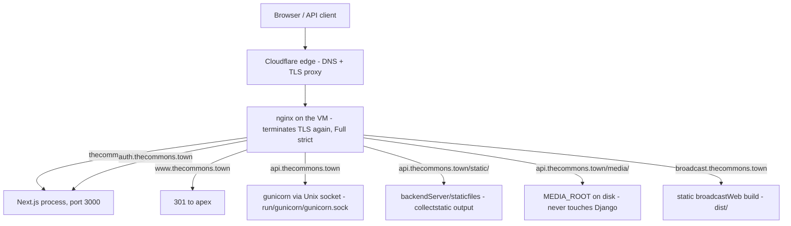
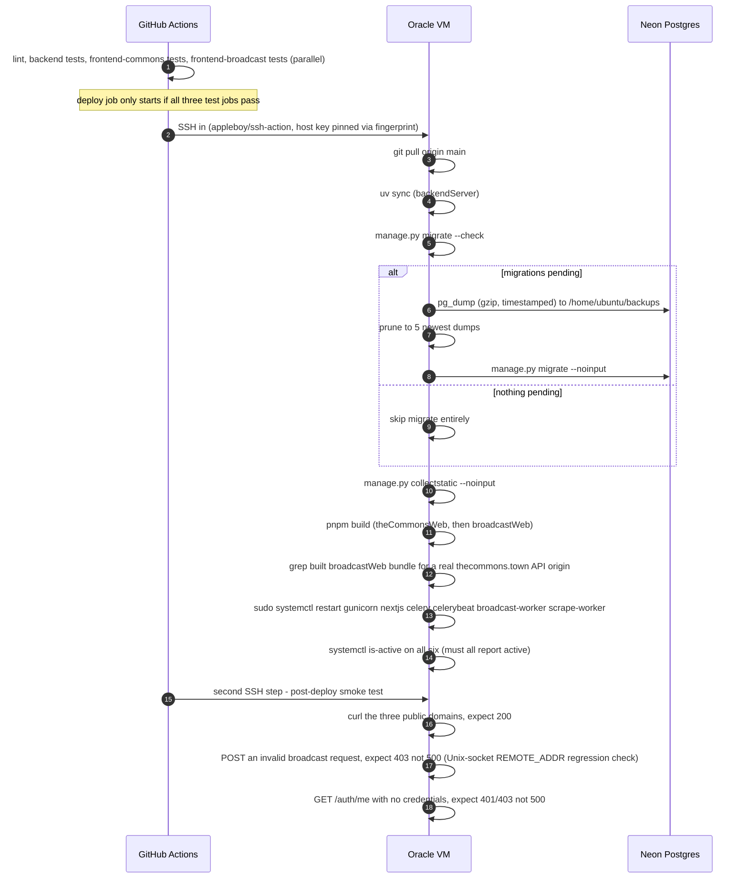
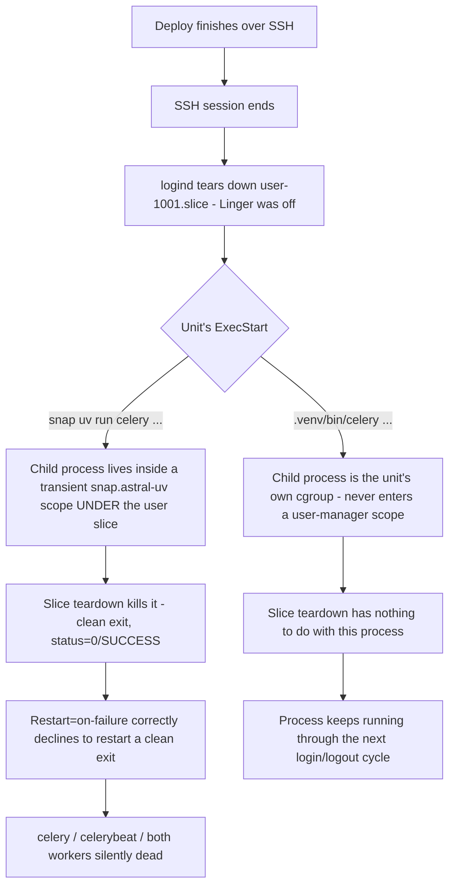
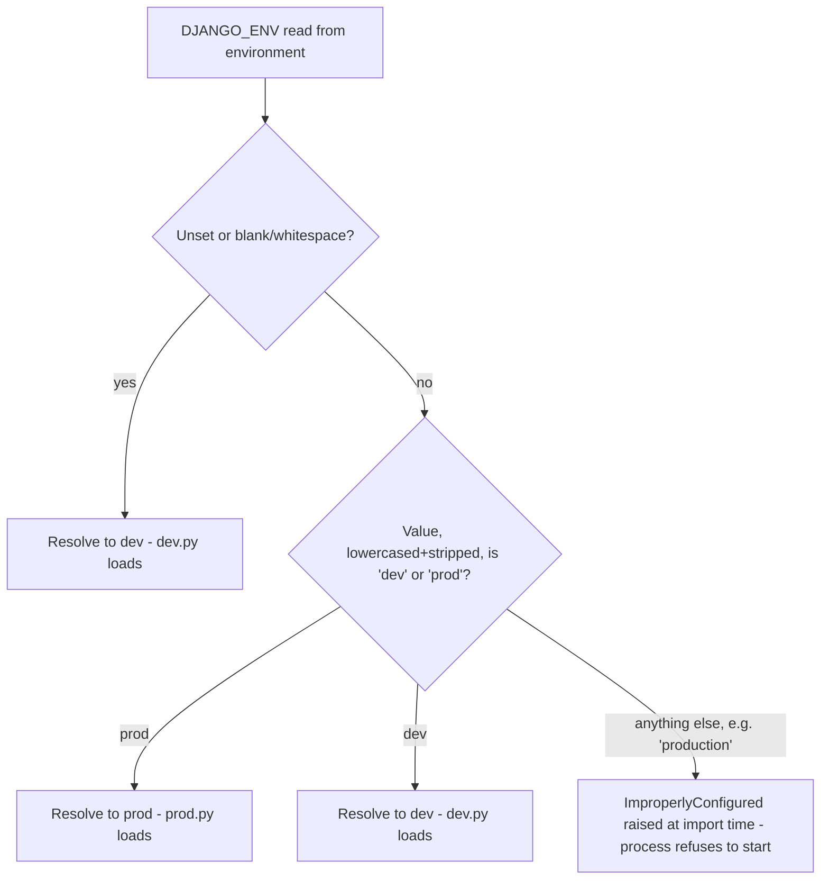

# Deployment & Operations

*Written 2026-08-01 against commit `5fe7a45`. Complements [`DEPLOY.md`](../DEPLOY.md),
which stays the operational source of truth for step-by-step deploy/setup commands — this
doc is the mental model: what's actually running, why it's arranged this way, and what
fails how. Sibling docs: [`overview.md`](overview.md) (whole-system map),
[`async-jobs.md`](async-jobs.md) (Redis/Celery queue and beat-schedule detail),
[`auth.md`](auth.md) (the Better Auth bridge this doc's nginx section resolves a question
for), [`containerization.md`](containerization.md) (the Docker cutover this doc explains is
pending), [`testing.md`](testing.md) (local dev setup).*

## 1. What's running, and the central fact to hold onto

**Read this first: two deployment stories exist in this repository right now, and only one
of them is live.** `DEPLOY.md` was rewritten during this same work session to describe a
fully containerized stack — Docker Compose, an `nginx` container, a `backend` container,
one container per Celery role — built and verified locally end-to-end. None of it has
touched the production VM. The VM has no Docker installed. Every service a reader would
SSH in and find today is the plain **systemd-unit deployment** this doc describes. If you
take one thing from this document, take this: **as of 2026-08-01, production is systemd,
not containers.** §9 covers the pending cutover and what changes when it happens.

The Commons runs on a single Oracle Cloud VM (Ubuntu 24.04, ARM64, 1 OCPU / 6 GB, IP
`129.80.229.41`) behind nginx, with Cloudflare in front for DNS and TLS (proxied, Full
strict). Postgres lives off-box, managed by Neon — the VM never runs a database server.
Everything else — the Django API, the Next.js site, Redis, four Celery-family processes —
runs as systemd units on that one box. There is no load balancer, no second VM, no
managed container platform. If this VM is down, the whole product is down: the public
site, the API, the broadcast operator console, ingestion, digests, everything. Anyone
touching production infrastructure, chasing a 2am page, or trying to understand why an
email didn't send depends on the picture in this document.

## 2. How it works

### Request routing

nginx is the single ingress. It terminates TLS using a Cloudflare origin certificate
(`/etc/ssl/cloudflare/thecommons.town.{pem,key}`) and fans requests out to whichever
backend owns that subdomain — a plain Django app (gunicorn) for the API, a Node process
for the main site, and static files for everything else.

**Three things worth calling out.** First, `auth.thecommons.town` and the apex both land
on the *same* Next.js process — Better Auth lives inside `theCommonsWeb`, not a separate
service, so the "auth origin" is a routing decision, not a different deployable. Second,
`api.thecommons.town` reaches gunicorn over a **Unix socket**
(`unix:/run/gunicorn/gunicorn.sock`), not TCP — this matters for one sharp edge below
(django-ratelimit's IP key) and is the reason the containerized rewrite in `DEPLOY.md`
switches to TCP instead: a socket path doesn't cross a container boundary cleanly. Third,
`/media/` is nginx reading a directory directly; Django is never in that request path in
production — see §5.

**On the `auth.thecommons.town` nginx routing question:** an earlier documentation pass
(`auth.md`) explicitly could not verify this and deferred it here. It's resolved: the
cutover runbook (`docs/runbook-auth-cutover.md`) records the exact server block added to
the VM's nginx config — `server_name auth.thecommons.town` with `proxy_pass
http://127.0.0.1:3000` and the standard `X-Real-IP`/`X-Forwarded-*` headers, TLS from the
same wildcard Cloudflare origin cert as every other subdomain — and an execution record
dated 2026-07-30 confirming it was applied and smoke-tested live (`curl
https://auth.thecommons.town/api/auth/jwks` returned 200 with a real JWKS body). One honest
caveat: that server block lives in a **hand-edited file directly on the VM**
(`/etc/nginx/sites-available/thecommons`), which is not itself checked into this
repository — only the *runbook instructions* for editing it are. The broadcast subdomain's
block is the one nginx fragment actually tracked in git
(`deploy/nginx-broadcast.conf.snippet`), meant to be pasted into that same live file. So
the routing is real, live, and verified — just not something `git grep` alone will ever
show you; you have to read the runbook or SSH in.

### How a deploy happens

Every push to `main` runs CI (`.github/workflows/ci.yml`): a `lint` job, then `backend`
(Django tests, Postgres 16 service container, `--tag=fast` then `--tag=db`),
`frontend-commons` and `frontend-broadcast` (pnpm build as the type-check gate, plus
`test:fast`/`test:db`) all run in parallel. Only if all three test jobs are green does a
gated `deploy` job SSH into the VM and touch anything — a failing test on `main` blocks
deployment outright, there is no way around that gate from the workflow file.

**Four things worth calling out.** First, the migration guard is genuinely conditional —
`migrate --check` exits non-zero only when there's real unapplied work, so most deploys
skip the dump-and-migrate branch entirely; a `pg_dump` is never skipped when a migration
*is* about to run, and the guard hard-fails the whole deploy if `pg_dump` isn't installed
rather than silently proceeding without a backup. Second, the broadcastWeb bundle grep
exists because a malformed `VITE_BROADCAST_API_BASE_URL` builds cleanly and only fails at
runtime, as every API call silently misroutes — this catches that class of bug before the
build goes live, not after. Third, `systemctl is-active` passing is necessary but not
sufficient — a crashing view or a misrouted SPA both restart clean and report `active`,
which is exactly why there's a separate smoke-test step hitting real URLs afterward, not
just a process-liveness check. Fourth, the smoke test's `403` check on a broadcast endpoint
is a deliberate regression probe: nginx talking to gunicorn over a Unix socket used to
leave `REMOTE_ADDR` empty, which crashed `django-ratelimit`'s IP-based rate limiting with
an unhandled 500 on every request to a rate-limited broadcast view — a `500` here means
that bug is back, a `403` means the request was correctly rejected before it ever became a
ratelimit crash.

There is no separate `gunicorn.service` or `nextjs.service` file in this repository's
`deploy/` directory, and none exists anywhere in git history — those two units were set up
by hand directly on the VM and were never checked in, unlike the four Celery-family units
and the healthcheck unit, which are. If you need their exact unit-file contents, SSH in and
read `/etc/systemd/system/gunicorn.service` / `nextjs.service` directly, or see the last
commit of `DEPLOY.md` before its Docker rewrite (`git show 053d65b:DEPLOY.md`) for a
recorded copy of what they contained as of late July.

## 3. The systemd units

| Unit | What it runs | Drains / serves | How to check it |
|---|---|---|---|
| `gunicorn` | Django via a Unix socket, 3 sync workers | `api.thecommons.town` (proxied by nginx) | `systemctl status gunicorn`; not tracked in `deploy/` — hand-configured on the VM |
| `nextjs` | `node`/`npm run start` for `theCommonsWeb`, port 3000 | `thecommons.town` and `auth.thecommons.town` (both proxy to the same process) | `systemctl status nextjs`; not tracked in `deploy/` — hand-configured on the VM |
| `redis-server` | Standard `apt`-installed Redis, `/etc/redis/redis.conf` | DB 0 = Celery broker/results, DB 1 = Django cache | `systemctl status redis-server`; `redis-cli -a <pass> ping` |
| `celery` (`deploy/celery.service`) | Default worker, `.venv/bin/celery -A backend worker -n commons-default@%h --concurrency=2` | Everything not explicitly routed elsewhere — digest sends, misc tasks | `systemctl status celery`; `manage.py healthcheck`'s `celery_worker` probe |
| `celerybeat` (`deploy/celerybeat.service`) | Scheduler, `django_celery_beat`'s `DatabaseScheduler` — exactly one process, never scale this | Fires `ingest-events-daily` (04:00 ET), `weekly-digest-sunday`/`monthly-digest` (18:00 ET), `broadcast-orphan-recovery` | `systemctl status celerybeat`; `manage.py healthcheck`'s per-task `beat:<name>` freshness probes — the check this doc's §8 incident is really about |
| `broadcast-worker` (`deploy/broadcast-worker.service`) | Playwright form-filler, `celery -A backend worker -Q broadcast -c 1` | The dedicated `broadcast` queue only — `-c 1` is load-bearing, not tuning: orphan recovery assumes a single worker | `systemctl status broadcast-worker` |
| `scrape-worker` (`deploy/scrape-worker.service`) | Headless-Chromium ingestion scraper, `celery -A backend worker -Q scrape -c 1` | The dedicated `scrape` queue, kept off the default worker so Chromium memory can't starve digests/ingestion | `systemctl status scrape-worker` |
| `healthcheck.timer` / `.service` (`deploy/healthcheck.*`) | Hourly `bash deploy/healthcheck.sh`, itself running `manage.py healthcheck --require-prod` | Nothing — read-only report | `systemctl list-timers healthcheck.timer`; `journalctl -u healthcheck.service -n 50` |

`celery`, `celerybeat`, `broadcast-worker`, and `scrape-worker` all `Require=` and
`After=redis-server.service` and set `Restart=always` — the restart policy is
belt-and-suspenders, explained in §4, not the primary fix for anything. `deploy/`'s
`nginx-broadcast.conf.snippet` is not a systemd unit; it's an nginx server-block fragment
meant to be appended by hand into the VM's single live config file.

## 4. The `uv run` vs. venv-binary sharp edge — a real outage, not a style rule

Every long-lived unit in `deploy/` execs `/home/ubuntu/thecommons/backendServer/.venv/bin/celery`
directly. That specific phrasing — the venv binary, not `uv run celery`, and not a wrapper
shell script — is load-bearing, and the reason is a real production incident recorded in
full at `docs/prod-incident-2026-07-21-scheduler-outage.md`.

**What actually happened, concretely:** all four Celery-family units ran through
`/snap/bin/uv run celery …`. Snap's `uv` spawns its child inside a transient
`snap.astral-uv.uv-*.scope`, parented under `user@1001.service` — the *user* session
manager, not the systemd unit's own cgroup. With account lingering off, the moment the
deploying SSH session ended, `logind` tore down `user-1001.slice` and every snap scope
under it, taking `celery`/`celerybeat`/`broadcast-worker`/`scrape-worker` down with it —
**a clean exit**, `status=0/SUCCESS`, which `Restart=on-failure` correctly declined to
restart (it's not a failure by that policy's definition). `gunicorn` and `nextjs`, which
never touched snap, stayed up the entire time on the same VM through the same deploys. The
async stack was fully dead for 8 days before anyone noticed, because the site itself kept
serving pages — nothing about "the site is up" implied "background jobs are running."

**What breaks if someone "simplifies" a unit back to `uv run`:** exactly this, again. The
fix — execing `.venv/bin/celery` directly — removes the snap-scope mechanism entirely,
which is the actual fix; `loginctl enable-linger ubuntu` and `Restart=always` are
defense-in-depth layered on top, not substitutes for it. A reviewer who sees `uv run` as
"more consistent with the rest of the deploy tooling" and reverts a unit to it silently
reopens this exact failure mode — it will not show up in `systemctl status` right after the
change, only after the next SSH session that started the deploy ends.

**One deliberate exception, and it is not a contradiction:** `healthcheck.service` still
uses `/snap/bin/uv` (`Environment=UV_BIN=/snap/bin/uv`, `ExecStart=... bash
deploy/healthcheck.sh`) and that is fine. It's `Type=oneshot` — the process starts, runs
the health report to completion in a few seconds, and exits on its own, well before any SSH
session it happened to be triggered near could tear down. The failure mode above only bites
a process still running at the moment a user slice gets torn down; a oneshot that's already
finished has nothing left to kill. Don't read the healthcheck unit's `uv` line as
permission to relax the rule anywhere else — it's a narrow exception with a specific reason,
not evidence the rule is soft.

## 5. Environment selection: `DJANGO_ENV` and how failure got narrower

Django settings are resolved by `backend/settings/__init__.py` via a function,
`select_settings_env`, reading the `DJANGO_ENV` environment variable — not by
`DJANGO_SETTINGS_MODULE` pointing at `prod.py` directly, the way Django docs usually show
it.

This is a deliberately narrowed failure mode, and the history matters. The original
incident (June 2026, referenced directly in the module's own docstring) was `DJANGO_ENV`
simply **missing** on the VM: the app silently served `dev.py`, whose `ALLOWED_HOSTS` is
localhost-only, so every real request to `api.thecommons.town` came back `DisallowedHost`
(HTTP 400) — which the frontend rendered indistinguishably from "there are just no events
right now." That silent-unset-defaults-to-dev behavior is **still current and still
deliberate** — every local laptop relies on `DJANGO_ENV` being absent and getting `dev.py`
for free, and changing that would break local dev for everyone. What changed is the *other*
failure shape: a **typo'd but non-empty** value (`DJANGO_ENV=production`, a stray `PRD`,
anything not exactly `dev` or `prod` after trimming and lowercasing) now raises
`ImproperlyConfigured` immediately at import time instead of quietly falling back to
`dev.py` — the process won't boot at all, which is loud and fast rather than silent and
slow. `events/tests/test_config_fast.py` pins this exact behavior as a regression test
(unset/blank → `dev`; `prod`/`PROD `/`Dev` all normalize correctly; `production`,
`staging`, `PRD`, `true` all raise).

The remaining gap — `DJANGO_ENV` unset in prod specifically, which the hard-error change
does nothing for, since unset is still valid input — is caught by `manage.py healthcheck
--require-prod`, run hourly via `healthcheck.timer`. That command checks `settings.DEBUG`
and whether `ALLOWED_HOSTS` is anything other than localhost-only, and reports a `FAIL` if
either looks like dev settings leaked into what's supposed to be prod. **Read `--require-prod`
correctly: it is a detector, not a guard.** It can tell you, up to an hour later, that
production is quietly running on dev settings; it cannot stop that from happening, and it
does not run on every request or every deploy — only once an hour, on the health-check
timer's own schedule. A misconfigured `.env` on the VM still means real downtime for up to
that long before anyone is told.

## 6. Media: why it lives outside the checkout

`MEDIA_ROOT` (client-uploaded event images) is set in production to
`/home/ubuntu/broadcast/media` — a path that sits next to the git checkout
(`/home/ubuntu/thecommons`), not inside it. `backend/settings/base.py`'s own comment on
`MEDIA_ROOT` states the reason directly: it defaults to a path *inside* the checkout for
local dev, but production overrides it in `.env` specifically so a `git pull` during deploy
can never touch uploaded files. A deploy that ran `git clean` or reset the working tree
inside the checkout would have no way to reach these files at all — they're simply not
under that directory.

The second half of the same design: nginx serves `/media/` directly as a plain file alias,
and Django is never in that request path in production. The comment in `base.py` says this
outright ("Served by nginx in prod, never by Django"), and the pre-Docker `DEPLOY.md`
revision that documented the live nginx config confirms it as a sibling `location /media/`
block to the existing `/static/` alias, pointing at the same `MEDIA_ROOT` path. The reason
is the ordinary one for serving static assets from the ingress instead of the app server:
nginx does it faster and without spinning up a Python worker to stream a file back to
disk. There's a real cost worth knowing about, not a bug: uploaded images are kept
indefinitely — no pruning job exists anywhere in this repo — so `MEDIA_ROOT` grows without
bound. At roughly 1–3 MB per event this is currently negligible against the VM's block
volume, but it's a number worth keeping an eye on, not a problem to "fix" by inventing a
retention policy nobody asked for yet.

## 7. Dev/prod database isolation

Every developer's local `DATABASE_URL` should point at a **Neon branch**, not the
production database — Neon branches are copy-on-write snapshots with their own connection
string, so a branch can be migrated, seeded, and reset freely without ever touching prod
rows. `docs/dev-db-isolation.md` is the full design doc; the shape that matters here is:
the production VM's `.env` keeps the real `DATABASE_URL` pointed at Neon's main branch, and
`DJANGO_ENV` is what decides which settings module (and therefore which behavioral
guardrails) apply — it does not, by itself, decide which database gets used. Nothing in
Django enforces that a `dev`-settings process can't be pointed at the prod `DATABASE_URL`;
the isolation is a matter of which connection string ends up in which `.env` file, and
that's a human discipline, not a code guarantee.

One extension of this worth knowing: `backend/settings/dev.py` supports an optional second
database alias, `prod_readonly`, populated only when `PROD_DATABASE_URL` is set — this lets
local devtools (the ingestion/broadcast monitor) inspect real production data without
routing writes through it and without merging prod into the primary `default` alias. It's
only actually safe if the credentials behind `PROD_DATABASE_URL` come from a Postgres role
that is read-only at the database level (a `monitor_readonly` role with `SELECT`-only
grants, per the checklist in `docs/dev-db-isolation.md`) — Django does not enforce
read-only-ness itself; a read-write DSN in that variable would happily let devtools write
to prod. If you ever set this variable locally, verify the role actually rejects writes (an
`INSERT`/`CREATE TABLE` against the `prod_readonly` connection should error with `permission
denied`) before trusting it.

## 8. Historical incident, still worth knowing

`docs/prod-incident-2026-07-21-scheduler-outage.md` is the full forensic record behind §4's
sharp edge — worth reading in full if you're the one debugging a "the site works but nothing
in the background is happening" report, because that is exactly the symptom this incident
produced: `gunicorn` and `nextjs` stayed up the entire 8 days, so nothing looked wrong from
the outside, while `celery`/`celerybeat`/`broadcast-worker`/`scrape-worker` were all dead.
The one lasting change from that incident that has nothing to do with the `uv run` fix: a
stale or never-fired beat schedule is now a hard `FAIL` in `manage.py healthcheck`, not a
`WARN` — a scheduler that stopped firing is treated as an outage, not a suggestion, because
that distinction is what would have caught this incident in hours instead of the 8 days it
actually took (the outage was only found by chance, during unrelated forensics against
`/devtools/monitor`, not by any monitoring that existed at the time).

## 9. The pending cutover: containers are built, not live

A parallel effort in this same working tree has built a complete Docker Compose
replacement for everything in this document — one container per service, described in
`docker-compose.yml`, `backendServer/Dockerfile`, `Dockerfile.frontend`, and
`deploy/nginx/`, with the full rationale in `docs/adr/0001-containerization.md`. It has been
verified locally end-to-end. **None of it is live.** The Oracle VM does not have Docker
installed, the `ubuntu` user isn't in a `docker` group, the persistent bind-mount
directories the compose file expects don't exist on the box, and the seven systemd units
this document describes have not been touched. `DEPLOY.md` was rewritten during this same
session to describe the containerized stack as the deploy target — read it as a plan for
the next cutover, not as a description of what answers a request to
`api.thecommons.town` right now. `containerization.md` (a sibling human doc, written
alongside this one) covers what changes once that cutover happens — new service names,
TCP instead of a Unix socket for gunicorn, images instead of a checked-out venv, and how
the exact sharp edges in §4–§6 above either disappear or get re-solved a different way
inside a container. Until someone runs that cutover on the actual VM, treat every fact in
§1–§7 of this document as the operative reality, and treat `DEPLOY.md`'s Docker
instructions as a runbook waiting for its day one, not a record of today.

## 10. Known gaps

No push notification exists for a failed health check — `systemctl --failed` and
`journalctl -u healthcheck.service` are the only read paths today; nothing pages anyone.
There is no automated rollback if a deploy's smoke test fails after the systemd restarts
already happened — the units are already running the new code by the time the smoke test
runs, so a failing smoke test currently means "go SSH in and diagnose," not "the previous
version is automatically restored." The exact live contents of `gunicorn.service` and
`nextjs.service` are not verifiable from this repository at all, for the reason noted in
§2 — they were never committed; anyone needing their precise current flags should SSH in
and read them directly rather than trust any doc's transcription, including this one's
citation of an old `DEPLOY.md` revision.
