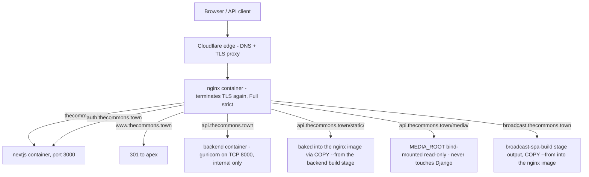
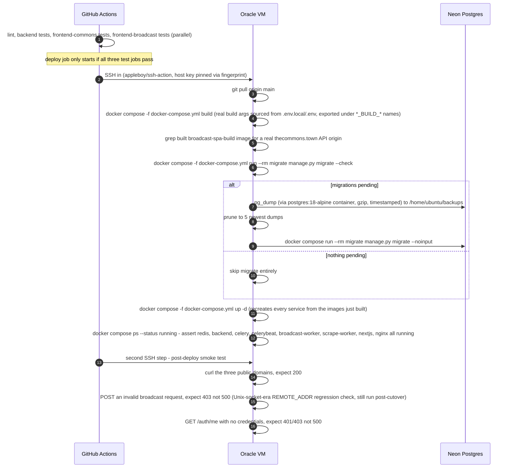
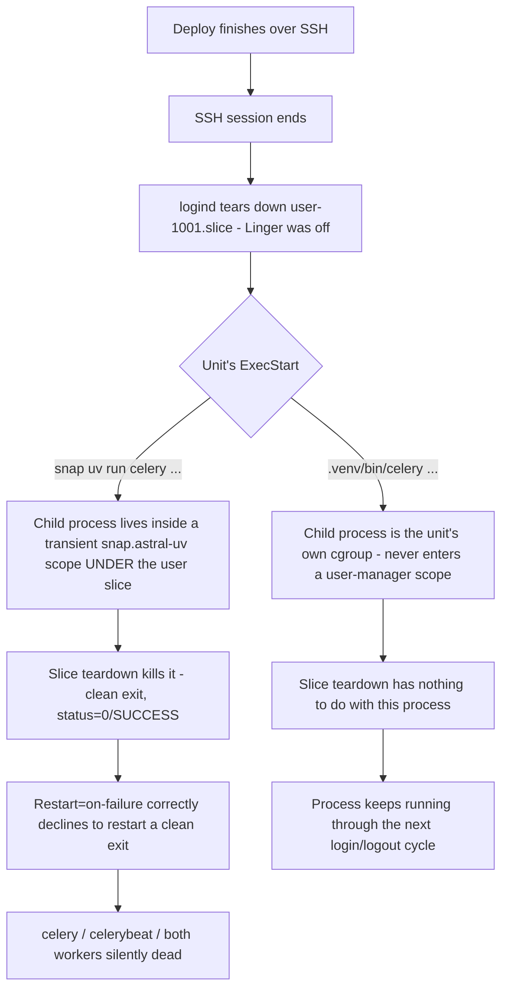
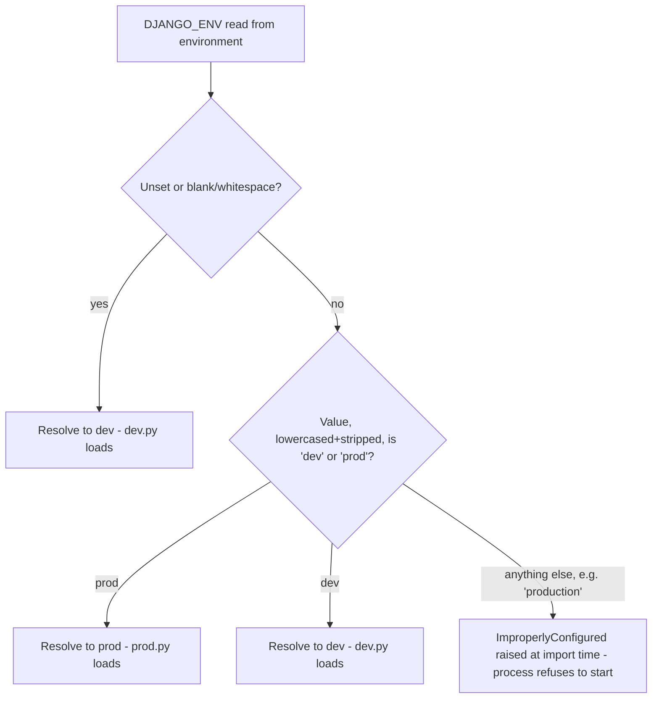

# Deployment & Operations

> **Last updated:** 2026-08-03, commit `9a38379`, branch `suite-47-tags-and-filters`

## Overview

The Commons runs on a single Oracle Cloud VM (Ubuntu 24.04, ARM64, 1 OCPU / 6 GB,
`129.80.229.41`) behind nginx, with Cloudflare in front for DNS and TLS. Postgres is
never on the VM — it's Neon, managed, off-box, in every environment.

**Production now runs on Docker Compose, as of 2026-08-02 (PR #41, the Suite 42
Dockerization cutover).** `docker-compose.yml` at the repo root is the live service
graph: `redis`, a one-shot `migrate`, `backend` (gunicorn, TCP), `celery`, `celerybeat`,
`broadcast-worker` (`-c 1`), `scrape-worker` (`-c 1`), `nextjs`, a one-shot
`broadcast-spa-build`, and `nginx` — the only service publishing host ports 80/443.
`DEPLOY.md` is the up-to-date, Docker-first deploy runbook; treat it as the operational
source of truth for commands.

The old systemd app units (`gunicorn`, `nextjs`, `redis-server`, `celery`, `celerybeat`,
`broadcast-worker`, `scrape-worker`) are **retired** — replaced by the containers above.
**One exception:** `healthcheck.service`/`.timer` was never containerized and still runs
host-level, shelling into the containers to run `manage.py healthcheck --require-prod`.
The `deploy/*.service` unit files still physically exist in the repo (historical
record / rollback reference) even though nothing on the VM runs them anymore.

The two facts worth carrying out of this doc: (1) a deploy is now
`docker compose -f docker-compose.yml build && up -d`, driven by CI, not
`git pull` + `systemctl restart`; and (2) the sharp edges from the systemd era —
`DJANGO_ENV` resolution, media living outside the checkout, Neon branch isolation — are
still real and still apply, just inside containers now. See the Deep Dive below for the
full request-routing diagram, the deploy pipeline, the retired-unit reference table, and
the historical incidents that shaped today's guardrails.

## Deep Dive

### 1. What's running, and the central fact to hold onto

**Production runs on Docker Compose.** `docker-compose.yml` at the repo root is the live,
current service graph — one container per role (`redis`, `migrate`, `backend`, `celery`,
`celerybeat`, `broadcast-worker`, `scrape-worker`, `nextjs`, `broadcast-spa-build`,
`nginx`) — built and deployed on every push to `main` via the CI `deploy` job (§2). This
replaced the previous systemd-unit deployment on 2026-08-02 (PR #41). If you take one
thing from this document, take this: **as of 2026-08-02, production is containers, not
systemd.** §3 covers what the retired units used to do and why the reference table is
still worth keeping around; §9 covers the cutover itself.

The Commons runs on a single Oracle Cloud VM (Ubuntu 24.04, ARM64, 1 OCPU / 6 GB, IP
`129.80.229.41`) behind nginx, with Cloudflare in front for DNS and TLS (proxied, Full
strict). Postgres lives off-box, managed by Neon — the VM never runs a database server.
Everything else — the Django API, the Next.js site, Redis, four Celery-family processes
— runs as Docker containers on that one box, orchestrated by `docker compose`. There is
no load balancer, no second VM, no managed container platform (no ECS/Kubernetes) — just
Docker Compose on the same single VM the systemd units used to run on. If this VM is
down, the whole product is down: the public site, the API, the broadcast operator
console, ingestion, digests, everything. Anyone touching production infrastructure,
chasing a 2am page, or trying to understand why an email didn't send depends on the
picture in this document.

### 2. How it works

#### Request routing

nginx is the single ingress — now itself a container, the only one in the compose file
publishing host ports 80/443. It terminates TLS using a Cloudflare origin certificate
(bind-mounted read-only from `/etc/ssl/cloudflare/thecommons.town.{pem,key}` on the host)
and fans requests out to whichever backend owns that subdomain — the `backend` container
(gunicorn) for the API, the `nextjs` container for the main site, and static files baked
into the nginx image for everything else.

**Three things worth calling out.** First, `auth.thecommons.town` and the apex both land
on the *same* `nextjs` container — Better Auth lives inside `theCommonsWeb`, not a
separate service, so the "auth origin" is a routing decision, not a different deployable.
Second, `api.thecommons.town` reaches gunicorn over **TCP** (`backend:8000`, exposed only
on the compose network, never to the host) — this is a deliberate change from the old
systemd deployment's Unix socket (`unix:/run/gunicorn/gunicorn.sock`), because a socket
path doesn't cross a container boundary cleanly; the switch is why the historical
`django-ratelimit`/`REMOTE_ADDR` sharp edge below is written up as a regression check
rather than a live risk. Third, `/media/` is nginx reading a read-only bind mount
directly; Django is never in that request path in production — see §6.

**On the `auth.thecommons.town` nginx routing question:** an earlier documentation pass
(`auth.md`) explicitly could not verify this and deferred it here. It's resolved: the
cutover runbook (`docs/runbook-auth-cutover.md`) records the exact server block added to
the VM's (then hand-edited) nginx config — `server_name auth.thecommons.town` with
`proxy_pass http://127.0.0.1:3000` and the standard `X-Real-IP`/`X-Forwarded-*` headers,
TLS from the same wildcard Cloudflare origin cert as every other subdomain — and an
execution record dated 2026-07-30 confirming it was applied and smoke-tested live (`curl
https://auth.thecommons.town/api/auth/jwks` returned 200 with a real JWKS body). That
routing decision carried forward unchanged into the containerized nginx config in
`deploy/nginx/` — same subdomain, same target process, now reached over the compose
network instead of `127.0.0.1`. The broadcast subdomain's block is the nginx fragment
tracked in git as `deploy/nginx-broadcast.conf.snippet`, folded into the current
`deploy/nginx/` config that ships inside the nginx image.

#### How a deploy happens

Every push to `main` runs CI (`.github/workflows/ci.yml`): a `lint` job, then `backend`
(Django tests, Postgres 16 service container, `--tag=fast` then `--tag=db`),
`frontend-commons` and `frontend-broadcast` (pnpm build as the type-check gate, plus
`test:fast`/`test:db`) all run in parallel. Only if all three test jobs are green does a
gated `deploy` job SSH into the VM and touch anything — a failing test on `main` blocks
deployment outright, there is no way around that gate from the workflow file.

**Four things worth calling out.** First, `collectstatic` and the frontend builds
(`pnpm build` for both `theCommonsWeb` and `broadcastWeb`) are no longer separate deploy
steps — they happen at Docker image build time (`backendServer/Dockerfile` bakes
`staticfiles_build/static`; `Dockerfile.frontend` builds both frontends), so the deploy
script itself only builds images, runs the guarded migration, and swaps containers.
Second, the broadcastWeb bundle grep exists because a malformed
`VITE_BROADCAST_API_BASE_URL` builds cleanly and only fails at runtime, as every API call
silently misroutes — this catches that class of bug before the build goes live, not
after. Third, the migration guard is genuinely conditional — `migrate --check` exits
non-zero only when there's real unapplied work, so most deploys skip the dump-and-migrate
branch entirely; a `pg_dump` (now run via a disposable `postgres:18-alpine` container,
since the VM no longer has a host-level `postgresql-client`) is never skipped when a
migration *is* about to run. Fourth, `docker compose ps --status running` replacing
`systemctl is-active` is necessary but not sufficient — a crashing view or a misrouted SPA
both restart clean and report running, which is exactly why there's a separate
smoke-test step hitting real URLs afterward, not just a container-liveness check.

The old `gunicorn.service`/`nextjs.service` units (never checked into `deploy/`, hand-set
up on the VM) are gone along with the rest of the systemd app units — their process
definitions now live in `docker-compose.yml`'s `backend` and `nextjs` services instead.
If you need the exact historical unit-file contents from the systemd era, see the last
commit of `DEPLOY.md` before its Docker rewrite (`git show 053d65b:DEPLOY.md`).

### 3. The retired systemd units (historical reference)

These units ran production until the 2026-08-02 Docker cutover (PR #41). They are no
longer active on the VM — the table is kept for anyone debugging an old incident report,
reading `docs/prod-incident-2026-07-21-scheduler-outage.md`, or comparing pre- and
post-cutover behavior. **The one still-active exception is the last row.**

| Unit | What it ran | Drained / served | Status today |
|---|---|---|---|
| `gunicorn` | Django via a Unix socket, 3 sync workers | `api.thecommons.town` (proxied by nginx) | Retired — replaced by the `backend` container (TCP 8000) |
| `nextjs` | `node`/`npm run start` for `theCommonsWeb`, port 3000 | `thecommons.town` and `auth.thecommons.town` (both proxied to the same process) | Retired — replaced by the `nextjs` container |
| `redis-server` | Standard `apt`-installed Redis, `/etc/redis/redis.conf` | DB 0 = Celery broker/results, DB 1 = Django cache | Retired — replaced by the `redis` container (`redis:7-alpine`) |
| `celery` (`deploy/celery.service`) | Default worker, `.venv/bin/celery -A backend worker -n commons-default@%h --concurrency=2` | Everything not explicitly routed elsewhere — digest sends, misc tasks | Retired — replaced by the `celery` container, same command |
| `celerybeat` (`deploy/celerybeat.service`) | Scheduler, `django_celery_beat`'s `DatabaseScheduler` — exactly one process, never scale this | Fires `ingest-events-daily` (04:00 ET), `weekly-digest-sunday`/`monthly-digest` (18:00 ET), `broadcast-orphan-recovery` | Retired — replaced by the `celerybeat` container; still exactly one process |
| `broadcast-worker` (`deploy/broadcast-worker.service`) | Playwright form-filler, `celery -A backend worker -Q broadcast -c 1` | The dedicated `broadcast` queue only — `-c 1` is load-bearing, not tuning: orphan recovery assumes a single worker | Retired — replaced by the `broadcast-worker` container, still `-c 1` |
| `scrape-worker` (`deploy/scrape-worker.service`) | Headless-Chromium ingestion scraper, `celery -A backend worker -Q scrape -c 1` | The dedicated `scrape` queue, kept off the default worker so Chromium memory can't starve digests/ingestion | Retired — replaced by the `scrape-worker` container, still `-c 1` |
| `healthcheck.timer` / `.service` (`deploy/healthcheck.*`) | Hourly `bash deploy/healthcheck.sh`, itself running `manage.py healthcheck --require-prod` | Nothing — read-only report | **Still live, host-level.** Never containerized — it shells into the running containers to run the same health command. |

The `deploy/*.service` unit files (`celery.service`, `celerybeat.service`,
`broadcast-worker.service`, `scrape-worker.service`, `healthcheck.service`,
`healthcheck.timer`, `healthcheck.sh`) and `deploy/nginx-broadcast.conf.snippet` still
physically exist in the repo's `deploy/` directory — nothing was deleted. "Retired" means
retired on the production box, not removed from git history; they're kept as a rollback
reference and because `healthcheck.service`/`.timer` are still genuinely in use.

### 4. The `uv run` vs. venv-binary sharp edge — a real outage, not a style rule

This is systemd-era history: it describes why the *retired* Celery-family units execed
the venv binary directly rather than `uv run`. It no longer applies mechanically inside
Docker (there's no snap-scope, no user-session teardown a container can be torn down by
in the same way), but the incident is still the reason today's containerized Celery
services (`celery`, `celerybeat`, `broadcast-worker`, `scrape-worker`) each run with
`restart: unless-stopped` and no dependency on a login shell surviving — the underlying
lesson (a "clean" silent exit is not the same as "still running") is exactly what that
policy guards against in the new architecture too.

Every long-lived systemd unit in `deploy/` execed
`/home/ubuntu/thecommons/backendServer/.venv/bin/celery` directly. That specific phrasing
— the venv binary, not `uv run celery`, and not a wrapper shell script — was
load-bearing, and the reason is a real production incident recorded in full at
`docs/prod-incident-2026-07-21-scheduler-outage.md`.

**What actually happened, concretely:** all four Celery-family units ran through
`/snap/bin/uv run celery …`. Snap's `uv` spawns its child inside a transient
`snap.astral-uv.uv-*.scope`, parented under `user@1001.service` — the *user* session
manager, not the systemd unit's own cgroup. With account lingering off, the moment the
deploying SSH session ended, `logind` tore down `user-1001.slice` and every snap scope
under it, taking `celery`/`celerybeat`/`broadcast-worker`/`scrape-worker` down with it —
**a clean exit**, `status=0/SUCCESS`, which `Restart=on-failure` correctly declined to
restart (it's not a failure by that policy's definition). `gunicorn` and `nextjs`, which
never touched snap, stayed up the entire time on the same VM through the same deploys. The
async stack was fully dead for 8 days before anyone noticed, because the site itself kept
serving pages — nothing about "the site is up" implied "background jobs are running."

**What broke if someone "simplified" a unit back to `uv run`:** exactly this, again. The
fix — execing `.venv/bin/celery` directly — removed the snap-scope mechanism entirely,
which was the actual fix; `loginctl enable-linger ubuntu` and `Restart=always` were
defense-in-depth layered on top, not substitutes for it.

**The one still-live unit, `healthcheck.service`, was never exposed to this:** it is
`Type=oneshot` with `ExecStart=/usr/bin/env bash
/home/ubuntu/thecommons/deploy/healthcheck.sh --no-color` — no snap, no `uv`, no
`UV_BIN` anywhere in the unit. (An earlier revision of this doc claimed it still ran
through `/snap/bin/uv`; that is not what the file says — verified against
`deploy/healthcheck.service` at commit `9a38379`.) Two independent reasons the outage
class can't reach it: the process starts, runs the health report to completion in a few
seconds, and exits on its own, so there's nothing still running when a user slice gets
torn down; and it never enters a snap scope in the first place. Its own header comment
makes the same point. What it *does* need from the host is `docker` reachable by
`User=ubuntu` — i.e. `ubuntu` in the `docker` group — since the script now works by
shelling into the containers (`docker compose ps` / `docker inspect` /
`docker compose exec -T`) rather than running `manage.py` natively.

### 5. Environment selection: `DJANGO_ENV` and how failure got narrower

Django settings are resolved by `backend/settings/__init__.py` via a function,
`select_settings_env`, reading the `DJANGO_ENV` environment variable — not by
`DJANGO_SETTINGS_MODULE` pointing at `prod.py` directly, the way Django docs usually show
it. This resolution mechanism is unchanged by the Docker cutover — every prod-facing
service in `docker-compose.yml` (`backend`, `celery`, `celerybeat`, `broadcast-worker`,
`scrape-worker`, `migrate`) sets `environment: DJANGO_ENV: prod` explicitly.

This is a deliberately narrowed failure mode, and the history matters. The original
incident (June 2026, referenced directly in the module's own docstring) was `DJANGO_ENV`
simply **missing** on the VM: the app silently served `dev.py`, whose `ALLOWED_HOSTS` is
localhost-only, so every real request to `api.thecommons.town` came back `DisallowedHost`
(HTTP 400) — which the frontend rendered indistinguishably from "there are just no events
right now." That silent-unset-defaults-to-dev behavior is **still current and still
deliberate** — every local laptop relies on `DJANGO_ENV` being absent and getting `dev.py`
for free, and changing that would break local dev for everyone. What changed is the *other*
failure shape: a **typo'd but non-empty** value (`DJANGO_ENV=production`, a stray `PRD`,
anything not exactly `dev` or `prod` after trimming and lowercasing) now raises
`ImproperlyConfigured` immediately at import time instead of quietly falling back to
`dev.py` — the process won't boot at all, which is loud and fast rather than silent and
slow. `events/tests/test_config_fast.py` pins this exact behavior as a regression test
(unset/blank → `dev`; `prod`/`PROD `/`Dev` all normalize correctly; `production`,
`staging`, `PRD`, `true` all raise).

The remaining gap — `DJANGO_ENV` unset in prod specifically, which the hard-error change
does nothing for, since unset is still valid input — is caught by `manage.py healthcheck
--require-prod`, still run hourly via the host-level `healthcheck.timer` (§3), which now
shells into the containers rather than running natively on the host. That command checks
`settings.DEBUG` and whether `ALLOWED_HOSTS` is anything other than localhost-only, and
reports a `FAIL` if either looks like dev settings leaked into what's supposed to be prod.
**Read `--require-prod` correctly: it is a detector, not a guard.** It can tell you, up to
an hour later, that production is quietly running on dev settings; it cannot stop that
from happening, and it does not run on every request or every deploy — only once an hour.
A misconfigured `.env`/`env_file` on the VM still means real downtime for up to that long
before anyone is told.

### 6. Media: why it lives outside the checkout

`MEDIA_ROOT` (client-uploaded event images) is set in production to
`/home/ubuntu/broadcast/media` — a path that sits next to the git checkout
(`/home/ubuntu/thecommons`), not inside it. `backend/settings/base.py`'s own comment on
`MEDIA_ROOT` states the reason directly: it defaults to a path *inside* the checkout for
local dev, but production overrides it in `.env` specifically so a `git pull` during
deploy can never touch uploaded files. That reasoning carried straight into the Docker
cutover: `docker-compose.yml`'s `backend` and `nginx` services both bind-mount the same
absolute host path (`${MEDIA_ROOT_HOST:-/home/ubuntu/broadcast/media}`) rather than
baking it into an image layer — deliberately the identical path prod's `.env` already
used, so the cutover needed zero changes to that variable.

The second half of the same design: nginx serves `/media/` directly as a read-only bind
mount, and Django is never in that request path in production — the comment in `base.py`
says this outright ("Served by nginx in prod, never by Django"). The reason is the
ordinary one for serving static assets from the ingress instead of the app server: nginx
does it faster and without spinning up a Python worker to stream a file back to disk.
There's a real cost worth knowing about, not a bug: uploaded images are kept indefinitely
— no pruning job exists anywhere in this repo — so `MEDIA_ROOT` grows without bound. At
roughly 1–3 MB per event this is currently negligible against the VM's block volume, but
it's a number worth keeping an eye on, not a problem to "fix" by inventing a retention
policy nobody asked for yet.

### 7. Dev/prod database isolation

Every developer's local `DATABASE_URL` should point at a **Neon branch**, not the
production database — Neon branches are copy-on-write snapshots with their own connection
string, so a branch can be migrated, seeded, and reset freely without ever touching prod
rows. `docs/dev-db-isolation.md` is the full design doc; the shape that matters here is:
the production VM's `backendServer/.env` (now read by every service via `env_file:` in
`docker-compose.yml`) keeps the real `DATABASE_URL` pointed at Neon's main branch, and
`DJANGO_ENV` is what decides which settings module (and therefore which behavioral
guardrails) apply — it does not, by itself, decide which database gets used. Nothing in
Django enforces that a `dev`-settings process can't be pointed at the prod `DATABASE_URL`;
the isolation is a matter of which connection string ends up in which `.env` file, and
that's a human discipline, not a code guarantee.

One extension of this worth knowing: `backend/settings/dev.py` supports an optional second
database alias, `prod_readonly`, populated only when `PROD_DATABASE_URL` is set — this lets
local devtools (the ingestion/broadcast monitor) inspect real production data without
routing writes through it and without merging prod into the primary `default` alias. It's
only actually safe if the credentials behind `PROD_DATABASE_URL` come from a Postgres role
that is read-only at the database level (a `monitor_readonly` role with `SELECT`-only
grants, per the checklist in `docs/dev-db-isolation.md`) — Django does not enforce
read-only-ness itself; a read-write DSN in that variable would happily let devtools write
to prod. If you ever set this variable locally, verify the role actually rejects writes (an
`INSERT`/`CREATE TABLE` against the `prod_readonly` connection should error with `permission
denied`) before trusting it.

### 8. Historical incident, still worth knowing

`docs/prod-incident-2026-07-21-scheduler-outage.md` is the full forensic record behind §4's
sharp edge — worth reading in full if you're the one debugging a "the site works but nothing
in the background is happening" report, because that is exactly the symptom this incident
produced: `gunicorn` and `nextjs` stayed up the entire 8 days, so nothing looked wrong from
the outside, while `celery`/`celerybeat`/`broadcast-worker`/`scrape-worker` were all dead.
The one lasting change from that incident that has nothing to do with the `uv run` fix: a
stale or never-fired beat schedule is now a hard `FAIL` in `manage.py healthcheck`, not a
`WARN` — a scheduler that stopped firing is treated as an outage, not a suggestion, because
that distinction is what would have caught this incident in hours instead of the 8 days it
actually took (the outage was only found by chance, during unrelated forensics against
`/devtools/monitor`, not by any monitoring that existed at the time). This incident predates
the Docker cutover and describes systemd-era behavior, but the healthcheck severity change
it produced is still in effect today.

### 9. The Docker cutover: done, not pending

**This section previously described the cutover as pending. It shipped.** As of
2026-08-02 (PR #41), the Docker Compose replacement described here is what runs in
production. The Oracle VM has Docker Engine + the `docker compose` v2 plugin installed,
the `ubuntu` deploy user is in the `docker` group (no `sudo` needed in the deploy path),
the persistent bind-mount directories (`/home/ubuntu/backups`, `/home/ubuntu/broadcast/{media,screenshots,downloads}`)
exist on the box, and the seven systemd units §3 describes have been stopped and are no
longer part of the live deploy path (healthcheck excepted).

The stack is described by `docker-compose.yml`, `backendServer/Dockerfile`,
`Dockerfile.frontend`, and `deploy/nginx/`, with the full rationale in
`docs/adr/0001-containerization.md`. `DEPLOY.md` is the current, accurate, Docker-first
deploy runbook — read it as a description of what answers a request to
`api.thecommons.town` right now, not a plan for someday. `containerization.md` (a sibling
human doc) covers what changed in the cutover in more detail — new service names, TCP
instead of a Unix socket for gunicorn, images instead of a checked-out venv, and how the
sharp edges in §4–§6 above either disappeared or got re-solved a different way inside a
container. Treat every fact in §1–§8 of this document as reflecting the current
containerized reality except where a section explicitly marks something as historical
(§3, §4, §8).

One live-config trap worth restating here because it bit the cutover directly: a bare
`docker compose` command (no `-f docker-compose.yml`) auto-loads
`docker-compose.override.yml`, which is local-dev-only (plain HTTP nginx, no cert,
repo-relative bind mounts, `DJANGO_ENV=dev`) — running that against the VM would silently
deploy the dev config to prod. Every command in `DEPLOY.md` and in the CI deploy job
passes `-f docker-compose.yml` explicitly for this reason.

### 10. Known gaps

No push notification exists for a failed health check — `docker compose ps`,
`journalctl -u healthcheck.service` (still host-level, §3), and `docker logs <service>`
are the only read paths today; nothing pages anyone. There is no automated rollback if a
deploy's smoke test fails after `docker compose up -d` already ran — the containers are
already running the new images by the time the smoke test runs, so a failing smoke test
currently means "go SSH in and diagnose," not "the previous version is automatically
restored." The exact historical contents of the retired `gunicorn.service` and
`nextjs.service` units are not verifiable from this repository at all, for the reason
noted in §2 — they were never committed even before the cutover; anyone needing their
precise legacy flags should consult the last pre-Docker `DEPLOY.md` revision
(`git show 053d65b:DEPLOY.md`) rather than trust any doc's transcription, including this
one's.
