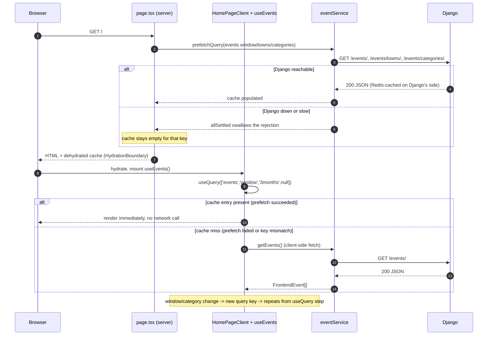
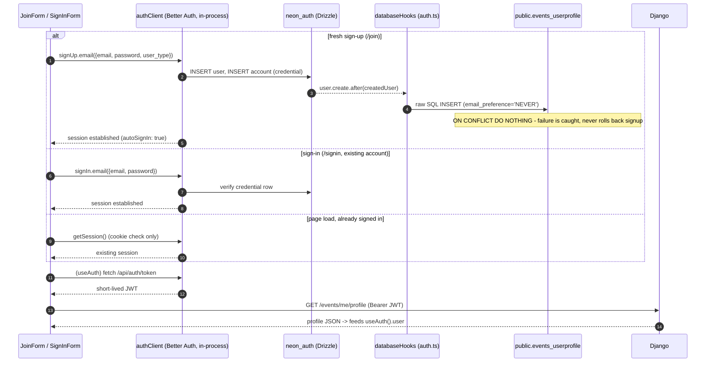
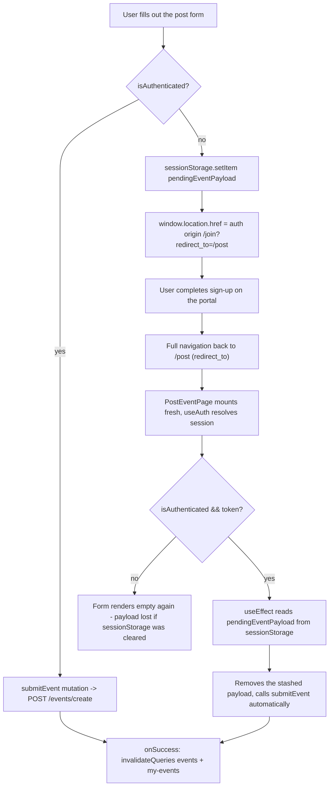

# The Main Site (theCommonsWeb)

> **Last updated:** 2026-08-03, commit `9a38379`, branch `suite-47-tags-and-filters`

## Overview

- `theCommonsWeb` is the public-facing Next.js 16 site (App Router, React 19, Tailwind v4,
  TanStack Query v5) that renders the event feed, calendar, post-an-event flow, profile/dashboard
  pages, and the standalone sign-in/sign-up portal. If this app is down, the whole site is down —
  there's no fallback rendering path.
- It talks to two backends: the Django REST API (`backendServer/`) for events/profiles/business
  data, and its own **Better Auth instance running inside this same Next.js process** for
  identity. The one fact newcomers get backwards most: this app *is* the identity provider —
  Django only mirrors Better Auth's `neon_auth` tables read-only and verifies the JWTs this app
  issues.
- The Django API has no server-rendered pages of its own; it's a pure JSON backend consumed by
  this app (and separately by `broadcastWeb`, not covered here).
- Where to go for a given task: home-feed rendering/prefetch → Deep Dive §2.1; how sign-in/sign-up
  resolves a session and JWT → §2.2; the "fill out `/post` while signed out" flow → §2.3; the
  route table → §3; hooks/services and query keys → §4; client-side auth gating → §5; visual
  spec pointer → §6; known traps (npm vs pnpm, type-checking, stale docs, query-key drift) → §7;
  open gaps the author didn't chase down → §8.
- Related docs: `theCommonsWeb/AGENTS.md` (terser, agent-facing directory map), `auth.md` (Better
  Auth internals, JWT/JWKS, cross-subdomain cookie), `design-system.md` (visual spec), `data-model.md`
  (Django API shapes), `testing.md` (running the test suite).

## Deep Dive

This complements `theCommonsWeb/AGENTS.md` (the agent-facing directory map, which stays terse) —
this doc goes deeper for a human landing in the codebase for the first time. For the identity
bridge itself (Better Auth internals, JWT/JWKS verification, the cross-subdomain cookie), see
`auth.md`; this doc only covers how the React side consumes that bridge. For the visual spec,
see `design-system.md`. For the shapes the Django API returns, see `data-model.md`. For running
the test suite, see `testing.md`.

### 1. What this is and who depends on it

`theCommonsWeb` is the public-facing Next.js 16 site — the App Router, React 19, Tailwind v4,
TanStack Query v5 stack that renders the newspaper-style event feed, the calendar, the post-an-
event flow, profile/dashboard pages, and the standalone sign-in/sign-up portal. It talks to two
backends: the Django REST API (`backendServer/`) for everything event-, profile-, and
business-related, and its own Better Auth instance (running inside this same Next.js process)
for identity. That second point is the one newcomers most often get backwards: **this app is
the identity provider.** Better Auth lives here, not in Django. Django only mirrors Better
Auth's `neon_auth` tables read-only and verifies the JWTs this app issues. If you're looking for
where "login" actually happens, you're already in the right codebase — see §5 and `auth.md`.

Everything a visitor sees — the feed, the calendar, event detail pages, the post form, the
profile and business dashboards, the newsletter signup and manage pages — is served from here.
The Django API has no server-rendered pages of its own; it's a pure JSON backend consumed by
this app (and by `broadcastWeb`, a separate Vite SPA not covered here). If this app is down, the
site is down — there is no fallback rendering path. If only Django is down, this app still
serves its shell and cached data (see §2.1's "Django down" branch), which is a deliberate
design choice in the home page's server component.

### 2. How it works

#### 2.1 Rendering the home feed — server prefetch, hydration, client refetch

The home route (`/`) is unusual among the app's pages: `app/page.tsx` is an async **server**
component that prefetches three queries into a `QueryClient` before any HTML reaches the
browser, then hands off to `HomePageClient` (a `'use client'` component) via TanStack Query's
`HydrationBoundary`. The route is marked `export const dynamic = 'force-dynamic'` specifically
so this prefetch runs on every request — without it, Next would statically prerender `/` once at
build time and freeze it, serving the same event list forever regardless of the nightly 04:00 ET
ingestion pipeline landing new events. All three prefetches are wrapped in `Promise.allSettled`,
not `Promise.all` — a failed prefetch (Django down, cold Neon connection) must not break server
rendering; the client component just falls back to fetching client-side once it mounts.

Once hydrated, `HomePageClient` calls `useEvents`, which owns a TanStack Query `useQuery` keyed
on the current window/category selection. Because the server prefetch used the *exact* query
key the client's initial state produces (`['events', 'window', '3months', null]` — 3-month
window, no category selected, matching `useEvents`'s default state), the client's first render
finds a warm cache entry and skips a redundant fetch entirely. Change the default window or
category state in `useEvents` without updating the server prefetch key in `app/page.tsx` (or
vice versa) and this silently degrades to a double-fetch on every home page load — nothing
breaks, but the whole point of the prefetch is lost. This is the sharpest instance of the
query-key-must-stay-in-sync problem described in §7.

Three things the diagram can't say. First, `staleTime` on the shared `QueryClient`
(`src/lib/queryClient.ts`) is one hour, not `Infinity` — a common misconception carried over from
how `useTowns`/`useCategories` are configured (they *do* set `staleTime: Infinity` per-query,
overriding the client default, because town/category lists change rarely). The event list itself
inherits the one-hour default, so a background refetch can happen without any user action if a
tab is left open past that window — though `refetchOnWindowFocus`/`refetchOnReconnect` are both
off, so it won't happen just from switching tabs. Second, `gcTime` really is `Infinity` on the
client — cached query data for a given key is never garbage-collected client-side, so switching
window/category back and forth re-renders instantly from cache rather than refetching, at the
cost of unbounded cache growth for a long-lived tab (acceptable for a page people don't leave
open for days). Third, `getQueryClient()` deliberately returns a *fresh* `QueryClient` on every
call when `window` is undefined (i.e., on the server) and a memoized singleton in the browser —
sharing one instance across concurrent server requests would leak one visitor's prefetched data
into another's response.

#### 2.2 From a session cookie to `useAuth().user`

`useAuth` (`src/hooks/useAuth.tsx`) is the only sanctioned way for a component to know who's
signed in — components must not call `authClient` (the Better Auth client, `src/lib/auth-client.ts`)
or read JWTs directly (see §7 for why the lint rule meant to enforce this doesn't actually
catch violations). `AuthProvider` wraps the whole app in the root layout and, on mount, resolves
three things in sequence: the Better Auth session (a cookie check against `/api/auth/*`), a
short-lived JWT for calling Django (`GET /api/auth/token`, Better Auth's `jwt()` plugin), and the
Django-side profile (`GET /events/me/profile`), the last of which is a TanStack Query
(`['profile', token]`) rather than imperative state — so invalidating that key anywhere in the
app (profile save, dashboard save) refreshes what `useAuth().user` reports without `AuthProvider`
needing to know who changed it.

Sign-up is the one path that also *writes* somewhere Django can't see coming: Better Auth's
`databaseHooks.user.create.after` hook (`src/lib/auth.ts`) fires inside the same transaction as
the new `neon_auth.user`/`neon_auth.account` rows, and runs a **raw SQL `INSERT`** — not a
Django API call, not the Django ORM — directly against `public.events_userprofile`, seeding
`email_preference` to `'NEVER'`. This is a real trap: the Django `UserProfile` model's field
default is `WEEKLY`, but that default only applies when the ORM constructs the row, and this row
never goes through the ORM. Every account created via `/join` starts with digests off, silently,
regardless of what the model file says. The insert is wrapped in try/catch with
`ON CONFLICT DO NOTHING` specifically so a mirror-insert failure (schema drift, a duplicate)
can't roll back the signup transaction and strand a Better Auth user with no way to sign in — the
tradeoff is that a user can transiently exist with no `events_userprofile` row at all if the
insert throws.

Two things worth calling out. The redirect that follows any of the three branches —
`window.location.href = resolveRedirect(redirect_to)` — is a full cross-origin navigation, not a
Next.js client route change, because the portal is served at a different origin in production
(`auth.thecommons.town`) from the apex app; `resolveRedirect` (`src/lib/redirect-allowlist.ts`)
exists purely to stop that redirect target from becoming an open-redirect vector, and is
deliberately a separate allowlist from `auth.ts`'s `trustedOrigins` (one governs where you can
navigate to, the other governs CORS/cookie trust — conflating them was explicitly avoided).
Second, sign-in and sign-up both leave the actual profile fetch to the same code path (`fetchJwt`
then `fetchProfileFromDjango`), so a bug in the profile fetch shows up identically regardless of
which portal flow triggered it — there's no separate "new user" profile-loading code.

#### 2.3 Posting an event across the auth wall

`/post` is reachable, and its form fully usable, without being signed in — the auth requirement
only bites at submission. This produces a flow that spans two page loads and a full-origin
round trip to the portal, which is easy to get wrong if you're not looking for it:

The form data itself never reaches the portal or Django until after authentication succeeds —
it's held client-side in `sessionStorage` for the round trip, which is why closing the tab (or
using a private window that clears storage on cross-origin navigation) between steps D and G
loses the draft silently. There's no warning for this; the user just lands back on an empty
form.

### 3. Routes

| Path | File | Type | Auth required? | Purpose |
|---|---|---|---|---|
| `/` | `app/page.tsx` + `HomePageClient.tsx` | server (prefetch) → client | No | Event feed/calendar, filters, detail modal (see §2.1) |
| `/about` | `app/about/page.tsx` | server | No | Static about page, SEO metadata |
| `/post` | `app/post/page.tsx` | client | Form visible to anyone; submission gated (see §2.3) | Multi-step event submission |
| `/profile` | `app/profile/page.tsx` | client | Yes | Edit town/tags/digest prefs; business/venue variant shows read-only identity + security notice |
| `/dashboard` | `app/dashboard/page.tsx` | client | Yes, and only `user_type` BUSINESS/VENUE | Manage submitted events, account settings, business listing |
| `/auth`, `/auth/login`, `/auth/signup` | `app/auth/{page,login/page,signup/page}.tsx` | server redirect | No | Legacy links; map old `?redirect=`/`?intent=` params to `redirect_to` and bounce into the portal |
| `/signin` | `app/(portal)/signin/page.tsx` + `SignInForm` | client | No (redirects away if already signed in) | Portal sign-in |
| `/join` | `app/(portal)/join/page.tsx` + `JoinForm` | client | No | Portal create-account (email + password + confirm, one step) |
| `/forgot-password` | `app/(portal)/forgot-password/page.tsx` + `ForgotPasswordForm` | client | No | Requests a Better Auth password-reset email |
| `/reset-password` | `app/reset-password/page.tsx` + `ResetPasswordForm` | client | No — the `?token=` in the URL *is* the credential | Sets a new password from the reset-email link |
| `/events/[uuid]` | `app/events/[uuid]/page.tsx` | server (async) | No | Event detail; `generateMetadata` + OpenGraph + JSON-LD structured data |
| `/newsletter/manage` | `app/newsletter/manage/page.tsx` + `ManageForm` | client | No — token-based, no account needed | Change digest frequency or unsubscribe via the emailed manage link |
| `/privacy-policy` | `app/privacy-policy/page.tsx` | server | No | Static privacy policy (covers both the site and the broadcast extension) |
| `/robots.txt`, `/sitemap.xml` | `app/robots.ts`, `app/sitemap.ts` | route handlers | No | Machine-consumed; sitemap paginates through `/events/` to list every event URL |
| `/api/auth/[...all]` | `app/api/auth/[...all]/route.ts` | route handler | — | Better Auth's catch-all handler, wrapped with a hand-rolled CORS layer (see §7) |

**Drift note:** `theCommonsWeb/AGENTS.md`'s route table only lists `/`, `/about`, `/post`,
`/profile`, `/dashboard`, the `/auth*` shims, the portal routes, and `/events/[uuid]` — it's
missing `/reset-password`, `/newsletter/manage`, `/privacy-policy`, and the `robots.ts`/`sitemap.ts`
route handlers, all of which exist and are live in the current tree. Worth fixing in that file
the next time someone's in there; not fixed here per this doc's scope (docs only, and that file
belongs to the agent-facing tree).

### 4. The data layer: hooks and services

Every network call to Django goes through `src/services/`, never directly from a component or
hook. Each service function reads `NEXT_PUBLIC_API_BASE_URL` (default `http://127.0.0.1:8000`)
at call time — but see §7 for why that "at call time" phrasing is misleading once the app is
built into a Docker image. `eventService` additionally maps every backend response
(`BackendEvent`, snake_case, `uuid`-keyed) into the frontend's `FrontendEvent` shape (camelCase
`id`, parsed `Date`, formatted price string) — that mapping happens once, in the service layer,
specifically so no component has to know the Django wire format.

| Hook / Service | Lives in | Backs | Query key(s) it owns |
|---|---|---|---|
| `useEvents` | `hooks/useEvents.ts` | Home feed + calendar: paged list, per-month calendar cache, window/category/tag/town filter state | `['events','window',window,category]`, `['events','page',pageUrl]`, `['events','month',key]` |
| `useTowns` | `hooks/useTowns.ts` | Town dropdown/filter options | `['towns']` (staleTime: Infinity) |
| `useCategories` | `hooks/useCategories.ts` | Category dropdown/filter options | `['categories']` (staleTime: Infinity) |
| `useAuth` / `AuthProvider` | `hooks/useAuth.tsx` | Session + JWT + Django profile; `login`/`signup`/`logout`/`refreshSession` | `['profile', token]` |
| `useMessageStack` / `MessageStackProvider` | `hooks/useMessageStack.tsx` | One-at-a-time banner queue (digest CTA, etc.) — plain React state, not TanStack Query | — |
| `useToggleSet<T>` | `hooks/useToggleSet.ts` | Generic multi-select toggle (used for tags, towns, business tags/service-area) | — |
| `useClickOutside` | `hooks/useClickOutside.ts` | Outside-click handler for dropdowns/menus | — |
| `eventService` | `services/eventService.ts` | Events CRUD, staged-event CRUD, `BackendEvent → FrontendEvent` mapping | — (consumed by the hooks/pages above) |
| `profileService` | `services/profileService.ts` | `GET/PATCH /auth/me`; `fetchWithRetry` for Neon cold-starts | consumed under `['profile', ...]` |
| `businessService` | `services/businessService.ts` | `/businesses...` CRUD for business listings | consumed under `['business','me',token]` (dashboard-only, `queryKey:` inline, no dedicated hook) |
| `newsletterService` | `services/newsletterService.ts` | Public subscribe/manage endpoints — intentionally never sends an auth token | consumed by `NewsletterSignup`/`ManageForm` directly, not via a shared hook |

Ad hoc query keys that aren't owned by a shared hook — because the pages that use them are the
only callers — include `['my-events', token]` (dashboard's own listing) and
`['staged-event', eventId, token]` (the edit modal). **These are the ones to watch when adding a
mutation:** `post/page.tsx`'s create-event mutation invalidates `['events']` and `['my-events']`
by string literal; `EditEventModal`'s update mutation invalidates `['my-events']` and
`['staged-event', eventId]` the same way. Nothing enforces that these literals match what
`dashboard/page.tsx` and `EditEventModal` actually declare as their query keys — they currently
do match, but a rename in one file silently stops invalidating the other. There is no shared
query-key constants module; string literals are the entire convention.

### 5. Auth on the client

`useAuth` is the boundary — see §2.2 for how it resolves state, and `auth.md` for the Better
Auth configuration, the JWKS bridge to Django, and the cross-subdomain cookie setup in
production. Two things worth flagging here because they trip up frontend work specifically
rather than backend work: **Google sign-in is disabled, not broken** — it's commented out in
`src/lib/auth.ts` (the `socialProviders` block) and the client-side popup flow that used to live
at `src/app/auth/google-popup/` was deleted outright when the standalone portal shipped, so
there's nothing to re-enable by uncommenting alone; re-adding it needs a new post-OAuth
account-type step built into the portal, since the old embedded flow that used to ask "are you a
business?" after Google auth no longer exists. And **there is no `middleware.ts`** — route
protection for `/profile`, `/dashboard`, etc. is entirely client-side, done by each page checking
`useAuth().isAuthenticated` after `isInitializing` goes false and rendering a "sign in required"
state rather than redirecting. This means the protected pages' HTML shell (including any data a
server component might have fetched) is never actually blocked at the routing layer — only the
client-rendered content is gated. All of the pages that need this today are client components
with no sensitive server-fetched data, so it hasn't mattered in practice, but it's not a
structural guarantee.

### 6. Design system

Tailwind v4 with the newsprint palette and typography as CSS custom properties in
`src/app/globals.css`, plus the `.rule-thick`/`.drop-cap`/`.skeleton-block` utilities used
throughout the pages above. The full enforceable spec — the banned list, the token names, the
component conventions — lives in `design-system.md`; nothing in this doc should be treated as
the aesthetic source of truth.

### 7. Sharp edges

**`npm install` is not blocked by anything mechanical — only by convention.** There is no
`packageManager` field in `package.json`, no `engines` field, and no `preinstall`/`only-allow`
guard anywhere in the repo. The only pnpm-specific artifacts are `pnpm-lock.yaml`,
`pnpm-workspace.yaml` (which sets `allowBuilds` for `esbuild`/`sharp`/`better-sqlite3`/
`@prisma/client`/`unrs-resolver` — packages whose native postinstall scripts pnpm blocks by
default and this file re-permits), and the prose in `AGENTS.md`/`CLAUDE.md`/`CODING_STYLE.md`
saying "pnpm only." Running `npm install` in `theCommonsWeb/` will happily proceed: npm ignores
`pnpm-lock.yaml` and `pnpm-workspace.yaml` entirely, resolves its own dependency tree (npm's
hoisting rules differ from pnpm's strict-by-default peer resolution, so versions can drift from
what CI tests against), generates a `package-lock.json`, and replaces pnpm's symlinked
`node_modules/.pnpm` store layout with npm's flat/hoisted one — corrupting the store references
pnpm relies on for any package still shared with other pnpm-managed workspaces on the same
machine (there's a sibling `broadcastWeb/` with its own separate pnpm workspace). CI itself only
enforces pnpm 11.1.1 via `pnpm/action-setup@v4`, and the Docker build pins the same version via
`corepack prepare pnpm@11.1.1` in `Dockerfile.frontend` — neither of those helps a local
developer who runs the wrong command first. **Recovery:** delete `node_modules` and any
generated `package-lock.json`, then run `pnpm install` again; if `pnpm-lock.yaml` was somehow
touched, restore it from git before reinstalling.

**The type-check is `pnpm build`, and only `pnpm build`.** `package.json` has no `tsc --noEmit`
script, and `next build`'s prerender pass is what surfaces type errors — there is no faster
feedback loop in the normal dev cycle than running (or waiting on) a full production build. CI's
`lint` job's own comment on this is explicit: `next build` loads the Better Auth route and
client during prerender, so `src/lib/db.ts` (which throws if `DATABASE_URL` is unset) and the
Better Auth config (which parses `*_BETTER_AUTH_URL` as a URL) both execute at build time — CI
supplies placeholder env values solely so the build completes, never real credentials. Locally,
that means a stray type error doesn't surface until you run a full build, which is slow enough
that it's easy to develop for a while against `pnpm dev` (which uses Turbopack and is far more
forgiving of type errors) before discovering a break. **This is now only half the picture,
though:** CI also has a `lint` job (`ruff` + `mypy` + `eslint`) that runs `pnpm lint` — contrary
to `ARCHITECTURE.md`'s "Known gaps" note, which currently says there's no lint step in CI and
that `eslint.config.js` is fully commented out. Neither is true anymore: `eslint.config.js` is
live (it wires up `eslint-config-next`'s `core-web-vitals`/`typescript` rule sets plus one custom
`no-restricted-imports` rule), and it runs on every push/PR. That's drift worth fixing in
`ARCHITECTURE.md` directly; flagged here per this doc's brief rather than corrected there, since
this doc's scope is `human-docs/` only.

**The `no-restricted-imports` rule banning direct `authClient` use doesn't actually catch
anything.** `eslint.config.js` blocks imports of `@/lib/auth-client`, matching the `@/*` → `./src/*`
path alias declared in `tsconfig.json`. But nothing in this codebase uses that alias — every
import anywhere in `src/` is relative (`../../lib/auth-client`, `../../../hooks/useAuth`, and so
on). The rule matches zero real import statements. In fact two files already import
`auth-client` directly rather than going through `useAuth`: `ForgotPasswordForm` and
`ResetPasswordForm`, because `useAuth`'s context doesn't expose `requestPasswordReset`/
`resetPassword`. That's a defensible exception (those flows are intentionally outside a
session), but the lint rule that's supposed to flag *unintentional* direct usage would silently
pass a genuine violation too, because it's checking the wrong import spelling for how this repo
actually writes imports.

**`NEXT_PUBLIC_*` values (and `DATABASE_URL`/`BETTER_AUTH_*`) are compiled into the JS bundle at
Docker build time, not read at container start.** This matters more than it looks like from
inside `next.config.ts` or `queryClient.ts` alone. `Dockerfile.frontend`'s `commons-build` stage
takes `DATABASE_URL`, `BETTER_AUTH_SECRET`, `BETTER_AUTH_URL`, `NEXT_PUBLIC_BETTER_AUTH_URL`,
`NEXT_PUBLIC_API_BASE_URL`, and `NEXT_PUBLIC_THE_COMMONS_API_KEY` as build `ARG`s, sets them as
`ENV` before `pnpm run build`, and Next inlines every `NEXT_PUBLIC_*` reference (the ones read in
`eventService.ts`, `profileService.ts`, `businessService.ts`, `newsletterService.ts`,
`useAuth.tsx`, `HomePageClient.tsx`, `post/page.tsx`, `HeaderAuthNav.tsx`) directly into the
compiled output during that step. `docker-compose.yml`'s own build-arg block documents this
explicitly and warns that compose's `${VAR:-default}` interpolation cannot read
`theCommonsWeb/.env.local` — that file is only consumed via `env_file:` at *container runtime*, a
completely different mechanism from the build-time `ARG`s that actually reach the bundle. Every
build arg has a safe CI-style placeholder default, so `docker compose build` always "succeeds"
even with the wrong values baked in — there is no build failure to catch a misconfigured API
origin; the failure mode is a live container silently calling the wrong Django host for every
request. (CI has an explicit guard for exactly this on the `broadcastWeb` side — grepping the
built bundle for a `thecommons.town` origin — but no equivalent grep exists for
`theCommonsWeb`'s own build.) Practically: changing `NEXT_PUBLIC_API_BASE_URL` and restarting the
container does nothing; the image has to be rebuilt with the new value passed as a build arg.

**`queryClient.ts`'s `staleTime` is one hour, not `Infinity`**, despite both `ARCHITECTURE.md`
and `theCommonsWeb/AGENTS.md` describing the defaults as `staleTime/gcTime: Infinity`. Only
`gcTime` is actually `Infinity`; `staleTime` is `60 * 60 * 1000`. `useTowns` and `useCategories`
each override it back to `Infinity` on their own query, which is presumably where the confusion
originated — but the event-list queries inherit the one-hour default. Worth fixing in
`ARCHITECTURE.md` directly; flagged here rather than corrected there for the same reason as the
lint-step drift above.

**The `['myEvents', token]` and `['myBusiness', token]` query keys documented in `ARCHITECTURE.md`
and `theCommonsWeb/AGENTS.md` don't exist in the code.** The actual keys are `['my-events', token]`
(kebab-case, `dashboard/page.tsx` and `EditEventModal.tsx`) and `['business', 'me', token]`
(`dashboard/page.tsx`, `businessService`'s consumer). This is the same class of drift as the
`staleTime` note above — both docs describe an earlier or intended naming convention that the
code has since diverged from — and it matters in practice because it's exactly the kind of key
someone would copy-paste from the docs into a new invalidation call and have it silently no-op.

### 8. Known gaps

I did not find a shared constants module for query keys (confirmed by grepping every
`queryKey:`/`invalidateQueries`/`setQueryData` call site in `src/`) — every key is a string
literal at its call site, which is the root cause of the query-key drift described in §7 and §4.
I also did not trace whether the one-hour `staleTime` on the event list was a deliberate choice
or a leftover from before `useTowns`/`useCategories` were split out with their own
`Infinity` overrides; the git history predates what's visible from reading the current tree
alone. Neither gap blocks using this doc to add a new page — both are things a future cleanup
pass would want to know about.
