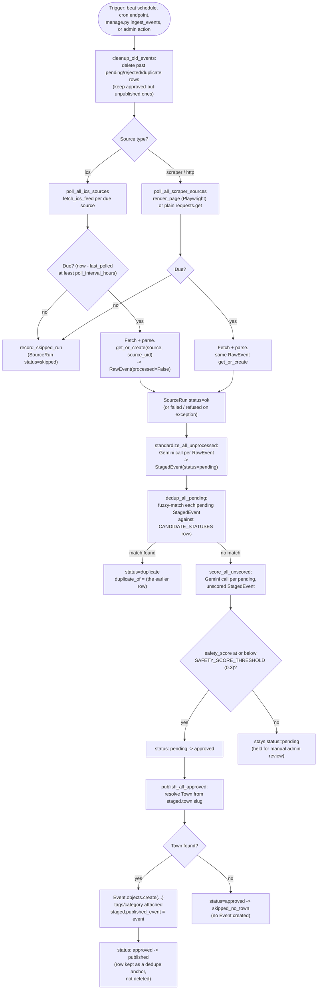
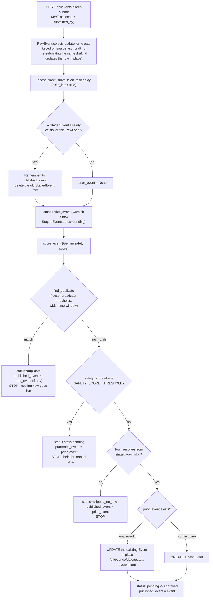
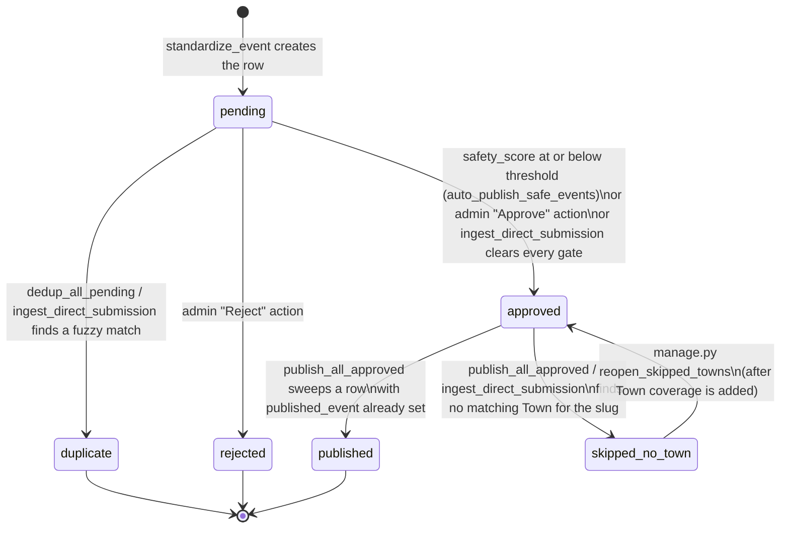
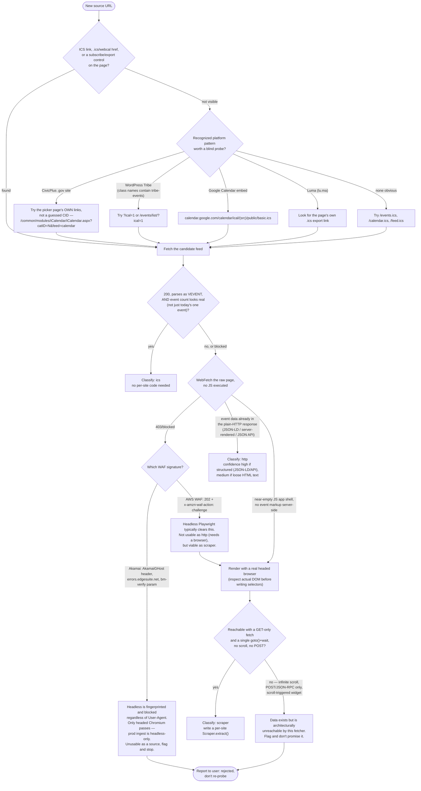

# The Ingestion Pipeline

> **Last updated:** 2026-08-03, commit `9a38379`, branch `suite-47-tags-and-filters`. This
> is the human-facing companion to [`docs/ingestion-pipeline.md`](../docs/ingestion-pipeline.md) (the
> agent-facing deep dive — stays the system of record for exact request/response shapes)
> and [`docs/safety-scoring.md`](../docs/safety-scoring.md) /
> [`docs/ingestion-monitoring.md`](../docs/ingestion-monitoring.md) (the `/devtools/monitor`
> dashboard and the `SourceRun` health model). Where this doc and those disagree, the code
> won this argument — see "Drift from `docs/ingestion-pipeline.md`" at the end.

Audience: someone inheriting this codebase who needs to either add a new town's event
calendar as a source, or figure out why a source has gone quiet.

## Overview

- **What it is:** The Commons doesn't rely on people submitting events by hand. It polls a
  list of town/venue/chamber-of-commerce websites on a schedule, pulls whatever raw event
  data each site exposes, hands each event to Google Gemini to clean it up into a
  consistent record, screens it for spam/abuse (also via Gemini), and — if it's clean —
  publishes it as a live `Event` on thecommons.town. A human only gets pulled in for an
  unrecognized town, a borderline safety score, or a probable duplicate.
- **Who depends on it:** the public `events` app (everything on the site is either
  pipeline-published or a direct host submission that went through the same code path),
  and the `broadcast` subsystem, which pushes already-published `Event` rows out to other
  towns' calendars (broadcast only ever reads `Event`, never `RawEvent`/`StagedEvent`).
- **The one fact that matters most:** there are two separate ways an event gets in —
  the **scheduled bulk pipeline** (nightly poll of every due source) and **direct host
  submission** (a business submits one event synchronously through the broadcast SPA).
  They share most of the same machinery (standardize → dedupe → safety-score → publish)
  but differ in ordering and terminal status — see Deep Dive §2 for both.
- **If ingestion silently stops**, nothing crashes or errors on the frontend — the site
  just slowly stops getting new events, which is why the `/devtools/monitor` dashboard
  (Deep Dive §4, and `docs/ingestion-monitoring.md`) exists.
- **Where to go for what:**
  - Adding a new source or classifying a URL as `ics`/`scraper`/`http` → Deep Dive §5.
  - A source has gone quiet or you're debugging why an event never went live → Deep Dive
    §6 (Sharp edges) and §7 (Known gaps).
  - Understanding the data model (`EventSource`, `SourceRun`, `RawEvent`, `StagedEvent`,
    `Event`) → Deep Dive §3.
  - Wiring into an endpoint or CLI command → Deep Dive §4 (Interfaces).

## Deep Dive

### 1. What this is and who depends on it

The Commons doesn't ask anyone to submit events by hand (mostly). Instead it polls a list
of town/venue/chamber-of-commerce websites on a schedule, pulls whatever raw event data
each one exposes, hands each event to Google Gemini to turn into a clean, consistent
record, screens it for spam/abuse (also via Gemini), and — if it's clean — publishes it
as a live `Event` that shows up on thecommons.town. A human only gets pulled in when
something is ambiguous: an unrecognized town, a borderline safety score, or a probable
duplicate the fuzzy matcher isn't sure about.

The pipeline lives entirely in the `ingestion` Django app (`backendServer/ingestion/`).
Two things depend on its output directly: the public `events` app (everything on the site
is either pipeline-published or a business's own direct submission that went through the
same code path), and the `broadcast` subsystem, which pushes already-published `Event`
rows *out* to other towns' calendars — broadcast reads `Event`, it never touches
`RawEvent`/`StagedEvent` (see [`broadcast.md`](broadcast.md) once it exists, or
[`docs/broadcast.md`](../docs/broadcast.md) today). If ingestion silently stops, the
front page slowly runs out of new events — nothing crashes, nothing errors on the
frontend, it just goes quiet, which is exactly why the monitoring dashboard covered later
in this doc exists.

There's a second entry point worth knowing about up front: a business or venue can submit
an event directly through the broadcast operator SPA, and that submission runs through
almost the same standardize → dedupe → safety-score → publish machinery, just
synchronously, one event at a time, instead of in the nightly batch. Both paths are
covered below.

---

### 2. How it works

#### 2.1 The scheduled pipeline: source → live Event

This is the nightly batch flow — one pass touches every due source, then every
unprocessed row created by that pass. It's the same shape whether it's triggered by
Celery beat, the cron HTTP endpoint, `python manage.py ingest_events` by hand, or the
Django admin's "Run ingestion pipeline" action; only the trigger differs.

**Six things worth calling out:**

1. **ICS sources and scraper/HTTP sources are polled by two separate code paths that are
   never chained together.** `run_ingestion_pipeline` (the Celery task beat fires at 04:00
   America/New_York) polls ICS only. `scrape_all_sources_task` (a separate beat schedule,
   03:30 America/New_York, routed to its own `scrape` queue) polls `scraper`- and
   `http`-type sources. A prior version of `run_ingestion_pipeline`'s own docstring
   claimed it mirrored the CLI command end-to-end; that was false, and two `http`-type
   sources went unpolled for weeks before anyone noticed. `python manage.py ingest_events`
   (no flags) does run both legs — that's the one command that actually reproduces "poll
   everything."
2. **"Fetch" for a `scraper` source means launching headless Chromium via Playwright**
   (`ingestion/scraping/browser.py::render_page`); an `http` source is a plain
   `requests.get()` with no browser at all. Both source types then run through the exact
   same per-site `Scraper.extract(html)` class — the only difference between the two types
   is how the HTML got fetched, not how it's parsed. See §5 for when each applies.
3. **Standardization (Gemini) is the only place raw data gets rewritten**, and it also
   fetches the event's own detail page a second time (via `requests`, or via Playwright if
   the source is `scraper`-type) purely to scrape a price out of the page text — this is a
   second network round-trip per event, independent of the original poll.
4. **Dedup runs before safety scoring in the scheduled pipeline**, but *after* safety
   scoring in the direct-submission path (§2.2). This isn't a bug, just an ordering
   difference between the two code paths worth knowing before you go looking for the "one"
   dedup step.
5. **`SourceRun` rows are written for every poll attempt**, including skipped ones, and
   are the backbone of `/devtools/monitor`'s health classification — see
   [`docs/ingestion-monitoring.md`](../docs/ingestion-monitoring.md) for how `ok` /
   `failed` / `refused` / `skipped` get turned into a health badge.
6. **Publishing never deletes a `StagedEvent`.** `publish_all_approved` flips swept rows to
   `status="published"` and leaves them in the table permanently (until
   `cleanup_old_events` reaps them once their event date has passed) — they're the fuzzy
   deduplicator's matching corpus, so a duplicate of an already-published event still has
   something to match against. See "Publishing doesn't delete" under Sharp Edges.

#### 2.2 Direct host submission: one event, synchronously

A business/venue operator using the broadcast SPA can submit an event straight into the
pipeline (`POST /api/events/direct-submit`), bypassing the poll step entirely. This is a
different code path (`ingestion/services.py::ingest_direct_submission`, run inside the
Celery task `ingest_direct_submission_task`) with materially different behavior from the
bulk flow above — different enough that drawing it as a branch of the diagram above would
have obscured both, so it gets its own.

**Four things worth calling out:**

1. **This is idempotent by `draft_id`, deliberately, so an operator hitting "Preview" twice
   after editing the form doesn't create two events.** The `RawEvent` is upserted on
   `source_uid=draft_id`; re-processing tears down the previous `StagedEvent` and starts
   standardization fresh, but the *previous* live `Event` (if the first submission already
   published) is captured as `prior_event` before that teardown and carried through every
   exit branch. `Event` has no soft-delete/unpublish concept — its existence *is* its
   publication — so none of the terminal branches (duplicate, held-for-review,
   skipped-town) are allowed to orphan a `prior_event` that's already live. They keep
   `published_event` pointed at it even though the *new* content never went live.
2. **A resubmission that now looks like a duplicate, or now scores unsafe, does not take
   the previously-published event down.** The old `Event` just sits there un-updated while
   the new `StagedEvent` sits in `duplicate`/`pending` pointing at it — this is a
   moderation queue item, not a live-site bug, but it can look like one if you're only
   staring at the `Event` table.
3. **A successful direct submission never reaches `status="published"`** — the terminal
   status here is `"approved"`, not `"published"`, even though the `Event` is live
   immediately (synchronously, inside this same task). It only gets relabeled
   `"published"` the next time `publish_all_approved` runs a sweep (nightly, or triggered
   manually) and finds `status="approved"` rows with `published_event` already set. Until
   then, a direct-submission row is indistinguishable by status alone from a bulk-pipeline
   row that's "approved but not yet swept" — check `published_event` to tell them apart,
   not `status`.
4. **`acks_late=True` on this Celery task specifically** (unlike every other task in
   `ingestion/tasks.py`) is load-bearing, not incidental: prod runs `--concurrency=2` under
   systemd with `MemoryMax=1G` and restarts on every deploy, and Celery's default is
   at-most-once delivery — a prefetched message is silently dropped if the worker dies
   mid-task. This was confirmed in prod on 2026-07-21 (a submission enqueued 5 minutes
   before a worker restart was never consumed). At-least-once redelivery here is safe
   specifically *because* this whole flow is idempotent per point 1 — don't copy
   `acks_late=True` onto a non-idempotent task expecting the same safety.

---

### 3. Data model

| Model | Key fields | What it represents |
|---|---|---|
| `EventSource` | `source_type` (`ics`/`scraper`/`http`/`email`/`direct`), `url`, `active`, `last_polled`, `poll_interval_hours`, `scraper_key`, `prompt_suffix` | A site to poll on a schedule. `email` is a defined choice with no importer behind it — see Known Gaps. The singleton `source_type="direct"`, `active=False` row exists purely so direct submissions have an `EventSource` FK to hang off; it is never polled. |
| `SourceRun` | `source` FK, `status` (`ok`/`failed`/`refused`/`skipped`), `trigger`, `items_new`, `error_class`/`error_message`/`traceback` | One row per poll *attempt* — including attempts that were skipped because the source wasn't due yet. This is the observability trail `/devtools/monitor` reads to compute health; see [`docs/ingestion-monitoring.md`](../docs/ingestion-monitoring.md). |
| `RawEvent` | `source` FK, `raw_title`/`raw_description`/`raw_location`/`raw_start`/`raw_end`, `source_uid`, `raw_organizer` (direct submissions only), `processed` | Event data exactly as fetched, before any LLM touches it. `unique_together = ("source", "source_uid")` is what makes re-polling the same feed idempotent. |
| `StagedEvent` | `raw_event` FK (nullable), `title`/`description`/`location_name`/`town`/`start_datetime`/`tags`/`category`/`price`/`link` (all Gemini output), `status`, `safety_score`/`safety_notes`, `duplicate_of` FK (self), `published_event` FK, `submitted_by` FK | The LLM-cleaned, human-reviewable version of an event. `town` is a free-text string Gemini produced, *not* a `Town` FK — resolving it to a real `Town` row only happens at publish time (see Sharp Edges). |
| `Event` (`events` app) | `uuid` (primary key!), `title`, `town` FK, `date`, `venue`, `tags`/`categories` (M2M), `is_verified`, `source_name`, `created_by` FK | The live, published record the frontend reads. Created once per `StagedEvent` that clears the pipeline (or once per direct submission), then updated in place on a direct-submission re-edit. |

For the full cross-app data model (accounts, newsletter, broadcast included) see
[`data-model.md`](data-model.md) once it exists, or `ARCHITECTURE.md`'s "Data Models"
section today.

#### `StagedEvent.status` lifecycle

`duplicate`, `published`, and `skipped_no_town` all remain candidates the fuzzy
deduplicator matches *against* on later runs (`deduplicator.CANDIDATE_STATUSES` — every
status except `rejected`, which is deliberately excluded so a host who fixes a flagged
problem and resubmits isn't auto-marked a duplicate of their own rejected attempt). None
of these three transition anywhere further automatically except `skipped_no_town`, which
only moves via the manual `reopen_skipped_towns` command — adding a `Town` row does
**not** retroactively republish anything on its own.

There is a second, parallel way to reach `approved`+`Event` that this diagram
deliberately doesn't distinguish by status alone: the Django admin's "Approve selected
events" bulk action (`ingestion/admin.py`) creates the `Event` itself, inline, rather than
going through `publish_all_approved` — and it does **not** set `source_name`,
`created_by`, or `is_verified`, unlike the pipeline's own publish path. An
admin-bulk-approved event permanently looks unattributed/unverified compared to one that
went through the real publish flow. See Sharp Edges.

---

### 4. Interfaces

| Interface | Auth | Calls |
|---|---|---|
| `GET /api/cron/ingest` | Bearer `CRON_SECRET` | Queues `run_ingestion_pipeline` (ICS leg only) |
| `POST /api/events/publish-approved` | Bearer `THE_COMMONS_API_KEY` | Queues `publish_all_approved_task` |
| `POST /api/events/direct-submit` | JWT optional (anonymous allowed), rate-limited 10/min/IP | Upserts a `RawEvent`, queues `ingest_direct_submission_task` |
| `GET/POST /admin/docs/publish-approved/` | Django staff | Same publish task, from a button in the admin docs pages |
| Django Admin → `EventSource` → "Run ingestion pipeline" action | Django staff | Runs `manage.py ingest_events` synchronously, in-request |
| Django Admin → `StagedEvent` → "Approve"/"Reject" actions | Django staff | Direct `Event` creation (approve) — see the admin-bulk-approve caveat above — or a plain status flip (reject) |
| Celery task `run_ingestion_pipeline` | beat, 04:00 America/New_York | Full ICS-leg pipeline: cleanup → poll (ICS) → standardize → dedup → safety → auto-publish |
| Celery task `scrape_all_sources_task` | beat, 03:30 America/New_York, `scrape` queue | Polls `scraper`/`http` sources only |
| Celery task `ingest_direct_submission_task` | on-demand from the view above | The §2.2 flow |
| `manage.py ingest_events [--skip-* ] [--shard N/M]` | CLI | The full pipeline, runnable in parts — see Sharp Edges for `--shard` |
| `manage.py cleanup_old_events` | CLI / called at the start of every pipeline run | Deletes past `RawEvent`/`StagedEvent` rows, preserving approved-but-unpublished ones |
| `manage.py add_source --url --type --name [--scraper-key] [--prompt-suffix]` | CLI | Registers/updates one `EventSource` row |
| `manage.py seed_sources [--force]` | CLI, dev-only unless forced | Projects the scraper registry into one `EventSource` row per scraper — for local testing, not prod |
| `manage.py reopen_skipped_towns` | CLI, manual | Flips `skipped_no_town` rows back to `approved` once their town slug now resolves |
| `/devtools/monitor`, `/devtools/probe` | Django staff, dev-only (404 in prod) | Funnel/health dashboard and a per-source dry-run probe — see [`docs/ingestion-monitoring.md`](../docs/ingestion-monitoring.md) |

---

### 5. Adding a new source: classification

Every new source has to be classified as one of `ics`, `scraper`, or `http` before any
code gets written. The repo has a slash command for this (`/source-creation`, or the
`source-creation` skill) that automates the process below — this section explains what it
actually does and the traps it encodes, so you can do it by hand or sanity-check its
output.

**Five things worth calling out:**

1. **A 403 is not one signal.** Akamai's bot-management block fingerprints *headless mode
   itself*, not the User-Agent string — swapping in a real Chrome UA does nothing, and the
   only known workaround (headed Chromium) isn't viable because `INGEST_SCRAPER_HEADLESS`
   is a single global flag, not per-source; flipping it for one stubborn source slows down
   and risks memory-exhausting every other scraper on the 6 GB prod VM. Chatham County
   (`chathamcountync.gov`) was evaluated and rejected on 2026-07-31 for exactly this
   reason — don't re-probe it, the finding is durable (Akamai's page also serves no
   ICS/JSON-LD, and even a headed fetch only reaches the month-grid view, not per-event
   descriptions or locations). An **AWS WAF** challenge (202 + `x-amzn-waf-action:
   challenge`) is a completely different, weaker block that headless Playwright usually
   clears on its own — the two look superficially similar (both start as a fetch failure)
   but call for opposite next steps.
2. **A CivicPlus `.gov` site's obvious guessed ICS URL
   (`iCalendar.aspx?CID=<n>`) returns HTTP 200 with an HTML subscribe-picker page, not a
   feed.** The real per-category feed URL
   (`/common/modules/iCalendar/iCalendar.aspx?catID=<n>&feed=calendar`) has to be read off
   the picker page's own links — confirmed across three separate CivicPlus sites.
3. **A WordPress "Tribe" (The Events Calendar) `?ical=1` URL can return 200 and valid
   `VEVENT` content while still being a false positive** — on at least one real site it
   contained only *today's* single event, not the actual feed. Always sanity-check the
   event *count* in a candidate ICS response, not just that `BEGIN:VEVENT` parses.
4. **The fetcher is architecturally GET-only with no scroll or interaction hook.**
   `_fetch_via_http` never sends a POST or custom headers; `render_page` does exactly one
   `goto()` + an optional selector wait, then snapshots the DOM — no scrolling, no click
   sequence. This rules out real sources that otherwise look scrapable: a POST/JSON-RPC
   calendar API, a nonce-carrying form submission, or a widget that only fetches its data
   after an intersection-observer/scroll event fires. These aren't fixable by picking a
   different `source_type` — the data is genuinely unreachable by this fetcher, and the
   right move is to flag it, not force a classification.
5. **Don't infer the platform, or even the state, from the URL.** A `/events-1` slug looks
   like a Wix default but isn't always Wix; a `.com` domain that reads like an NC town can
   belong to a same-named town in a different state entirely (verify via the page's own
   `addressRegion` in any JSON-LD present) — an out-of-state source would silently inject
   wrong-state events into a platform that's explicitly scoped to a handful of NC towns.

Once a URL is classified `scraper` or `http`, building it means: subclass `Scraper`
(`ingestion/scraping/scrapers/base.py`), implement `extract(html) -> list[RawEventData]`
against a real saved HTML fixture (prefer parsing `<script type="application/ld+json">`
schema.org `Event` blocks when the site has them — they're far more stable across
theme/plugin updates than CSS selectors), register the class by key in
`ingestion/scraping/scrapers/__init__.py`, and write a fixture-based test. None of this
touches the database or triggers a live poll — the `EventSource` row itself gets created
separately, by hand or via `/devtools/ingestion-playground`
(see [`docs/devtools-ingestion-playground.md`](../docs/devtools-ingestion-playground.md)).

---

### 6. Sharp edges

**`events.Event`'s primary key is `uuid`, not `id`.** `Event` declares
`uuid = models.UUIDField(primary_key=True, ...)` and has no `id` column at all — calling
`Count("id")` or `.values("id")` on an `Event` queryset raises `FieldError` at query time,
not silently returns zero. The monitoring code already works around this correctly
(`devtools/monitoring.py` uses `Count("pk")` specifically for its `Event`-source
attribution query) — copy that pattern, not the `Count("id")` used elsewhere in the same
file for `RawEvent`/`StagedEvent` querysets, which really do have an `id` column and are
fine as-is. If someone "fixes" this by adding an `id` field to `Event`, they'd be adding a
second, unused primary-key-shaped column and changing the table's actual PK column out
from under every FK that points at `Event` (`StagedEvent.published_event`, broadcast's
`CanonicalEvent` plumbing) — don't.

**`INGEST_SHARD_COUNT=3` in production silently limits a plain `ingest_events` run to
about a third of sources.** `_resolve_env_shard` computes the shard as
`day_of_year % INGEST_SHARD_COUNT` and only polls sources where `id % count` matches that
number — so a given source is actually polled roughly every 72 hours under this setting,
not the 24h its own `poll_interval_hours` implies. If you SSH into prod and run
`manage.py ingest_events` by hand to force-poll everything, this env var is still set and
you'll get the same ~1/3 slice the scheduled run would have gotten that day — you need
`--shard 0/1` (or set `--skip-poll`/`--skip-scrape` off and pass a shard that covers
everything) to actually poll all sources in one pass. This is a deliberate prod setting,
not a bug — removing it (or "fixing" the confusion by unsetting it) means every source
gets polled daily instead of every third day, which is fine functionally but changes load
and give-transient-failures-fewer-retries behavior that was chosen on purpose. See
`DEPLOY.md`'s note on this exact variable for the reasoning.

**`auto_publish_safe_events` looks like a no-op when it isn't one.** It only ever acts on
`StagedEvent` rows with `status="pending"` *and* a non-null `safety_score` — if there are
zero such rows (e.g. everything pending is still waiting on the safety scorer, or
everything scoreable has already been auto-approved), it returns
`{"auto_approved": 0, "held_for_review": 0}` and does nothing else. Crucially, it does
**not** flush rows that are already `status="approved"` sitting with `published_event`
still null — those exist (an admin approved something manually, or a prior run set
`approved` but the transaction for the final publish step never got a chance to run). The
function that actually flushes *all* approved-and-unpublished rows regardless of how they
got to `approved` is `publish_all_approved()` — call that directly (or hit
`POST /api/events/publish-approved`, or the admin's "Publish approved events" docs page)
if you suspect approved rows are sitting stuck. Debugging "why isn't this approved event
showing up" by re-running `auto_publish_safe_events` alone will look like it did nothing,
because for that specific stuck row, it did.

**Source-classifier traps** — see §5's decision tree and its five callouts in full; the
short version: CivicPlus's obvious guessed ICS URL is a decoy (the real feed URL has to be
read off the picker page), a Tribe `?ical=1` URL can 200 with valid-but-wrong (single-day)
content, an Akamai 403 and an AWS WAF 403 call for opposite next steps and only one of
them (Akamai) is a dead end given the global headless-only setting, Chatham County
specifically was evaluated and rejected on 2026-07-31 (don't re-probe those exact URLs),
and the fetcher's GET-only/no-scroll architecture rules out POST-driven and
infinite-scroll calendars regardless of how the site is otherwise classified.

**Never use the Django ORM inside a `sync_playwright()` block.** This constraint is
usually associated with `broadcast/runner.py`, but it applies here too, in
`ingestion/scraping/browser.py::render_page` — the module's own docstring states it
explicitly (Playwright keeps an asyncio event loop alive on the calling thread, which the
ORM's async-aware connection-locals handle badly). In practice ingestion's actual callers
already respect this without anyone having to think about it: `render_page` takes a plain
URL string and returns a plain HTML string with zero ORM access inside its
`sync_playwright()` block, and `_ingest_with_scraper` (`scraper_importer.py`) is
explicitly split into three phases — PHASE 1 fetch (no ORM), PHASE 2 pure `extract()` (no
ORM, no browser), PHASE 3 the `RawEvent.get_or_create()` writes, strictly *after* the
browser has already been closed. If you're adding a new scraper and are tempted to look up
or write a Django model from inside `extract()` or anywhere upstream of it while a page is
still open, don't — move that logic to PHASE 3.

**A `StagedEvent.town` is a free-text string from Gemini, resolved to a real `Town` row
only at publish time, by a naive slugification.** `town_slug =
staged.town.lower().replace(" ", "-")` is not Django's `slugify` — it doesn't strip
punctuation. If Gemini returns a town name with an apostrophe or a period, or any
formatting Django's actual `Town.slug` values don't share, the lookup misses and the
event silently lands in `status="skipped_no_town"` even though the town is "obviously"
covered. This is the most common reason a source that's clearly producing events never
shows anything live — check `/devtools/monitor`'s funnel for a nonzero `no_town`-adjacent
count, or query `StagedEvent.objects.filter(status="skipped_no_town")` directly, before
assuming the source itself is broken.

**The Django admin's "Approve selected events" bulk action and the pipeline's own publish
path both create `Event` rows, but populate different fields.** The admin action
(`ingestion/admin.py`) builds the `Event` inline and does not set `source_name`,
`created_by`, or `is_verified` — those stay at their model defaults (`""`, `None`,
`False`) forever, since nothing ever backfills them. `services.publish_all_approved` sets
all three correctly (`source_name` from the originating `EventSource.name`, `is_verified`
from the submitter's `user_type`). An event manually approved in the admin will
permanently look unattributed and unverified compared to one that went through
`publish_all_approved`, even though both are equally "approved."

---

### 7. Known gaps

- **`EventSource.source_type` has an `"email"` choice with no importer behind it anywhere
  in the codebase.** It's a defined model choice, nothing more — treat it as reserved/dead
  rather than a working ingestion path.
- **`SourceRun.items_fetched` is defined on the model but is never actually set** by
  either poll loop — only `items_new` and `items_duplicate` get populated in practice
  (and `items_duplicate` itself wasn't verified as written anywhere either during this
  pass). If you're relying on `items_fetched` for a diagnostic, confirm it's populated for
  your code path before trusting it; it may just read 0 for everything.
- **`Category` is a many-to-many field on `Event` but the pipeline only ever attaches at
  most one category** (`staged.category` is a single slug string, not a list) — the M2M
  shape exists for future flexibility that isn't used yet.
- This doc did not independently verify every claim in
  [`docs/devtools-ingestion-playground.md`](../docs/devtools-ingestion-playground.md) — it
  reads as an implementation *plan* (some function signatures and file layouts it
  describes, like a source-scoped `DELETE` in `publish_all_approved`, don't match current
  code, which flips status to `published` rather than deleting) rather than a description
  of the shipped tool. Treat it as historical design context, not a current behavior
  reference, until someone re-verifies it against `devtools/` directly.

#### Drift from `docs/ingestion-pipeline.md`

That doc is the agent-facing deep dive and stays authoritative for request/response
shapes, but as of this pass it has fallen behind the code in a few concrete ways worth
flagging rather than silently propagating:

- It describes only the ICS path (Phase 1) — `scraper`/`http` sources and the entire
  `scraping/` package (23 registered per-site scrapers as of this commit) aren't
  mentioned at all.
- It omits safety scoring entirely — its "Phase 4" jumps straight from dedup to admin
  review, with no mention of `safety_scorer.py`, `SAFETY_SCORE_THRESHOLD`, or
  `auto_publish_safe_events`.
- Its "Phase 5 — Publish" section says approved `StagedEvent` records are deleted after
  publishing ("Delete all approved StagedEvent records (cleanup)"). Current code does the
  opposite on purpose — see "Publishing doesn't delete" in §2.1 — rows are flipped to
  `status="published"` and kept as dedupe anchors.
- Its tag table claims "35 total" tags; `standardizer.py`'s `VALID_TAGS` list currently
  has 19.
- It has no mention of `SourceRun`, the sharding env var, or the direct-submission
  idempotency/`prior_event` behavior covered in §2.2 here.
