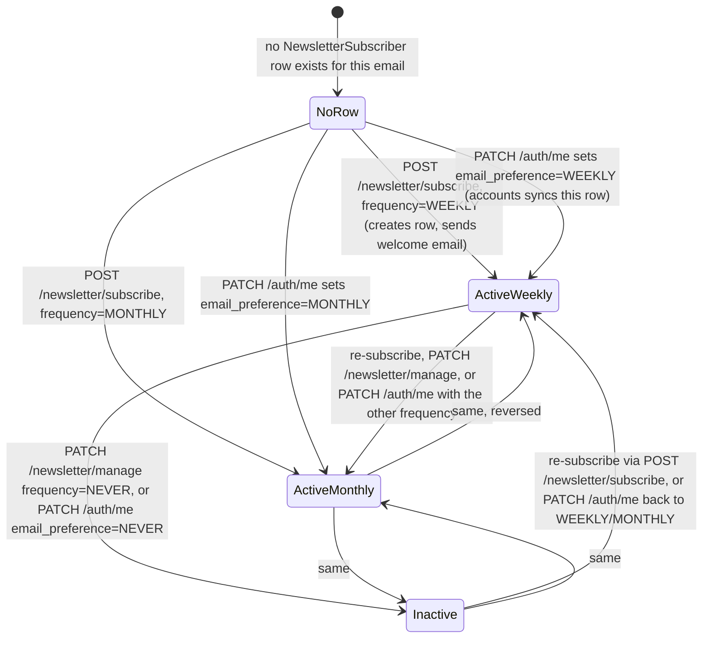
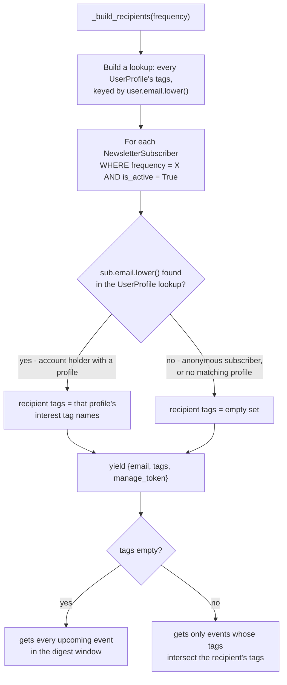
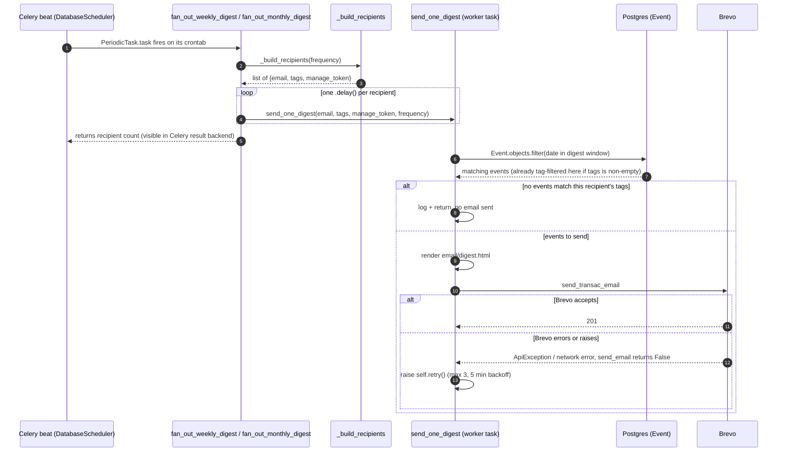
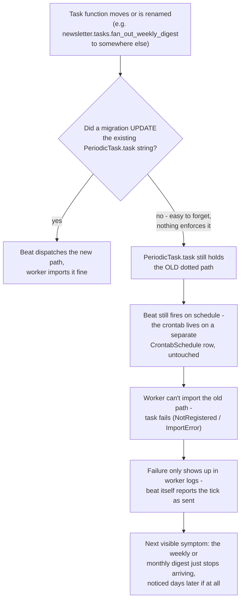

# The Newsletter (`newsletter` app)

> **Last updated:** 2026-08-03, commit `9a38379`, branch `suite-47-tags-and-filters`
>
> Originally written by reading `backendServer/newsletter/` in full (models, views, urls,
> `email_service.py`, `tasks.py`, `admin.py`, the digest management commands, migrations, and
> the email templates under `newsletter/templates/email/`), the generic transport it calls out
> to (`backendServer/events/email_service.py`), the parts of `backendServer/accounts/` that
> touch subscribers, and the beat/Brevo settings in `backendServer/backend/settings/base.py`.
> Complements `overview.md` (§6, one-paragraph summary), `data-model.md` (the field-level
> `NewsletterSubscriber` table and the Suite 41 migration history), and `auth.md` (the
> account-holder side of identity). If anything here disagrees with the code, trust the code.

## Overview

- `newsletter` is one of six Django apps in `backendServer`. It owns one thing: a mailing list
  (`NewsletterSubscriber`) of email addresses with a `WEEKLY`/`MONTHLY` frequency preference, plus
  a Celery-driven engine that renders and sends a personalized digest of upcoming `Event` rows.
  There's no login anywhere in this app — subscribing takes only an email, and managing or
  cancelling uses an unguessable token in a link, never a password or session.
- Two kinds of people share the same table: anonymous subscribers who just typed an email in, and
  account holders (`accounts.UserProfile`) whose digest preference syncs into this same
  `NewsletterSubscriber` row. There's no separate model for the two.
- The two facts that matter most: (1) a fresh signup gets `email_preference='NEVER'` and **no**
  `NewsletterSubscriber` row at all, so brand-new users are silently opted out until they change
  a setting (see Deep Dive §5); and (2) sends are entirely driven by a Postgres-stored
  `PeriodicTask` schedule that does **not** auto-follow code moves — moving a task without a data
  migration breaks digests silently (Deep Dive §5).
- Who depends on it: Celery beat fires weekly/monthly with no human in the loop, so failures are
  silent until a subscriber complains; `accounts` writes into this app's table directly; and the
  public site's subscribe form and profile settings page both call its endpoints.
- Where to go for a task: adding/removing a subscriber → Deep Dive §2.1; "why didn't recipient X
  get an email" → Deep Dive §2.2 and §5; how sends actually fire → Deep Dive §2.3; a manual/ops
  resend or smoke test → Deep Dive §2.4; the field-level schema → Deep Dive §3; the endpoint/task
  list → Deep Dive §4; known traps → Deep Dive §5; what's unverified → Deep Dive §6.

  **future work**
  - Need to make the newletter look better visually
  - Figure out how to send events that a user may prefer, for example from thir town or with filters
  they use a lot. 
  - I don't think the newletter sends properly so need to figure out whats going on there. 

## Deep Dive

### 1. What this is and who depends on it

`newsletter` is one of six Django apps in `backendServer`. It owns exactly one thing: a mailing
list of email addresses, each with a `WEEKLY`/`MONTHLY` frequency preference, and a Celery-driven
engine that renders and sends a personalized digest of upcoming `Event` rows to that list. There
is no login requirement anywhere in this app — subscribing takes only an email address, and
managing or cancelling a subscription is done through an unguessable token embedded in a link,
never a password or session.

Two kinds of people end up on the list. The first is a pure newsletter subscriber who has no
account on The Commons at all — they typed an email into a subscribe form and get everything.
The second is an account holder (someone with a `UserProfile` in the `accounts` app) who set an
email digest preference on their profile; if they've also tagged interests, their digest is
narrowed to matching events. Both kinds live in the exact same table, `NewsletterSubscriber` —
there is no separate "authenticated subscriber" model.

Who depends on it: the Celery beat schedule fires it weekly and monthly with no human in the
loop, so if this app breaks, the failure mode is silent — nobody notices until a subscriber
asks why they stopped getting email (see §5). The `accounts` app depends on it directly (writing
a row here is how a profile's email preference becomes a real mailing-list entry), and the
public site's subscribe form and profile settings page both call its two endpoints directly.

### 2. How it works

### 2.1 Getting onto (or off) the list

A `NewsletterSubscriber` row can be created or changed by three independent write paths, and
they all converge on the same table. There's no diagram needed for any one of them alone (each
is a short read-modify-write), but seeing all three together against the row's actual states is
where the behavior gets non-obvious — in particular, deactivating never deletes the row, and one
of the three paths doesn't require the user to ever touch the newsletter app's endpoints at all.

Three things worth calling out that the diagram can't say on its own:

- **`PATCH /newsletter/manage` with `frequency=NEVER` only flips `is_active` to `False` — it
  leaves the stored `frequency` value untouched.** The docstring-level intent (see the test
  `test_patch_never_deactivates_without_deleting_row` in `newsletter/tests/test_newsletter_db.py`)
  is so a later re-subscribe can silently restore the old cadence. The row and its
  `manage_token` are never deleted by this path.
- **The `PATCH /auth/me` path lives entirely in `accounts/views.py`, not in this app.** Every
  time that endpoint is called (not just when `email_preference` is in the request body — the
  sync block runs unconditionally after any profile save), it re-derives the subscriber row from
  the profile's *current* `email_preference`: `WEEKLY`/`MONTHLY` does an `update_or_create` with
  `is_active=True`; `NEVER` does a `filter(email=...).update(is_active=False)`. This is the
  `accounts → newsletter` half of the deliberate coupling described in §5.
- **A brand-new signup never touches any of these arrows.** Account creation happens in
  `theCommonsWeb`'s Better Auth hook (see `auth.md`), which inserts a `UserProfile` row directly
  with `email_preference` hardcoded to `'NEVER'` — no `NewsletterSubscriber` row is created at
  signup at all, by any path. See §5 for why this matters.

### 2.2 Resolving who gets a digest — the two-source branch

Both digest paths (the Celery fan-out in §2.3 and the synchronous `send_digest` management
command) call the exact same function to answer "who gets this digest, and what should be in
it" — `newsletter.email_service._build_recipients(frequency)`. `NewsletterSubscriber` is the
only thing this function reads to decide *who* is on the list; it reads `accounts.UserProfile`
only to decide, for each subscriber it already found, whether their digest should be narrowed.

Three things this diagram can't say on its own:

- **The correlation is a case-insensitive string match on email, not a foreign key.**
  `NewsletterSubscriber` has no relationship column to `UserProfile` at all — `data-model.md`
  §2 and §6 cover why. If an account holder's `NewsletterSubscriber.email` and their
  `BetterAuthUser.email` ever diverge (e.g. they changed their account email but the sync
  hasn't re-run), the lookup simply misses and they're treated as anonymous — full digest,
  no tag narrowing, and silently so.
- **An account holder with `tags` set but zero matching events in the window gets no email at
  all that cycle** — not an empty digest, no email. This is intentional (see the per-recipient
  skip in §2.3) but is the single most common answer to "why didn't they get one."
- **This is the only resolver in the codebase.** Both the Celery fan-out and the `send_digest`
  command import it; there is no second, divergent recipient query anywhere else in the repo.

### 2.3 Sending the digest — beat, fan-out, and per-recipient retry

The schedule that actually fires digests lives in Postgres, not in code — `django-celery-beat`'s
`DatabaseScheduler` reads `PeriodicTask` rows and dispatches by dotted task-path string. Two rows
exist: `weekly-digest-sunday` (Sunday 18:00 America/New_York) and `monthly-digest-first` (1st of
the month, 18:00 America/New_York). Each fires a *fan-out* task, which queues one small task per
recipient rather than sending inline — so a slow or failing send for one recipient can never
block or delay another's.

Four things worth calling out beyond the diagram:

- **`fan_out_weekly_digest` and `fan_out_monthly_digest` are plain, unretried tasks.** If the
  loop that queues `send_one_digest` dies partway (a DB hiccup, a broker connection drop), the
  recipients already queued are unaffected, but anyone after that point in the list simply never
  gets a task queued for them, with nothing beyond a Celery task-failure log entry.
- **`send_one_digest` is not idempotent against a Brevo-side partial success.** `send_email`
  (in `events/email_service.py`, see §2.4) catches every exception and returns `False`, which is
  the sole retry trigger. If Brevo actually queued the email but the HTTP response was lost to a
  timeout, the task still retries — a recipient can receive the same digest twice. There is no
  idempotency key passed to Brevo and no dedup on this app's side.
- **`send_one_digest` re-queries `Event` independently for every recipient**, rather than reusing
  one query across the fan-out the way `send_digest` (§2.4) does. For a small list this is
  inconsequential; it's worth knowing before assuming a shared events list is being reused.
- **The command `send_weekly_digest` just calls `fan_out_weekly_digest.delay()`** — it is a thin
  manual trigger for the same path above, not a separate implementation.

### 2.4 The synchronous fallback and the one-off test command

`newsletter/management/commands/send_digest.py --frequency WEEKLY|MONTHLY` calls
`email_service.send_digest(frequency)` directly, in-process, with no Celery involved. It queries
`Event` once, calls `_build_recipients` once (the same resolver as §2.2), and loops synchronously
over every recipient, filtering the shared event list per-recipient and calling `send_email`
directly. It is not on the beat schedule anywhere — the `PeriodicTask` rows point at the
Celery fan-out tasks in §2.3, never at this command. It exists as a manual/ops-triggered
alternative, and its shape doesn't need a second diagram: it is the same
recipients-then-render-then-send sequence as §2.3 with the Celery hop and per-recipient retry
removed.

`send_test_digest --email <address>` is different in kind, not just shape: it renders a
*different* template (`email/weekly_digest.html`, not `email/digest.html`), always in the
`WEEKLY` shape regardless of any real subscriber, pulls the next five upcoming events with no
tag filtering, and passes no `manage_url` into the template context at all — so the footer falls
back to the "reply to unsubscribe" text rather than a real manage link. It's a template/delivery
smoke test, not a preview of what any real subscriber receives.

### 3. Data model

`newsletter` owns exactly one model, `NewsletterSubscriber` — `email` (unique), `frequency`
(`WEEKLY`/`MONTHLY`), `is_active`, `subscribed_at`, and `manage_token` (a UUID, unique, the
entire authentication mechanism for the login-free manage link). The full field-level table,
its `db_table` history, and the Suite 41 migration mechanics live in `data-model.md` §6 and §8 —
this doc doesn't restate them.

### 4. Interfaces

| Interface | Trigger / caller | Description |
|---|---|---|
| `POST /newsletter/subscribe` | Public subscribe form | `{email, frequency}` → creates or updates a `NewsletterSubscriber` (`update_or_create` keyed on email), sends a welcome email with the manage link. No auth. |
| `GET /newsletter/manage` | Manage-link landing page | `?token=<manage_token>` → returns `{email, frequency, is_active}` for that one subscriber. 404 on an unknown or malformed token. |
| `PATCH /newsletter/manage` | Manage-link landing page | Same token auth; body `{frequency: WEEKLY\|MONTHLY\|NEVER}`. `NEVER` sets `is_active=False` without touching `frequency`; anything else sets both `frequency` and `is_active=True`. |
| `PATCH /auth/me` (in `accounts`) | Profile settings page | Not owned by this app, but the only other writer of `NewsletterSubscriber` — syncs a row to match the profile's current `email_preference` on every save. |
| `newsletter.tasks.fan_out_weekly_digest` | `PeriodicTask` `weekly-digest-sunday` (Sun 18:00 ET) | Resolves recipients, queues one `send_one_digest` per `WEEKLY` subscriber. |
| `newsletter.tasks.fan_out_monthly_digest` | `PeriodicTask` `monthly-digest-first` (1st of month, 18:00 ET) | Same, for `MONTHLY` subscribers. |
| `newsletter.tasks.send_one_digest` | Queued by the two fan-out tasks only | Renders and sends one recipient's digest; retries up to 3x (5 min backoff) on a Brevo failure. |
| `python manage.py send_digest --frequency WEEKLY\|MONTHLY` | Manual/ops | Synchronous equivalent of the fan-out path — not on the beat schedule. |
| `python manage.py send_weekly_digest` | Manual/ops | Thin wrapper that calls `fan_out_weekly_digest.delay()`. |
| `python manage.py send_test_digest --email <address>` | Manual/ops | One-off delivery/template smoke test — see §2.4 for how it differs from a real digest. |

### 5. Sharp edges

**Moving or renaming a Celery task does not update the beat schedule — the `PeriodicTask` row
has to be repointed by hand, in a data migration, or it fails silently on a weekly cadence.**
This is the concrete trap Suite 41 hit and the reason it's the first thing to know about this
app. `django-celery-beat`'s `PeriodicTask.task` column is a plain string — a dotted import path —
stored in Postgres, set once by `events/migrations/0015_seed_digest_beat.py` and
`0020_seed_monthly_digest_beat.py` when the digest fan-out tasks still lived in
`events.tasks.fan_out_weekly_digest` / `fan_out_monthly_digest`. When those tasks moved to
`newsletter.tasks` in Suite 41, the `PeriodicTask` rows did not follow automatically — nothing
in Django or Celery keeps a beat schedule in sync with where a `@shared_task` function actually
lives. `newsletter/migrations/0002_repoint_digest_beat.py` is the fix: a `RunPython` data
migration that does a plain `PeriodicTask.objects.filter(task=OLD_PATH).update(task=NEW_PATH)`
for both rows, fully reversible. As of this doc, that migration has run and both rows correctly
point at `newsletter.tasks.fan_out_weekly_digest` / `fan_out_monthly_digest` — confirmed by
reading the migration and by the guard test `MonthlyBeatScheduleSeedTests` in
`newsletter/tests/test_digest_db.py` (a sibling guard exists for the weekly row in
`events/tests/test_beat_schedule_db.py`), so **the schedule is currently correct.** The trap for
whoever moves one of these tasks next:

Anyone renaming or relocating `send_one_digest`, `fan_out_weekly_digest`, or
`fan_out_monthly_digest` needs a `RunPython` migration in the same change that updates the
existing `PeriodicTask.task` string — mirroring `0002_repoint_digest_beat.py` — not just a code
change. A guard test against the live `PeriodicTask` row (as `test_digest_db.py` and
`test_beat_schedule_db.py` already do) is the only thing that would have caught a missed repoint
before it cost a week.

**A fresh signup gets `email_preference='NEVER'` and no `NewsletterSubscriber` row at all —
neither matches what the model's own field default implies.** `accounts.models.UserProfile.
email_preference` is declared `default=EmailFrequency.WEEKLY`, but that default only applies to
rows created through the Django ORM. The real signup path (`theCommonsWeb`'s Better Auth
`databaseHooks.user.create.after`, documented in `auth.md`) inserts the mirrored
`events_userprofile` row with a raw SQL `INSERT` that hardcodes `email_preference` to
`'NEVER'` — and does not touch `NewsletterSubscriber` at all. So a brand-new account holder is
opted out of digests from the moment they sign up, and stays entirely absent from
`NewsletterSubscriber` (not merely inactive — no row exists) until they explicitly change their
preference through `PATCH /auth/me`. This is real doc drift worth flagging on its own: the model
field's stated default reads as "new users default to weekly," which is not what happens for any
account created through the actual signup flow.

**The `accounts` ↔ `newsletter` import cycle is deliberate — do not "fix" it.** `accounts.views`
(the `PATCH /auth/me` handler, §2.1) imports `newsletter.models.NewsletterSubscriber` at module
level to keep the subscription row in sync with a profile's `email_preference`.
`newsletter.email_service._build_recipients` imports `accounts.models.UserProfile` (inside the
function body, not at module level) to read that same account holder's interest tags back out
for digest narrowing (§2.2). Each direction serves a different purpose — one writes, the other
reads — and both are called out explicitly in `backendServer/AGENTS.md`'s isolation contract and
enforced by dedicated tests: `newsletter/tests/test_isolation_fast.py` asserts this app imports
nothing from `ingestion` or `broadcast` (allowing `accounts` and `events` by name), and the
mirror test lives under `accounts/tests/`. The only hard boundary here is `ingestion` and
`broadcast`, which neither app may import.

**A tag-filtered recipient with zero matching events receives nothing that cycle — not an empty
digest, no email at all.** `send_one_digest` returns early (§2.3) the moment its event query
comes back empty after tag filtering; `send_digest`'s synchronous loop does the same per
recipient. This is intentional (there's a dedicated test for it,
`test_send_one_digest_skips_when_no_events_match_tags`), but it means "why didn't I get the
newsletter this week" can have a perfectly correct, silent answer: their interest tags just
didn't match anything in the window. There is no distinct "no events found" email variant sent
in this case (that copy only exists in the template's `` branch, which fires for an
*anonymous* subscriber whose full, untagged event list happens to be empty — a different case).

### 6. Known gaps

I did not verify whether any frontend code (`theCommonsWeb`) reads or displays
`NewsletterSubscriber.subscribed_at`, or whether the `/newsletter/manage` landing page in the
frontend surfaces the distinction between "inactive, frequency preserved" and "never
subscribed" to the user — both are visible only in the API response, not covered here since this
doc is grounded in `backendServer/`. I also did not find any process that backfills a
`NewsletterSubscriber` row for an account holder who has never touched `PATCH /auth/me` since
signup (the comment in `theCommonsWeb/src/lib/auth.ts` calls a missing `UserProfile` row
"acceptable... may be backfilled," but no backfill job for the newsletter side turned up in
`backendServer/`) — if one exists outside the backend, it wasn't visible from here. Finally, I
did not trace what happens on the frontend if `POST /newsletter/subscribe` succeeds but the
best-effort welcome email fails (`send_newsletter_welcome` swallows the failure and the endpoint
still returns 201) — whether the subscriber is ever told their manage link didn't arrive.
