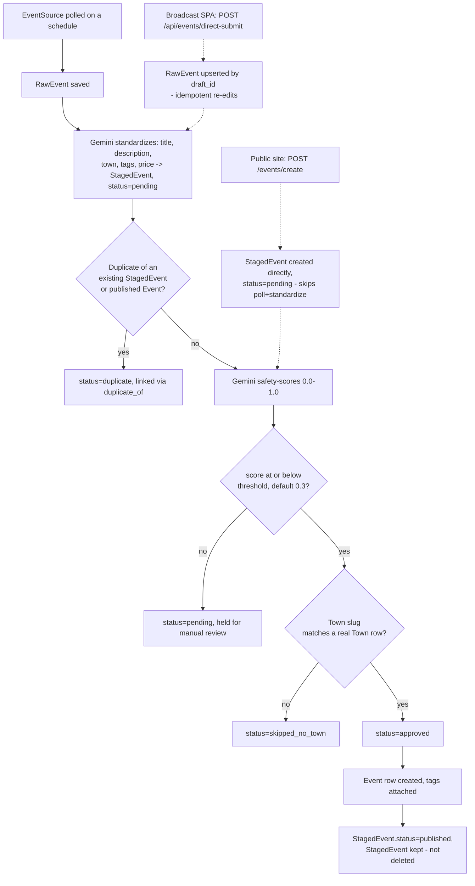
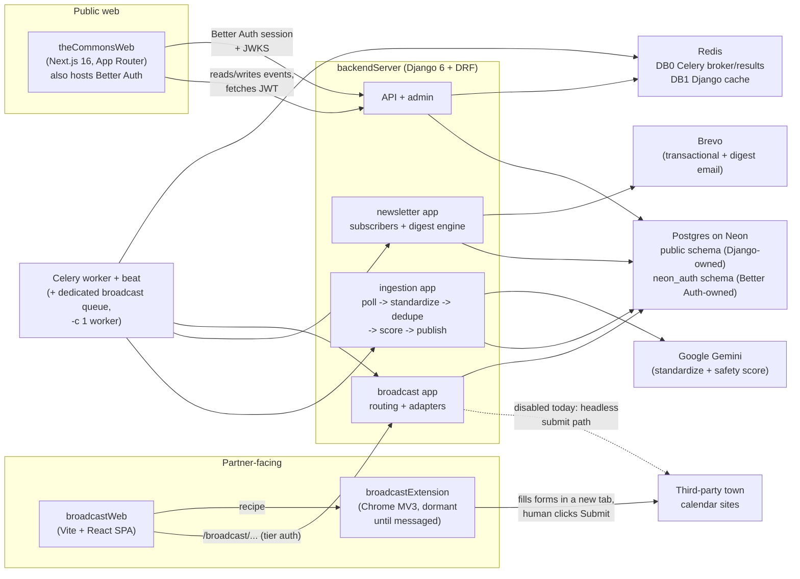

# Overview

> **Last updated:** 2026-08-03, commit `9a38379`, branch `suite-47-tags-and-filters`. Written by reading `backendServer/ingestion/`, `backendServer/events/models.py`, `backendServer/newsletter/`, `backendServer/broadcast/`, `AGENTS.md`, `ARCHITECTURE.md`, and `docs/broadcast.md`. If anything here contradicts the code, trust the code.

## Overview

The Commons is a local events aggregator for three small North Carolina towns — Chapel Hill, Carrboro, and Pittsboro — built with a deliberate "digital newspaper" look (serif type, ink on cream, no gradients or pill buttons) rather than a typical startup aesthetic.

It does three jobs under the hood:

- **Ingests events automatically** from town/community calendar sources, cleans them up with an LLM (Gemini), screens them for safety, and auto-publishes the ones that pass.
- **Accepts direct submissions** from residents (public site) and partner hosts (the "broadcast" console), the latter of which can also *push* one event out to other towns' calendars via browser automation.
- **Runs a newsletter** — a token-based (no-login) mailing list with a weekly/monthly digest.

The two audiences that matter most: **residents** browsing the public site (`theCommonsWeb`), and **event hosts/partners** using the broadcast console (`broadcastWeb`) to distribute one listing across several towns' calendars at once.

The single most important architectural fact: **Better Auth (inside the `theCommonsWeb` Next.js app), not Django, is the identity source of truth** — Django only verifies a JWT, it never issues its own login/session. The second: `ingestion/` and `broadcast/` are two genuinely separate subsystems, walled off from each other by both convention and isolation tests.

Where to jump in the Deep Dive below, by task:
- Understanding the event lifecycle (scrape → standardize → dedupe → score → publish) → **§3**
- The broadcast/syndication subsystem → **§5**
- The newsletter/digest → **§6**
- Background jobs, Celery/Redis layout → **§7**
- The overall architecture diagram → **§8**
- Known doc drift as of this writing → **§10**

## Deep Dive

This is the map. Read it first, then follow the pointers — `docs/` is the agent-facing system of record and stays canonical for line-by-line detail; this doc exists to orient a human who has never opened the repo.

### 1. What this is

The Commons is a local events aggregator for three small North Carolina towns — Chapel Hill, Carrboro, and Pittsboro. It is not a startup product. The intended feel, enforced throughout the frontend's CSS tokens, is a **digital newspaper**: Georgia serif, ink on cream newsprint, column rules instead of cards and shadows, density over whitespace, no gradients, no pill buttons. That aesthetic choice shows up as a real constraint on the codebase — a new UI component that reaches for a shadow or a rounded badge is fighting the design system, not extending it.

Under the hood it does three jobs. First, it finds events other people posted elsewhere — town government sites, community calendar feeds — and pulls them in automatically, cleans them up with an LLM, and checks them for anything that shouldn't be public before they go live. Second, it lets people submit events directly, either through the public site or through a partner-facing "broadcast" flow that also *pushes* an event out to other towns' calendars via automated browser form-filling. Third, it keeps a mailing list and sends out a digest of what's coming up.

The two audiences that matter: **residents**, who browse the public site (`theCommonsWeb`) for what's happening nearby, and **event hosts / partner organizations**, who use the broadcast console (`broadcastWeb`) to get one event listing distributed across several towns' calendars at once. A third, much smaller audience is whoever is running the ingestion pipeline day to day — the Django admin and a dev-only monitoring dashboard exist for exactly that.

### 2. The monorepo, piece by piece

```
thecommons/
├── backendServer/       Django 6 + DRF — the API, the ingestion pipeline, the broadcast subsystem, Celery
├── theCommonsWeb/       Next.js 16 (App Router) — the public site, and also the identity provider
├── broadcastWeb/        Vite + React — the operator console for pushing an event to other calendars
├── broadcastExtension/  Chrome MV3 extension — dormant unless a broadcast job needs a human hand
├── deploy/               systemd units + nginx config for the one production VM
└── docs/                 agent-facing deep dives — the system of record Claude reads on every task
```

**`backendServer/`** is a Django + Django REST Framework project, managed with `uv` rather than pip, split into five small apps instead of one monolith: `accounts` (identity — mirrors Better Auth's tables and holds the local `UserProfile`/`BusinessProfile`), `events` (the public `Event`/`Town`/`Tag` models and the read endpoints), `newsletter` (subscribers and the digest engine), `ingestion` (the pipeline described in §3), and `broadcast` (the syndication subsystem, described in §5). The apps are deliberately walled off from each other in a few places — most importantly, `broadcast/` and `ingestion/` are not allowed to import from each other or from other app internals, which is enforced by isolation tests, not just convention.

**`theCommonsWeb/`** is the public-facing site — a Next.js 16 App Router app that also happens to host **Better Auth**, the identity provider for the whole system. That's a detail worth sitting with: there is no separate auth service, and Django never issues its own login/session — it only verifies a JWT that this Next.js app minted. Auth is served at its own subdomain (`auth.thecommons.town`) fronted by a "portal" route group inside the same app, but it's the same codebase and the same deploy. The identity/auth bridge is its own document (`auth.md`) — not covered further here.

**`broadcastWeb/`** is a separate single-page app (Vite, not Next.js) for the partner-facing side of the product: pick an event, pick which town calendars to push it to, and either let the browser extension autofill each site's form or hand it off for manual review. It talks to the same Django backend under `/broadcast/...` but is its own deployable, its own build, and its own test suite.

**`broadcastExtension/`** is a Chrome MV3 extension that only activates when the broadcast SPA explicitly messages it — it does nothing on ordinary browsing, and its `host_permissions` list is the literal set of calendar sites it's allowed to touch. It is currently the *primary* mechanism broadcast uses to fill third-party forms (a human reviews and clicks Submit themselves); an older, fully-headless Playwright path still exists in the backend but is disabled in the SPA today. See §5 and `broadcast.md`.

**`deploy/`** holds the systemd unit files and nginx snippets for the single production host — one Oracle Cloud VM running everything (gunicorn for Django, the Next.js server, Redis, and several worker processes) behind nginx, with Postgres running externally on Neon. Full detail lives in `deploy-ops.md`.

**`docs/`** is not for people — it's the agent-facing system of record that Claude Code (and any future coding agent) reads before touching this repo. It stays canonical for exact endpoint lists, adapter registries, and settings values; this human-docs tree exists alongside it so a person doesn't have to read agent-oriented prose to get oriented.

### 3. How a single event moves through the system

An event's life has three possible starting points and one of four possible endings. The common path — a scraped event that gets auto-published — looks like this:



**Six things the diagram can't say on its own:**

1. **Published `StagedEvent` rows are not deleted.** A `StagedEvent` that becomes an `Event` flips to `status="published"` and stays in the table, because it's the corpus the deduplicator matches future scrapes against — deleting it would let the same event get re-published as a "new" one the next time a source is polled. It's eventually swept by a `cleanup_old_events` step once its start time is in the past.
2. **Three different entry points feed the same standardize → dedupe → score → publish chain**, but only one of them (the scheduled poll of an `EventSource`) goes through all of it starting from step 1. A resident submitting via `POST /events/create` skips straight to a pending `StagedEvent` (no LLM standardization — they typed the clean fields themselves). A host submitting via the broadcast SPA's direct-submit path *does* go through the full LLM chain, and does so idempotently — resubmitting an edited draft with the same `draft_id` upserts the same `RawEvent` rather than creating a duplicate.
3. **An unrecognized town name doesn't reject the event — it parks it.** `Town` is a real SQL table (`accounts`/`events` don't hardcode a town list), so if Gemini's guess at the town doesn't slugify to an existing row, the event sits in `skipped_no_town` rather than getting silently dropped or force-assigned somewhere wrong.
4. **The safety threshold only gates automatic publishing, not the ability to publish at all.** An event scoring above the threshold isn't rejected — it stays `pending` for a human reviewer to approve or reject by hand in the Django admin.
5. **Direct-submission re-edits can update an already-published `Event` in place** rather than creating a second one, keyed by the same `draft_id` → `RawEvent` → prior `StagedEvent.published_event` chain. This is how a host correcting a typo after their event already went live doesn't spawn a duplicate.
6. **The whole chain — poll, standardize, dedupe, score, publish — is retried as a unit**, not step by step, because each step is written to be safely re-run (idempotent): if any step raises, the entire pipeline run is retried up to three times.

The pipeline runs automatically once a day via Celery beat, and can be triggered manually via a cron-secret-protected endpoint or a management command. It's built from independently-named steps — poll, standardize, dedupe, score, publish — that mirror the diagram above one-to-one; the exact functions and a walkthrough of tuning the safety threshold live in `ingestion.md` and `safety-scoring.md`.

### 4. Publishing and the public site

Once an `Event` row exists, it's just data — read by the public API (`GET /events/...`, cached in Redis and invalidated on writes) and rendered by `theCommonsWeb`'s home feed, calendar view, and event-detail pages. There's no separate "publish" step beyond the `StagedEvent → Event` promotion described above; an `Event` row existing *is* what "published" means, which is also why a published event can't currently be unpublished or soft-deleted — only its owner can hard-delete it. The frontend's data layer, routes, and component conventions are covered in `frontend.md`; the visual system in `design-system.md`.

### 5. Broadcast — pushing an event the other direction

Ingestion pulls events *in*. Broadcast pushes a single event *out* to other towns' community calendars — Chapel Hill/Carrboro/Pittsboro partners who want one listing to land on several third-party sites without re-typing it five times. It is a genuinely separate subsystem: its own models (`BroadcastSubmission`, `BroadcastTarget`), its own access-tier gating (a Bearer JWT or an access code, resolved to tier 0/1/2), and a hard isolation rule enforced by tests — `broadcast/` never imports from `events/` or `ingestion/`, operating instead on its own denormalized copy of an event's fields.

The primary path today is extension-driven, not fully headless: the operator SPA (`broadcastWeb`) requests a per-site "recipe" from the backend, hands it to the Chrome extension, and the extension opens each target site's form in a new tab and fills every field it can — a human still reviews the prefilled form, solves any captcha, and clicks Submit themselves. A second, fully server-side path exists (a Playwright-driven headless browser that claims queued jobs from a database queue and submits without a human in the loop) but is currently disabled in the SPA in favor of the extension flow. Neither path uses the Django ORM while a headless browser session is open — that's a hard rule, since Playwright and Django's connection pooling don't mix safely. `broadcast.md` is the single source of truth for the adapter list, access-code mechanics, and the worker's queue setup; this paragraph is deliberately the whole story here.

### 6. The newsletter

`newsletter/` is small and mostly decoupled from the rest of the system: an email address plus a frequency preference (`WEEKLY`/`MONTHLY`), no login required to subscribe or to manage that preference — an unguessable token in the manage link is the only credential. A scheduled Celery job resolves the current recipient list once a week and once a month, builds a personalized set of upcoming `Event` rows per recipient (tag-filtered for account holders, everything for anonymous subscribers), and sends one email per recipient through Brevo. `newsletter.md` covers the recipient-resolution logic and the digest templates in more depth.

### 7. Everything that makes it run in the background

Two kinds of async work happen off the request cycle. Most of it — the daily ingestion pipeline, the weekly/monthly digest fan-out — runs on **Celery**, backed by a single Redis instance split into two logical databases (one for the Celery broker and results, a separate one for Django's read-through cache). Broadcast's dispatch also runs on Celery now, but on its own dedicated queue drained by exactly one single-concurrency worker — deliberately, because the orphan-recovery logic assumes only one worker could ever be mid-drain at a time. `async-jobs.md` covers the queue layout, the beat schedule, and the sharp edges around it in full; `deploy-ops.md` covers how each of these processes is kept running in production (they're systemd units, not ad hoc scripts).

### 8. Architecture at a glance



**Four things worth calling out about this picture:**

1. **Better Auth, not Django, is the identity source of truth.** It lives inside the `theCommonsWeb` Next.js app (at its own subdomain), owns a `neon_auth` schema in the same Postgres database that Django never migrates, and Django's role is purely to verify a JWT against that app's published JWKS. A newcomer expecting a Django `User` model to matter here will be looking in the wrong place — see `auth.md`.
2. **`ingestion/` and `broadcast/` don't talk to each other directly**, even though a broadcast submission can trigger an ingestion run (via the direct-submit bridge described in §3) — that bridge's code lives entirely on the `ingestion/` side, so the isolation rule holds in both directions.
3. **One Postgres database, two owners.** `public` schema tables are Django's (migrated normally); `neon_auth` schema tables are Better Auth's mirrors, read-only from Django's side, never migrated by Django.
4. **The whole thing runs on one virtual machine.** There's no separate services cluster — gunicorn, the Next.js server, Redis, and every worker process share one Oracle Cloud VM behind nginx. That's a deliberate scale-appropriate choice, not a stopgap; `deploy-ops.md` covers what that means operationally.

### 9. Where to go next

Onboarding order, roughly foundational-first: `auth.md` (identity bridge) → `ingestion.md` (the pipeline in §3, in full) → `data-model.md` (every model and how they relate) → the rest as needed — `broadcast.md`, `newsletter.md`, `async-jobs.md`, `deploy-ops.md`, `frontend.md`, `design-system.md`, `testing.md`, `containerization.md`. `docs/` stays the deeper, agent-facing reference underneath all of them — when a human doc and `docs/` seem to disagree, `docs/` and the code win.

### 10. Doc drift found while writing this

Three things in the root-level docs are stale relative to the code as of this commit, flagged here rather than silently worked around:

- **`ARCHITECTURE.md`'s Broadcast section says broadcast "does not use Celery — it runs its own DB-backed queue worker."** That's no longer accurate: `broadcast/tasks.py` defines `process_broadcast_queue` and `recover_broadcast_orphans` as real Celery tasks, routed via `CELERY_TASK_ROUTES` in `backend/settings/base.py` to a dedicated `broadcast` queue drained by a single `-c 1` worker — which matches `docs/broadcast.md` (the subsystem's own stated source of truth) and this repo's `CLAUDE.md`, not `ARCHITECTURE.md`.
- **`ARCHITECTURE.md`'s Broadcast flow narrative describes only the headless Playwright submit path** (`run_broadcast_worker` claims a job, `runner.py` drives one Chromium session per target) as if it were the live flow. Per `docs/broadcast.md`, the extension-driven autofill flow (§5 above) is the *primary* path today, and the headless path it describes is explicitly disabled in the SPA. `docs/broadcast.md` is more current here and should be trusted.
- **`PROJECT_CONTEXT.md`** is an explicitly-generated snapshot ("regenerate rather than hand-edit") and still describes `UserProfile`, `BusinessProfile`, and `NewsletterSubscriber` as living in the `events` app. They were moved to `accounts`/`newsletter` respectively (state-only migrations, `db_table` unchanged) — `ARCHITECTURE.md` reflects this move correctly; `PROJECT_CONTEXT.md` does not yet.

Not independently verified: the exact production behavior of the disabled headless-Playwright broadcast path (its code exists and its models are current, but nothing in this pass exercised it end-to-end) — left for `broadcast.md` to confirm or correct.
