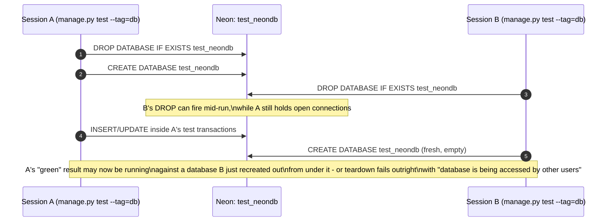
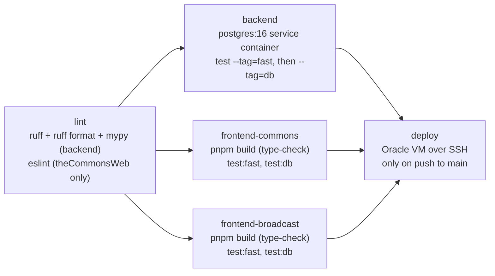

# Testing & Local Development

> **Last updated:** 2026-08-03, commit `9a38379`, branch `suite-47-tags-and-filters`

This is the human-facing walkthrough that complements
[`backendServer/AGENTS.md`](../backendServer/AGENTS.md)'s Testing section, which stays the
agent-facing reference for exact tags, settings names, and management-command flags. Where the
two disagree, trust `backendServer/AGENTS.md` and the code underneath it — this doc exists to be
*followed*, not to be the source of truth.

Audience: someone with a fresh clone of this repo, general web-dev skill, and zero context on
The Commons specifically. Every command below was checked against the repo's actual scripts and
`--help` output at this commit, not assumed.

## Overview

- This doc gets a fresh clone of The Commons running locally and explains how its test suites
  are organized. It covers three toolchains: `uv` for the Django backend, `pnpm` for two
  independent frontends (`theCommonsWeb` and `broadcastWeb`), and a local Redis needed to *run*
  the app (not to test it). It does not cover architecture or any subsystem in depth — see
  [`overview.md`](overview.md) and [`async-jobs.md`](async-jobs.md) for that.
- Both backend and frontend tests are split into two tiers by explicit tags, not filenames:
  `fast` (no database) and `db` (needs Postgres, or `jsdom` on the frontend side). The backend's
  `db` tier runs against a **real Postgres test database on Neon**, not SQLite and not an
  ephemeral container — that's a locked decision.
- The single biggest thing to know before running anything: the Neon test database is shared
  infrastructure. If your `DATABASE_URL` points at the same Neon branch as any other terminal,
  session, or agent running `--tag=db` tests at the same time, both runs can race to
  create/drop/write the same literal database — and the dangerous failure mode is a **silent
  false-green**, not a crash. Always run `--tag=db` (and full `manage.py test`) suites serially,
  with `--noinput` and `pipefail`. Full detail in Deep Dive §4.
- Quick map by task: first-time setup → §2; understanding backend test tiers/tags → §3; hit a
  "database is being accessed by other users" error → §4 and §5; frontend Vitest tiers → §6; do
  I need Redis running to test? (no) → §7; full command cheat sheet → §8; what CI actually runs →
  §9; known doc drift → §10.

## Deep Dive

---

### 1. What this covers, and who it's for

Getting this repo running locally touches three separate toolchains — `uv` for the Django
backend, `pnpm` for two independent frontends (`theCommonsWeb` and `broadcastWeb`), and a local
Redis for anything that isn't the test suite — plus a Postgres test database that lives on Neon,
not on your machine, and is shared in a way that will burn you if you don't know about it up
front. This doc walks through all of that: a first-run setup from clone to a running system, how
the backend's two test tiers work and why the Postgres test database needs care, how the
frontend's Vitest tiers mirror (and don't quite mirror) the backend's, and what CI actually runs
on a pull request.

It does not cover application architecture, the data model, or any single subsystem in depth —
[`overview.md`](overview.md) is the map for that, and [`async-jobs.md`](async-jobs.md) is the
deeper dive on *why* Redis and Celery exist at all, not just how to stand up Redis locally.
Production deployment is [`deploy-ops.md`](deploy-ops.md); the emerging Docker-based local/prod
setup is [`containerization.md`](containerization.md); frontend architecture and conventions
beyond "how do I run the tests" live in `frontend.md` (once it exists — until then,
[`theCommonsWeb/AGENTS.md`](../theCommonsWeb/AGENTS.md) covers the same ground for an agent
audience).

---

### 2. First run: clone to a running system

> [`local-setup.md`](local-setup.md) is now the fuller version of this section — prerequisites
> and versions, all four env files, Celery workers, Playwright, and the Docker Compose path.
> This section is kept as the short form for someone who is here to run the tests. If the two
> disagree, `local-setup.md` is the more recently checked one.

#### 2.1 Backend

```bash
git clone <repo-url> thecommons && cd thecommons/backendServer
uv sync
```

`uv sync` needs no `--frozen` locally (that flag is CI-only, and fails instead of updating the
lockfile if `pyproject.toml` and `uv.lock` have drifted). Next, create `backendServer/.env` from
`backendServer/.env.example` and fill in at minimum `DATABASE_URL` — a Postgres connection
string. Point it at a personal Neon dev branch rather than the shared prod database; the
one-time setup for that is [`docs/dev-db-isolation.md`](../docs/dev-db-isolation.md), not
duplicated here. Everything else in `.env.example` (Gemini, Brevo, the Better Auth JWKS URL,
`CRON_SECRET`, `THE_COMMONS_API_KEY`) has a working dev-mode fallback or is only needed for
features you may not be touching yet — `DATABASE_URL` is the one variable that's a hard
requirement: `backend/settings/dev.py` raises `RuntimeError` at import time if it's unset, before
anything else in Django even loads.

```bash
uv run python manage.py migrate
uv run python manage.py runserver
```

`runserver` needs a **local Redis** reachable at whatever `REDIS_URL`/`REDIS_CACHE_URL` resolve
to (`.env.example` defaults both to `localhost:6379`, DB 0 and DB 1). This is a real requirement
for running the app, not for testing it — see §7. The quickest path:

```bash
brew install redis && brew services start redis   # macOS
# apt install redis-server                        # Ubuntu
redis-cli ping                                     # -> PONG
```

To also process background jobs (digests, ingestion, broadcast) rather than just enqueue them,
run a worker alongside `runserver` — see [`async-jobs.md`](async-jobs.md) for the full queue
topology and which worker command to use for which queue.

#### 2.2 Frontend — theCommonsWeb (the public site)

```bash
cd theCommonsWeb
pnpm install
```

**This repo is pnpm-only.** `npm install` will fail here — the store is symlinked in a way plain
npm doesn't handle, and CI pins `pnpm@11.1.1` via `pnpm/action-setup`. Use that same major
version locally (`corepack enable` or `npm i -g pnpm@11` both work). Copy
`theCommonsWeb/.env.example` to `.env.local` (not `.env` — Next.js gives `.env.local`
precedence, and a stale `.env` from an earlier Vite-era setup still exists in some checkouts and
will silently lose to it) and fill in `DATABASE_URL` (same Neon branch as the backend — Better
Auth and Django share one Postgres database) plus `BETTER_AUTH_SECRET`. Then:

```bash
pnpm dev
```

#### 2.3 Frontend — broadcastWeb (optional, partner-facing SPA)

```bash
cd broadcastWeb
pnpm install
cp .env.example .env      # VITE_* vars, not .env.local — this one's a Vite app
pnpm dev
```

Only needed if you're working on the broadcast/syndication side; the public site and its tests
don't depend on it.

#### 2.4 Verify you have a green suite

Once the backend `.env` has a working `DATABASE_URL`, confirm the full picture before doing
anything else, in this order (why this order matters is §4):

```bash
cd backendServer
DJANGO_SETTINGS_MODULE=backend.settings.test uv run python manage.py test --tag=fast
DJANGO_SETTINGS_MODULE=backend.settings.test uv run python manage.py test --tag=db

cd ../theCommonsWeb
pnpm test:fast
pnpm test:db
pnpm build      # type-check
```

If all of that is green, you have a working backend, a working frontend, and a working test
loop. §8 has the full command table, including `broadcastWeb` and lint.

---

### 3. Backend tests: tiers, tags, and the Postgres test database

Backend tests always run under a dedicated settings module, **never** the same `dev`/`prod`
settings the app itself uses:

```bash
DJANGO_SETTINGS_MODULE=backend.settings.test uv run python manage.py test
```

`backend/settings/test.py` inherits `dev.py` (same `DATABASE_URL` parsing) and then changes what
matters for a test run: it strips a `-pooler` suffix off the DB host, because Neon's pooler
(PgBouncer) endpoint can't `CREATE`/`DROP` a database and the suite needs to do both to spin up
and tear down its own database. It also points `TEST_RUNNER` at
`backend.test_runner.NeonAuthTestRunner`, a thin subclass of Django's `DiscoverRunner` that,
after Django creates the normal test database, additionally creates a `neon_auth` schema and the
two Better Auth mirror tables the suite writes to (`BetterAuthUser`, `BetterAuthAccount`) — those
are `managed = False` in the app itself, so Django's ordinary migration-based test-DB setup
never touches them, and something has to build them once, centrally, or every test class would
have to repeat that setup itself. **This is deliberately a real Postgres database, not SQLite —
that's a locked decision, not a placeholder to swap out.**

Tests are split into two tiers by an explicit `@tag(...)` decorator, not by filename:

```bash
DJANGO_SETTINGS_MODULE=backend.settings.test uv run python manage.py test --tag=fast   # no DB
DJANGO_SETTINGS_MODULE=backend.settings.test uv run python manage.py test --tag=db     # Postgres
```

- **`fast`** tests are plain `unittest.TestCase` subclasses (not Django's `TestCase`) tagged
  `@tag("fast")`. They touch no database at all, and `NeonAuthTestRunner.setup_databases` knows
  this — it checks whether `"default"` is even in the set of database aliases the selected tests
  need, and skips building the `neon_auth` schema entirely when a fast-only run doesn't need it.
  `DATABASE_URL` still has to be *set* in the environment (settings import fails immediately
  otherwise), but for `--tag=fast` it never has to be *reachable* — nothing tries to connect.
- **`db`** tests are Django's own `TestCase`/`TransactionTestCase` subclasses tagged
  `@tag("db")`. These do create the Postgres test database (named `test_<your DB name>`,
  typically `test_neondb`), run inside it, and drop it at the end.

Most test files signal their tier in the filename too (`test_ics_importer_db.py`,
`test_standardizer_fast.py`), but that's a naming convention layered on top for readability —
**the `@tag(...)` decorator on the class is what `--tag=fast`/`--tag=db` actually select on.**
Several files don't follow the filename convention at all (`broadcast/tests/test_api.py`,
`accounts/tests/test_business_api.py`, `newsletter/tests/test_digest.py`, and others) and still
tag every test class correctly — the decorator, not the filename, is load-bearing. As of this
commit, every backend test file carries at least one `@tag` (verified across `accounts`,
`events`, `newsletter`, `ingestion`, `broadcast`, and `devtools`) — there's no untagged file
quietly falling through both `--tag` runs today. That's worth keeping true: a test class that
touches the database but is tagged `"fast"` (or a `unittest.TestCase` that someone converts to
Django's `TestCase` without updating its tag) breaks the tier's own promise — running
`--tag=fast` with no Postgres reachable at all (offline, no `.env`, no Neon branch set up yet)
will then fail with a connection error on exactly the tier that's supposed to need none. When
adding a new test, the two things that have to agree are: which `TestCase` base class it
inherits, and which tag it carries.

A recent full run was reported at roughly **253 `fast` + 446 `db`** tests — quoted here for a
sense of scale, not independently re-measured for this doc (see §11).

---

### 4. The shared Neon test database — read this before running two things at once

This is the sharp edge most likely to waste your afternoon, so it gets its own section instead
of a bullet point.

The `--tag=db` test database is not created fresh in some ephemeral container — it's a real,
named database (`test_<name>`) created and dropped on whatever Postgres server `DATABASE_URL`
points at, via Django's standard `DROP DATABASE IF EXISTS` / `CREATE DATABASE` teardown-then-setup
dance. If `DATABASE_URL` in your environment points at the same Neon branch as anyone or anything
else running tests at the same time — a second terminal, a second Claude Code session, a
background agent, a teammate sharing your dev branch — **both processes are racing to
create/drop/write to the literal same database.**



**This produces two different failure shapes, and the second one is the dangerous one:**

1. **A loud failure.** One session's `DROP DATABASE` fails because the other still holds open
   connections — Postgres refuses with "database is being accessed by other users." Annoying,
   but honest: you know the run didn't complete cleanly.
2. **A silent, untrustworthy pass.** Both runs finish and both report green, but each ran some
   fraction of its suite against a database the other session had just wiped and rebuilt out
   from under it. A green result under these conditions tells you nothing — it isn't proof the
   code is correct, only that nothing crashed loudly enough to fail the process. Worse, if either
   session also commits code mid-run, that commit can sweep up the other session's in-flight
   edits into a commit neither of you intended.

**The mitigation is procedural, not technical — there's no lock Django or Neon gives you here
for free:**

- **Run backend `--tag=db` (and full, untagged `manage.py test`) suites serially.** Don't start
  a second one while a first is mid-run, across terminals, sessions, or subagents that share a
  `DATABASE_URL`.
- **Always pass `--noinput`** on any automated or non-interactive invocation. Without it, Django
  prompts interactively before destroying an existing test database — in a headless session that
  prompt just hangs forever, which looks identical to a stuck test run from the outside.
- **Set `pipefail`** whenever a test invocation is piped into something else (`| tee run.log`,
  `| grep FAIL`, and similar) — without it, a non-zero exit from `manage.py test` gets masked by
  the exit code of whatever it's piped into, and a real failure reads as a clean pass:

  ```bash
  set -o pipefail
  DJANGO_SETTINGS_MODULE=backend.settings.test uv run python manage.py test --tag=db --noinput 2>&1 | tee /tmp/test-db.log
  ```

If you're the only one working against your Neon dev branch, none of this bites — the risk is
specifically concurrent access to the *same* `DATABASE_URL`, which is easy to hit by accident in
this repo's normal workflow (multiple terminals, multiple agent sessions) even with only one
human at the keyboard.

---

### 5. Stale Neon sessions blocking teardown

A related but distinct failure: even with no genuine concurrent run, a Neon test-DB session can
occasionally outlive the process that opened it (a killed test run, a crashed connection pool)
and keep holding `test_neondb` open, so the *next* run's `DROP DATABASE` fails with the same
"database is being accessed by other users" error described above, even though nothing else is
actually racing it right now. Two ways out, in order of preference:

```sql
-- Run against the same Postgres server DATABASE_URL points at
SELECT pg_terminate_backend(pid)
FROM pg_stat_activity
WHERE datname = 'test_neondb' AND pid <> pg_backend_pid();
```

then re-run the suite normally. Or, if you're iterating locally and don't need a clean schema
every time, pass `--keepdb` to skip the drop/create cycle entirely and reuse the existing test
database between runs (Django still applies any new migrations to it first).

---

### 6. Frontend tests: Vitest fast/db tiers

Both `theCommonsWeb` and `broadcastWeb` use the same two-project Vitest layout, deliberately
mirroring the backend's `fast`/`db` naming — but **the frontend `db` tier does not touch any
database.** Neither frontend talks to Postgres directly (both go through the Django API, and
tests mock `fetch`), so "db" here means something narrower: it's the tier that runs under
`jsdom` (for component and hook tests that need a DOM) versus `fast`, which runs under plain
`node` for pure-logic tests with no DOM at all. Don't read "db" here as "needs a database
running" the way the backend's tag does — it's a naming echo, not the same guarantee.

```
theCommonsWeb/vitest.config.ts, broadcastWeb/vitest.config.ts
  fast: environment 'node', include src/**/*.fast.test.{ts,tsx}
  db:   environment 'jsdom', include src/**/*.db.test.{ts,tsx}, setupFiles: ./vitest.setup.ts
```

```bash
cd theCommonsWeb   # or broadcastWeb — identical script names
pnpm test          # both projects, single run
pnpm test:fast     # node tier only
pnpm test:db       # jsdom tier only
pnpm test:watch    # watch mode
```

Neither tier needs the Django backend, Redis, or a database running — both stub the network
(`vi.stubGlobal('fetch', …)`) rather than hitting a real server. Type-checking is a separate
step, not part of `vitest` at all: `pnpm build` (`next build` for theCommonsWeb, `tsc -b && vite
build` for broadcastWeb) is the type-check gate for both, and is what CI runs.

---

### 7. Local Redis — required to run the app, not to run its tests

Worth stating plainly, because it's easy to assume otherwise coming from §2's setup:
`backend/settings/test.py` sets `CELERY_TASK_ALWAYS_EAGER = True` and unconditionally swaps
`CACHES` to Django's in-process `LocMemCache` — so **the entire backend test suite, `fast` and
`db` alike, needs no Redis running at all.** Every `.delay()` call in a test executes inline,
synchronously, in the test process.

> **Doc drift, flagged rather than propagated:** [`docs/redis-celery-handoff.md`](../docs/redis-celery-handoff.md)'s
> Testing section currently says the suite runs under dev settings with
> `CELERY_TASK_ALWAYS_EAGER = False`, and that tests needing synchronous execution have to wrap
> the call in `@override_settings(CELERY_TASK_ALWAYS_EAGER=True, ...)`. That's backwards from
> what `backend/settings/test.py` actually sets today — eager is already the suite-wide default,
> so that override pattern is only needed for a test that deliberately wants the opposite,
> *non*-eager, behavior. Trust `backend/settings/test.py`, not that doc's Testing section, until
> it's corrected. [`async-jobs.md`](async-jobs.md) covers the same drift in more depth.

Redis *is* required the moment you actually run the app (`manage.py runserver` plus a worker) —
`dev.py` only swaps to `LocMemCache` when `"test"` is in `sys.argv`; a plain dev server run uses
the real Redis-backed cache and a real Celery broker, both defaulting to `localhost:6379` (DB 0
broker/results, DB 1 cache) per `.env.example`. The straightforward path is installing Redis
locally (§2.1). A parallel, **not yet settled** effort is containerizing the whole stack — an
uncommitted `docker-compose.yml` plus `docker-compose.override.yml` for local dev, covered in
full in [`containerization.md`](containerization.md) — which does include a `redis:7-alpine`
compose service. Worth knowing precisely what that does and doesn't give you today: that `redis`
service publishes no port to the host at all, so it's only reachable by other containers on the
same compose network. It's a real alternative if you run the *entire* stack via `docker compose
up` (backend, Celery, everything, per `docker-compose.override.yml`'s local-dev config), but it
is not yet a drop-in replacement for `brew install redis` if you're running the backend natively
via `uv run manage.py runserver` the way §2.1 describes — there's no host port mapping to point a
native process's `REDIS_URL` at.

---

### 8. Command reference

| Command | Runs | Needs | Roughly |
|---|---|---|---|
| `DJANGO_SETTINGS_MODULE=backend.settings.test uv run python manage.py test --tag=fast` | Backend fast tier | `DATABASE_URL` set (not reachable) | Seconds — ~253 tests as of a recent run |
| `DJANGO_SETTINGS_MODULE=backend.settings.test uv run python manage.py test --tag=db` | Backend DB tier | Live Postgres at `DATABASE_URL`; run serially (§4) | Slower — ~446 tests, DB create/migrate/drop each run |
| `DJANGO_SETTINGS_MODULE=backend.settings.test uv run python manage.py test` | Every tagged backend test, both tiers | Live Postgres; run serially | Sum of the above |
| `uv run ruff check . && uv run ruff format --check . && uv run mypy .` (in `backendServer/`) | Backend lint + format + types | Nothing external (mypy only imports `backend.settings.dev`, needs `DATABASE_URL` set but not reachable) | Seconds |
| `pnpm test:fast` (in `theCommonsWeb/` or `broadcastWeb/`) | Frontend node-tier tests | Nothing | Seconds |
| `pnpm test:db` (same dirs) | Frontend jsdom-tier tests | Nothing (no real DB — §6) | Seconds |
| `pnpm build` (same dirs) | Type-check (`next build` / `tsc -b && vite build`) | Env vars present (placeholders fine for type-check only — see CI's job for the exact placeholder set) | Tens of seconds |
| `pnpm lint` (`theCommonsWeb/` only) | ESLint | Nothing | Seconds |

`broadcastWeb/package.json` has no `lint` script at all, and neither CI's lint job nor
`.pre-commit-config.yaml` lints it — only `theCommonsWeb` is linted anywhere in this repo today.
Not something this doc fixes, just worth knowing so you don't go looking for a `pnpm lint` that
isn't there.

`.pre-commit-config.yaml` runs the backend's ruff-check/ruff-format/mypy and theCommonsWeb's
ESLint as local hooks (same commands as above, scoped by `files:` patterns to only fire when
matching files changed) — no test suite runs in pre-commit, only lint/format/types.

---

### 9. What CI runs

`.github/workflows/ci.yml` triggers on every push to `main` and every pull request into `main`; a
newer push to the same branch cancels an in-flight run for it.



Every test/type-check job depends on `lint` passing first. The three test jobs (`backend`,
`frontend-commons`, `frontend-broadcast`) run in parallel once lint is green, and `deploy` only
runs when all three of those pass, only on a push to `main` (never on a pull request, so a fork
PR never gets access to deploy secrets), and only after that.

A few specifics worth knowing:

- **`backend`** spins up a real `postgres:16` service container for the job (not Neon) — CI's
  `DATABASE_URL` points at `localhost:5432` inside the runner, so CI never touches your Neon
  branches and the shared-database hazard in §4 doesn't apply to CI runs. It runs `--tag=fast`
  and `--tag=db` as two separate steps in the same job (`uv run python manage.py test --tag=fast`
  then `--tag=db`), without the `DJANGO_SETTINGS_MODULE` prefix shown elsewhere in this doc — CI
  sets it once via the job's `env:` block instead.
- **`frontend-commons`** and **`frontend-broadcast`** each run `pnpm build` as the type-check
  gate before their tests, with placeholder env values baked in only for that step (real secrets
  live on the deploy VM, never in CI) — see the workflow file's inline comments on
  `frontend-commons`'s build step for exactly which variables get placeholders and why.
- **`deploy`** is out of scope for this doc — it SSHes into the production Oracle VM, builds and
  runs the Docker Compose stack, runs a guarded `migrate --check`/pre-migrate backup dance, and
  ends with a set of smoke-test `curl` checks against the live site. Full detail is in
  [`deploy-ops.md`](deploy-ops.md) and [`containerization.md`](containerization.md).

---

### 10. Known gaps and doc drift

- **`docs/redis-celery-handoff.md`'s Testing section is stale** on which settings the suite runs
  under and which way `CELERY_TASK_ALWAYS_EAGER` is set — covered in full in §7, and also
  flagged independently in [`async-jobs.md`](async-jobs.md).
- **`docs/broadcast.md`'s "CI gap" note is stale.** It currently says "most `broadcast/tests/`
  files carry no `@tag`... so these tests do not run in CI today." That was true at some earlier
  point but isn't anymore: every file under `broadcast/tests/` carries at least one `@tag("fast")`
  or `@tag("db")` as of this commit (verified directly, not just via `backendServer/AGENTS.md`'s
  claim to the same effect), and CI's `backend` job runs both tags. The stale-session recovery
  advice in that same note (`pg_terminate_backend` / `--keepdb`) is accurate and is what §5 above
  is grounded in.
- **`broadcastWeb` has no lint step anywhere** (§8) — not a documented decision either way in
  anything read for this doc, just an asymmetry with `theCommonsWeb` worth someone deciding on
  deliberately rather than it staying accidental.
- **Not independently re-measured for this doc:** the ~253 fast / ~446 db test counts in §3 and
  §8 are quoted from a recent run reported elsewhere, not reproduced here — this doc was written
  without running the actual suites, specifically to avoid colliding with any other session's
  concurrent run against the shared Neon test database described in §4.
